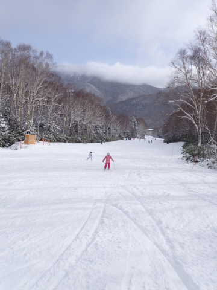
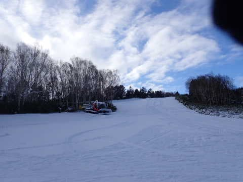

# 2022/12/11(日)の志賀高原焼額山スキー場詳細レポート…午前リフト激混みながら，気温は冷えてゲレンデコンディションは良かったよ

📅 投稿日時: 2022-12-14 02:25:48

うーーーん．

14日，すごい冷えるんだけど…

新潟の海沿いではかなり雪が

降るんだけど…

志賀高原殺しの西風（涙）

志賀高原は今は雪が降っている

ようなのですが…

西風のせいで，そんなに積もらなさそう（泣）

14日の1日かけて，10cmちょいしか

積もらないかも…

激烈に冷えてるのに．

西風が惜しい…

でも，17，18日とまた冷え込みが

やってきて．

18日は今の予想なら，14日よりは

北風になりそうなので…

18日志賀でも積もってくれるんじゃないかな？？

…あくまでも，今の予想天気図通りなら

ですが…

しかし．

日曜日に降るんじゃなく，週末の前に

降ってくれて，週末は晴れがいいん

だけどな～←なんてワガママ…

ってなことで．

今さらながら感がありますが…

昨日はちょっと状況がクリティカル

だったので書けなかった，日曜の志賀高原

詳細レポートです！！！

一昨日の速報にも書いたように…

日曜は明け方当たりから雪が降り始め．

朝8時ごろには駐車場にも5cmほどの

積雪が！

わずか5cmとはいえ，天然雪があると

テンションが上がります…！！！

ただ．8:30オープンのリフトに並んでいる

人が，昨日よりずっと多いことがちょっと

気になるところ…

もしかしたら，今日は混むのか？？

とりあえず．

あさイチのリフトに乗って登っていくと…

ゲレンデは圧雪の上に新雪が乗っていて．

滑っていく人が気持ちよさそうに

新雪を蹴散らして滑っていきます…

ぐおおおおおお！

わずか5cmでもいい．

今シーズン初の新雪を早く滑りたい…！！

山頂に上がると…

ふぉぉぉぉぉ！！

雪だ！！

圧雪コース上も，圧雪の上に

スキー板が隠れるほどの新雪が！！

あさイチ新雪，いただきま～す！！！！

いや…

久しぶりの天然雪の感触…

養殖ものばかりにならされていると．

「久しぶりの天然物は美味いのぉ…」

と感動で涙を流しつつ，言葉を失う

レベルです…

いや，感動…！！！！

ドサドサ積もるほどではないものの，

リフト1本乗ってる間でもこれだけ

積もるくらいの雪が午前中は降り続け．

バーンコンディションは良かったのですが…

営業開始から1時間近くたった

9時半ごろ．

研修会の50人ほどの団体さんが

入ってきたのをきっかけに…

…うげげげげげ～！！！

リフトにすごい列が並んでるんです

けど！？？？

9時半から11時近くまでの1時間半．

リフト待ちはこのくらいの列がついて

ました…

ただ，縦長の列なので見た目ほど

待ち時間は長くなく．

10分前後の待ち時間でしたね…

うーん．

昨日の土曜は熊の湯と横手がすごい

待ち時間だったようなので．

昨日熊の湯と横手で待ち時間に懲りた人が

今日は焼額に流れてきたのかな…？

ただ．

リフトの待ち時間は長かったけど．

リフトが長いので，1回待てば長い

距離を滑れるし．

短いリフトでちょっと滑ったら

また長く待たなきゃいけない…

ってよりはマシだし．

ペアリフト1本分の輸送力しかなく，

それでいてゲレンデは結構広め

なので…

コース上は全く混んでおらず．

そこまでひどいストレスじゃなかった

かな…

最大ピークは10時ごろで．

10時半を過ぎるとリフト待ちは

7分程度に短くなり．

さらに11時過ぎには5分弱，

11時半には3分弱まで

短くなり…

午後はほぼ待ちなしになりました～！！

そして．

昼ごろには雪も弱まり．

薄っすら日も射すこともある程度の

天気になってきて…

日が射す中，新雪が乗ったいい雪を

滑れるとは…！！！

あまりにも雪がよく，人も少ないので，

大回り板を履きたくなるほどの

いいコンディション！！！

いや…

焼額に来るまでは．

「どうせ人工雪100％だし，ペアリフト1本

　だけだし．コース幅もそんなに広く

　ないだろうし，楽しいかなぁ…」

と心配していたけど．

いやいやいやいや．

楽しいよ！！！！！

そして．

午後になるとゲレンデの人も

グッと減って．

もう，イエティと全然違う！！←比較対象が違う

こんな広いコースを好き放題に滑れる

シアワセっ！！！！！

ただ，今日の積雪はそんなに多かった

わけじゃないので．

午後になると，ところどころ下地の

人工雪の硬いのが出て来てましたが…

それでも，エッジを立ててあれば

全く気にならず大回りできる

レベル！

イエティに比べれば．

このコース幅で，この人口密度で

滑れるんだから…

いやーーー．

今シーズンは12月2週目にして，

やっとスキーをしたって感じ…！

いや．

昨日は睡眠1時間半で丸一日滑って，

さらに深夜まで飲んでしまい．

今日は最後まで滑る気力が残ってる

かな…？と心配したけど．

新雪5cm効果でゲレンデコンディションが

かなり気持ちよく．

気が付いたら，昼休みも摂らずに

もう夕日が傾く時間…

ってなことで．

今日も朝8:30から16:00まで．

休むことなく滑り続けてしまったの

でした…

ペアリフト1本しかうごかなかったけど．

午前中はかなりリフトが混んだけど．

でも．

やっと天然雪の上で滑ることができ．

「やっぱりスキーは天然雪だ！！

こんなに気持ちいいんだ！！！！」

と，実に久しぶりの天然雪を滑って

感動したこの週末だったのでした…

…でも．

最後まで滑って300km運転するのも

久しぶりだったので．

かなり疲れた…

## 💬 コメント一覧

### 💬 コメント by (副院長)
**タイトル**: Unknown
**投稿日**: 2022-12-14 12:09:56

天然雪始め、おめでとうございます。よさげですが、まだまだ、劇混みだからと我慢しております。ところで、京都人には関係ないのですが、ネクスコ東日本の「ドラぷら」で志賀の往復はお安くなってるんですか？ネクスコ西日本には全く、そのようなものはなく、うらやましい感じなんですが。

### 💬 コメント by (副院長)
**タイトル**: Unknown
**投稿日**: 2022-12-14 12:14:47

訂正、ドラ割「ウィンターパス2023」でした。各方面に割引のようで。

### 💬 コメント by (新米パパさん)
**タイトル**: Unknown
**投稿日**: 2022-12-14 12:52:30

今年もよろしくお願いします。

24から志賀高原プリンス2泊で参戦予定です。

志賀高原プリンスは香港外資に売却されたそうですが、変わらずセゾンカードとか使えるんですね

### 💬 コメント by (レインボー改めブラボー75)
**タイトル**: Unknown
**投稿日**: 2022-12-14 13:24:02

水曜日の志賀高原情報

朝の湯田中は小雨、上林は小雪0℃、蓮池は小雪-3℃。

焼額山４ロマは圧雪の上に新雪10センチ。気持ちいいです。でも、寒い。寒さに慣れてないせいか、足と手が。

２時間滑ったら風と雪が強くなったのでリタイア。今はまだこの程度が身の程かと。

帰りの高天は強風-6℃。週末には２高が動くらしいけど、この雪が多かったら、ひょっとして２ゴンも？

希望的見解でした。

### 💬 コメント by (Skier_S)
**タイトル**: 今週末は焼額第2高速運転！
**投稿日**: 2022-12-15 02:30:11

＞副院長さま

高速割引情報ありがとうございます．

ドラぷらで志賀往復の割引が出てますが，休日割引が使えればそっちの方が安いです…

土日しかスキーに行けない私の場合は残念ながら役立たない割引です．

＞新米パパさま

24日からプリンスですか！

私も今のところ24，25日は参戦予定ですのでまたお会いしましょう…！

＞ブラボー75さま

意外と新雪10cm積もったんですね…

もう少し少ないかと思いました．

明日，明後日も寒いのでご注意を！

週末に2ゴン動くといいですね…

