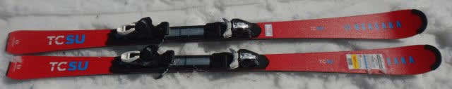
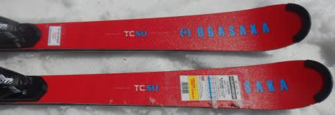
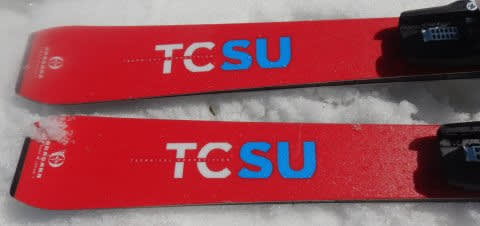
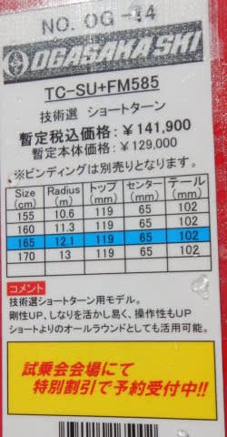
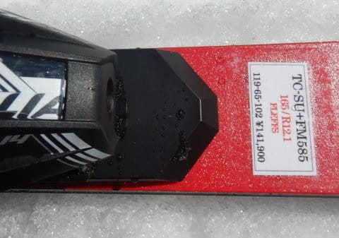

# 2023シーズンモデルのスキー板，試乗レポートその31…OGASAKA TC-SU + FM585

📅 投稿日時: 2022-07-23 01:03:07

🏷️ カテゴリ: [スキー板試乗](c0bd8048615710cee890e403a36cc9a2b.md)

ここ数日，

Blogの更新時間を見て分かる通り，

寝るのは外が明るくなる午前4時ごろが続き．

そして今日も最後のWeb会議が終わったのが

午後10時頃…

まだ今週の仕事が終わってないけど．

大事な教訓として．

明日できることは明日やればいい

という，有名な言葉があるので←それってダメな教訓じゃん…

…もう，今日は早く寝ます！！←と言っても，もう夜1時を過ぎてる気が…これって早いのか？

いや．3連休はいいんだけど（ホントに3日とも休めるんなら…）

3連休の反動で，

平日が4日しかないのはいろいろ辛い…

でも．

ちゃんとBlogを更新してから寝るのが偉い！！

えらいよ！←全力で自分を誉めておく

本日も2023シーズンモデルのスキー板試乗レポート．

今回はオガサカ編です．

では，どうぞ～！

○OGASAKA TC-SU + FM585　165cm

基礎小回り

前回も同じTC-SUを試乗しましたが．

[前回は一番強いSR585プレートのついた160cm](e6d114a91eed00f08ba314f32d9e4c743.md)．

今回は，優し目のFM585プレートがついて165cmと，

プレートと長さ違いの板になります．

板が粘って，トップからテールまでのエッジが

効いて，たわみに沿って回っていく私の好きな

系統の気持ちいい板ですが…

滑り出すと，結構柔らかく感じます．

エッジグリップも，強いというより

ちょっと優しいくらいに感じますね．

SRプレート付きと全然違う！！

SRプレートはどちらかというと

エッジグリップと張りが強く，ずらそうと

思わなければエッジに沿ってキーンと

キレていくカービング板に感じますが．

GRプレート付きは，基本的にはカービング

性能の強い板ながら，急斜面では簡単に

エッジを外して板を動かしていくことが

できます．

急斜面でも自分が好きなだけズルズルと

板を動かせる，エッジグリップのいい意味の

ルーズさがあります．

だらしなくずれていくのではなく，

ずらして行った中での板の圧の感じ方や

コントロール性はすごくいいので，

グリップして切っていくのも，

板を動かしてターンを作っていくのも好き放題．

迎え角を作って板を動かしていけば，

板がズレつつきれいに旋回力を出して

くれるので，

板がずれて逃げていくのではなく，

ずらしていけば勝手にターンが仕上がって

いく感じ．

スイングウエイトも軽いので，

板は好きなように動かしたい放題だし，

カービングしていった時の板のたわみ，

返りの出方もばね感があって好きだし．

GRプレートでも，スピードを出すと

板がたわみきってしまうような感じは

ありません．

ズレ・キレ両方いけるいい板です．

ただ，スピード嗜好，グリップ嗜好が強い人は

SRプレートを，

急斜面で板を動かしながらターンを仕上げて，

板の動きを見せたい人はGRプレートを

選べばいいんじゃないかな～．
