# Amazfit GTR，10月のアップデート以降スキーモードがバグってるんですが（涙）

📅 投稿日時: 2020-12-18 02:24:21

降りますね…

降ってます．

水曜16日の夜から17日の朝にかけての積雪，

焼額では50cmですか…

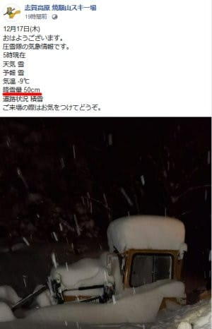

（[焼額山スキー場Facebook](https://www.facebook.com/yakebitaiyama/posts/3505427899552531)より）

このおかげで，焼額山は明日からの

第2ゴンドラ営業をアナウンスしましたが．

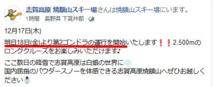

（[焼額山スキー場Facebook](https://www.facebook.com/yakebitaiyama/posts/3507002362728418)より）

あまりにも積もりすぎたため．

安全面の観点から，かぐらスキー場は

田代エリアのオープンを延期した

ようです…（涙）

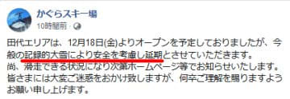

（[かぐらスキー場Facebook](https://www.facebook.com/snowkagura/posts/3366552236805406?__tn__=-R)より）

このほか，熊の湯も本来ならこの週末から

クワッド運転予定だったのが，積雪が

ありすぎてクワッドがオープンできず，

急遽週末は第1ペアが運転になるという話…

ってな感じで．

あまりにも雪が降りすぎていろいろ影響が

出ている今日この頃，皆様いかがお過ごし

でしょうか（以上，時候の挨拶）

…昨日も書きましたが，

もう一度書きます．

降るのと降らないのが極端すぎるんだよ

…もう少し平均して降ってほしかった…

とりあえず，この雪のおかげで，

焼額山は明日18日（金）から第2ゴンドラが

動くようですが．

この土曜日は激冷えの吹雪だし．

コロナの影響で3人乗車定員だし．

1ゴンは動かないし．

2ゴンに人が集中して，激込みの

予感…（ちょい涙）

そして，昨日の記事で．

この冷え込みは，12月22日までは

続きそう…と書きましたが．

改めて一か月予想を見ると…

22日から26日ごろまで一瞬平年並みか

平年比+1度くらいまで気温が上がりますが．

そのあと，また27日~1月9日ごろまで

平年より寒い日が続きそうです…！！

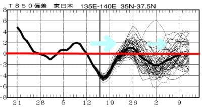

…ここにきて，遅れてきたヒーローのように

ラニーニャがその本領を発揮してきたようですが．

冷え始め，遅いよ

そして，

極端すぎるよ

まぁ，でも，雪があるだけ

昨年の雪不足よりマシ

と思いましょう…

ってなことで，本題へ．

えー．

このBlog読者の愛読者の方はご存知

と思うのですが．

私はスキーのログ記録用として，

[スマートウォッチAmazfit GTR](eeb684c478255cfab52c0b4bc023f3d47.md)を

愛用しているわけで．

この，Amazfit GTR．

スマホアプリを使わずとも，

時計のGPSで滑走記録を記録してくれて．

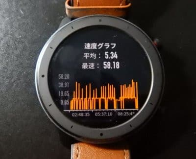

さらに滑っている途中，LINEやメールの通知

をスマホを出すことなく確認できるなど

結構便利で．

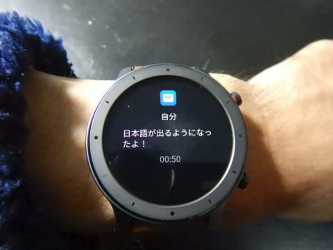

…多少GPSの精度が悪い以外，

概ね満足して使っていたのですが．

この10月．

いきなりスマートウォッチの

アップデートがかかり…

ファームウェアとリソースファイルの

アップデート後．

おっと．GPSのファームも更新されるの？

…もしかしたら，不満だったGPSの精度が

上がるかな？？

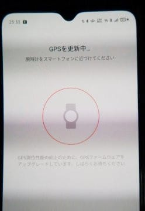

と，期待して使ってみたところ．

あんまりGPSの精度は改善して

ませんでした…（涙）

で．

肝心のGPS精度が上がらなかったこのファーム．

しばらく使ってみても，以前と変化が無いようで．

一体何が変わったのかな…

と，思っていたころ．

スキー場で，とんでもない副作用が

あることに気づきました…っ！！

本来なら，スキーモードで，

滑走本数と積算滑走標高差とかが

出るはずのところ．

（日本語アップデート前の写真なので

　英語画面だけど，滑走本数12本，

　滑走標高差864mと表示されている）

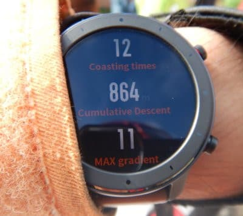

このファームアップ後．

滑走本数のカウントと標高差の

カウントが異常になってしまい．

何本滑っても，滑走本数歩表示は1本のままで，

積算滑走標高差は，なぜか下った標高と

登った標高が両方足されるという

謎仕様になり．

100m登って100m下ると，

積算滑走標高差0mと表示されるように

なってしまいました…（激涙）

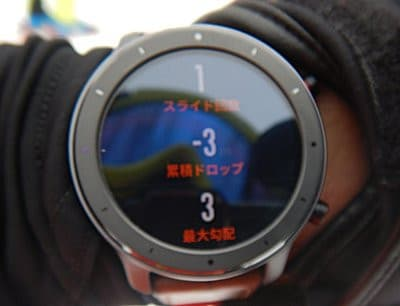

（一日滑った後でも，スライド回数＝滑った本数1，

　累積ドロップ＝積算標高差が-3mになってる（涙））

ただ，標高差グラフは正しく記録されており…

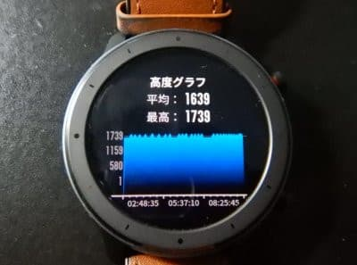

スマホで確認すれば，下り積算標高差は

バグで0になってますが，上り積算標高差は

正しく計算されているみたいです…

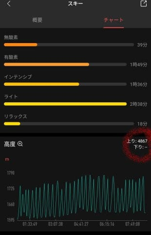

そのほか，GPS地図や，

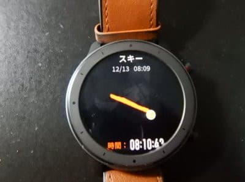

速度グラフ

最高速度，平均速度などは

おかしくなってませんね…

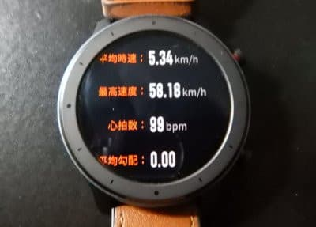

ということで．

どうやらおかしくなったのは積算標高差と

滑走本数カウントのみのようですが．

…はっきり言って，スキーの滑走標高差を

測るためにこのスマートウォッチを

買ったんですけど…

一番期待した大事な機能に，狙ったかの

ようにバグを埋め込んで来るとは…っ！！！

20000mクラブの人間にとって

一番重要である積算標高差記録

を狙ったようにダメにしてきたAmazfitに，

何か人為的な悪意があるんじゃないか

と思わずにいられない，Skier_Sだったの

でした…（涙）

## 💬 コメント一覧

### 💬 コメント by (かず)
**タイトル**: Unknown
**投稿日**: 2020-12-18 10:07:51

サラサラと聞いてシーズン中なら間違いなく行ってました！シーズン初日なので溺れそうなので諦めます…

2ゴンのみ…goto祭…どこまで並ぶのか？？画像待ってますヨ！

### 💬 コメント by (Northfox)
**タイトル**: いつも天気予報ありがとうございます！！
**投稿日**: 2020-12-18 12:59:35

土曜は所要で一日熊の湯で滑るのですが．．．吹雪ですか。

ちょっと厳しい一日になりそうですね．．orz

ほんと冷え方、降り方が極端すぎますね。

### 💬 コメント by (西舘)
**タイトル**: Unknown
**投稿日**: 2020-12-18 13:01:13

と言う訳で先程通過してきた訳ですが…サンバレー、シマシマ作成と共にリフト試運転してました！

(;´∀`)( '∀' ; )(´^ω^｀)ジャイアント明日動くかなぁ、パルスの日ですからねえ、せめてジャイアント動かさないとと思うんですけど。

### 💬 コメント by (Skier_S)
**タイトル**: あと2時間半後に出発
**投稿日**: 2020-12-19 01:38:08

＞かずさま

土曜の2ゴンは混みそうです…

でも，激寒吹雪なので，2高は辛そう…

＞Northfoxさま

土曜熊の湯ですか…

風もあって雪も吹き付け，結構寒いですよ．

くれぐれも防寒をしっかりとしていってください！

＞西舘さま

ジャイアントは動かないようですね．

西舘と発哺クワッドだけのようです…

西舘はフーディーが動かず，東館ゴンドラも寺子屋も動きません（涙）

