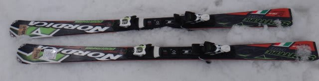
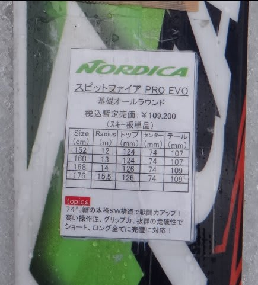
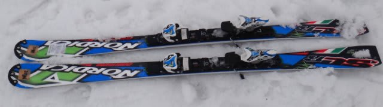
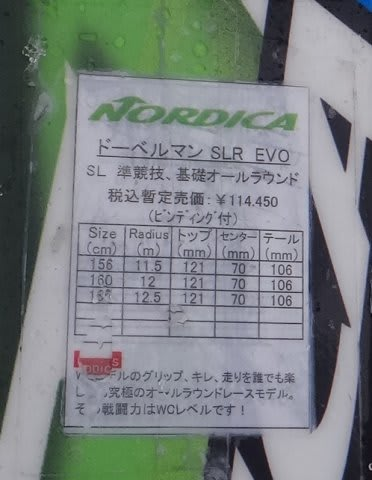

# まだ続く！2014シーズンモデルのスキー試乗レポートその12…NORDICA編

📅 投稿日時: 2013-05-14 02:25:49

🏷️ カテゴリ: [スキー板試乗](c0bd8048615710cee890e403a36cc9a2b.md)

数多くの読者が．

「あれ？まだ試乗レポート，終わってなかったんだ…」

…と思ってしまうであろう今日この頃．

みなさまいかがお過ごしでしょうか…

…ってことで．

実はまだ終わっていなかった，4月志賀高原での試乗レポート．

GWの10連休のネタが豊富でしばらく中断状態でした…

まだ半分も終わってないよ…！

この日の状況などは，[ここ](ef8d403e7031a831282c8ff83e65e31ec.md)を見て思い出してもらうとして．

今回はノルディカ編です．

では，どうぞ～

-----------

NORDICA 

SPITFIRE PRO EVO 168cm

オールラウンド基礎用．

この上に，EDT搭載のもうひとつ上のモデルの板があるようですが…

…これは．あまりレベルが高くないのかな？

エッジグリップが比較的弱め．

角付けしていくと，たわんで曲がっていくけど，

ガッツりエッジグリップというより，逃がそうと思えば簡単に逃がせる程度の

エッジグリップ．

返りもそれほど強くなく，まったりと返ってきます．

そのため，ゆっくりとした切り替え動作となり，

板の求めるターン弧は中回りから大き目のターンなのかな～．

って感じ．

狙いがショートというよりロング目の板らしいので，

比較的どっしりとした落ち着きとゆったりとした返りはそれらしい．

グリップもマイルドめに感じたので，ギンギンに攻撃的に滑る板ではなく，

どちらかというと，比較的気楽にゆったりとしたリズムで

すべる板のように感じました…

DOBERMANN SLR EVO 165cm

SL競技用．

これは…

典型的な，ウッドコアのサンドイッチ小回り板ですね．

結構しっかりした張り，比較的早い返り．がっつりしたエッジグリップ．

たわみを出すように乗り手が仕掛けていくと，それに応えた

ターン弧でトップが回りこんでくる感じ．

結構張りが強いので，スピード耐性は高いです．

SL競技用の板らしく，攻撃的に滑っていけばかなり鋭い，深い小回りが

できます．

ちょっと張りが強く返りが早い板なので，力を抜いて気楽に滑る…って感じの板では

ないですが，整地を高速スピード域で攻撃的に小回りするには良さそう…

…でも，ちょっと疲れるかも(笑)．
