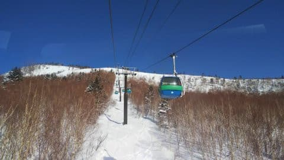
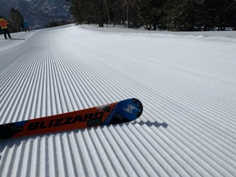
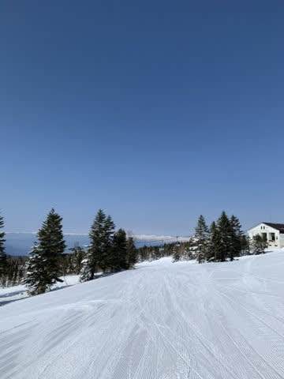
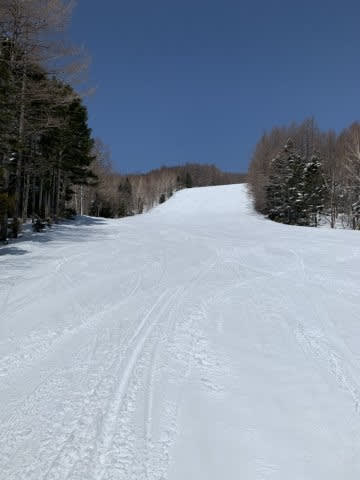
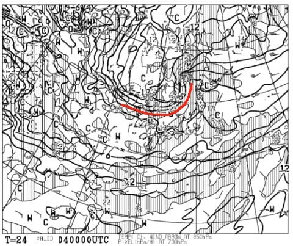
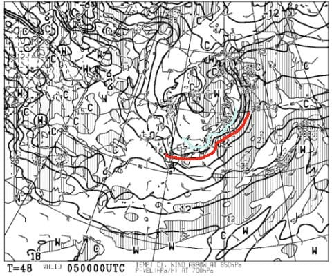
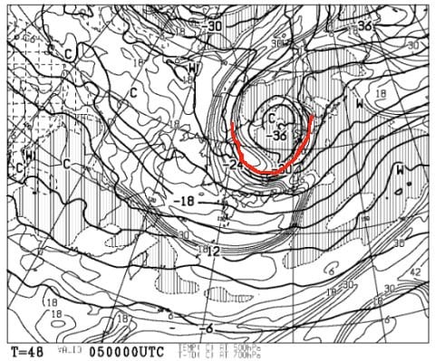
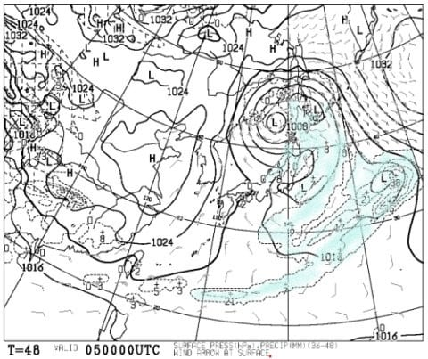
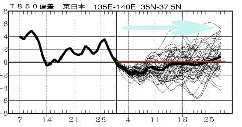

# 本日の志賀高原スキー場，朝は晴天で雪も最高だったけど，午後はストップ雪．そして一か月予想図を見てみると，この4月は冷えそうな予感…っ！

📅 投稿日時: 2020-04-04 01:06:19

🏷️ カテゴリ: [日記](cc4b5682fb7b8b144980957a978653fb0.md)

えー．

スキー場レポートを書かなくなったからか．

あるいは，4月に入ってスキーシーズンが

終わっちゃった人が多いからか．

今週に入り，一気にこのBlogのアクセス数が

先週までの半分近くに減ってしまった今日この頃．

皆様いかがお過ごしでしょうか…

うーん．

しかし，ホントに今週から読者数が

一気に減ったのですが．

でも．

それでも，志賀高原愛にあふれるこのBlog．

今日も特派員からのスキー場レポートを

お送りします！

で．まず．

本日朝イチはすっきり晴天っ！！

そして，朝イチのバーンは…

昨日積もった雪が圧雪された，

見事なシマシマバーン！！

朝のうちは，昨日の冷え冷え雪がいい感じで

圧雪された，かなり最高なバーンだったようで．

4月というのに，かなりいいコンディション

だったようですね…

そして，ゲレンデは無人と思えるほどの

ガラガラだったようですが．

ただ，やはり気温が上がった今日の昼間は，

昼前ごろからストップ雪になったようですね…

とはいえ．

昨日，雪が積もってくれただけありがたい…

いろいろ情報＆写真をくれた志賀付近在住の特派員の皆様，

ありがとうございました～！

で．

週末の志賀高原の天気ですが．

（自分でも最近ちょっと予想するのが虚しくなりつつある)

4日（土）の850hpa天気図を見ると．

まぁ，予想通り朝は+3℃線が志賀高原に

近づいているレベル．

朝は放射冷却で0℃以下まで落ちるものの，

昼間はちょっと気温が上がりそう…

天気は晴れ⇒午後は曇りかな．

5日（日）の850hpa図を見ると．

をを！結構な冷え冷え！

水色の-6℃線が志賀高原にかかってます．

…それどころか，500hpa気温図を見ると…

なんと．

そこそこの積雪の目安，-30℃の寒気が

入ってますよ！

4月にはありえないレベル！

これは，真冬の空気です…！

そして，地上天気図では，降水量が

日本海側に予想されているので…

これは，5日は降ります．

5日朝は10cmほどの積雪が

ありそうです…！！

この雪は午前中まで降り続き，

昼間も雪が積もりそう…！

…ただ．

風も強そうなので．

吹雪ってことかも…

ってなことで，

4日(土）：朝の気温は0℃下回る．-2度程度かな？

　朝のバーンはちょっとカリカリした，ザラメが

　固まったような雪．

　朝は日が射しそうなので，すぐに緩んで

　いい感じにエッジが効くバーンになる．

　昼ごろには+3℃くらいまで上がり，

　雪は緩んでちょいと重めになりそう…．

　ただ，昼過ぎには雲も増えてきて，

　気温も下がりそうなので，雪はストップ雪に

　なるほどひどく緩まず，比較的フラットな

　バーンで滑れそう…

5日(日)：前日夜から雪降り！かなりの冷え冷え．

　朝までに10cm程度の積雪．

　あさイチは-8℃以下まで冷え込みそう！

　風が強そうなので，奥志賀ゴンドラは

　ヤバいかな．

　焼額もゴンドラヤバそうだけど…

　焼額のゴンドラは止まらないと思う．

　朝は柔らかめの圧雪の上にうっすら新雪．

　雪は午前中降り続け，さらに数cm積もるかな？

　最高気温も-5℃前後までしか上がらず，

　真冬並みの冷えひえコンディション！

　ただ，午後になると固めの下地が

　出てくるかな…

　午後は雪が止む．夕方は日も射すかも？

ってな感じです．

で．

もう，4月になったので．

はたしてこの4月，小雪だった今年の

スキー場の息の根を止める，高温が続くのか…？

と，1か月予想図を見てみましたが…

…をを！！

なんだか，水色矢印で示した，

4月の全期間で．

気温は大体平年並みか，平年より

わずかに低い感じで推移しそうですよ…っ！！

これならば，この4月は

昨シーズンみたいに，超冷え冷えが続く

奇跡の4月って程ではなさそうですが．

激烈高温が続いてあっという間に雪が消える

という悲劇はなさそうです！！

これなら，GWまで雪がもってくれるかも…！

うーむ．

でも．

雪がGWまでたっぷり残ったとしても．

GWまでに安心してスキーできる状況にならない

というリスクの方が高い気がする…（涙）

…早く状況が落ち着きますように…(願）

## 💬 コメント一覧

### 💬 コメント by (レインボー)
**タイトル**: Unknown
**投稿日**: 2020-04-04 12:38:43

土曜日の志賀高原情報

朝一の気温マイナス2度、正解でしたよ。快適バーン楽しめました。ご来志賀できないかたの分まで滑り続けてます。今日で42日連続です。明朝、住み慣れた湯田中から愛妻の待つ(待ってなんかいないと横やりを入れないでね)自宅へ。

予定ではそのつもりだったのですが、明朝また、なんて悪の囁きが！　おまけに明日は積もるというs様のお告げが。朝だけ滑っちゃおかな。

なんて意思の弱い最低の男なんだろう。

以上、ダメ男でした。

### 💬 コメント by (レインボー)
**タイトル**: Unknown
**投稿日**: 2020-04-04 12:41:13

お借りします。

かずさーん、今でしょ！明日はラストチャンスかも？

### 💬 コメント by (かず)
**タイトル**: Unknown
**投稿日**: 2020-04-04 14:19:58

志村ショック中ですが…かなり悩んでます…日月で…

### 💬 コメント by (レインボー)
**タイトル**: Unknown
**投稿日**: 2020-04-04 16:18:07

たびたび恐れ入ります。

かずさん、悪の囁きは怖いですね。お互い。

### 💬 コメント by (ほっぽ)
**タイトル**: 20000mゴールド達成
**投稿日**: 2020-04-04 22:05:14

Ｓさん

自粛中なのにすみません。

今日、思いついて奥志賀早朝スタートから奥ゴン＆ダウンヒルをグールグル回して

無事20000mゴールド達成しました。

昼間はグサグサの雪に妖怪出没と、体力を消耗するコンディションでしたが、

日中営業のみでも、早朝との合わせ技でも、何とか達成しました。

http://hoppo.officialblog.jp/

### 💬 コメント by (Skier_S)
**タイトル**: 残念ながら，明日は積もりません（涙）
**投稿日**: 2020-04-04 23:05:58

＞レインボーさま

すみません…天気図が西~西南西に変わって，今晩から明日の積雪は

ほとんどなくなりました（涙）

でも，1-2cmの積雪があれば，明日は冷えるのでいい感じになるかも…

＞かずさま

まあ，このご時世ですので．

無理はせずに…

あと，ご安心ください．一部コメントは抹消しておきました（笑）．

見れた人は運が良かった人ということで（笑）．

＞ゆーきさま

大丈夫です！行くなら朝7:30から焼額へ！！

＞ほっぽさま

20000m達成おめでとうございます！！

妖怪板つかみが出る日にチャレンジするのがすごいですが，

ガラガラだったので良かったのかも…

LINEで速報見てましたが，早朝からだったので余裕の時間で達成してましたね（笑）．

明日のKonSukeさん登場が決まったようなので，

明日授与式あるかもしれません…

### 💬 コメント by (ほっぽ)
**タイトル**: Unknown
**投稿日**: 2020-04-05 05:22:28

Ｓさん

明日、というか今日、KonSukeさん出勤されるのですか。

何時頃一の瀬ファミリーに行けばよいか、現地特派員に接触して聞いてみます。

自粛中のところ、わざわざありがとうございます。

