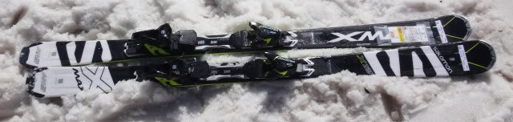
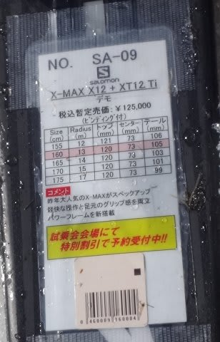
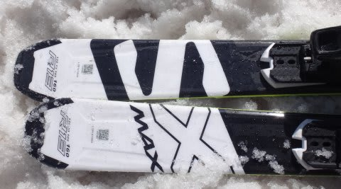

# 2017シーズンモデル，スキー試乗レポート第11回…SALOMON編その３

📅 投稿日時: 2016-06-01 02:41:50

ダメだ…

今日もご無体時間に帰宅なので．

1機種のみ．

サロモンの1台です．

これと，あともう1台で一の瀬で試乗した板は終わりです…

では，どうぞ～！

○SALOMON X-MAX X12 160cm

エキスパートオールラウンド用．

昨年は1種類だったX-MAX.

今シーズンは，X-MAX6，8，10，12の4種類になったようで．

…来シーズンのX-MAX10が，今シーズンのX-MAXに

匹敵する，ということですが…

実際は，去年のX-MAXは12に近いんじゃないかな？

とりあえず，履いてみたところ…

すごく軽い！

良くたわみ，良く曲がる．

傾けると，サイドカーブに乗ってスーッと曲がり，

その遠心力で自動的にたわみが出て，さらに

ターンが深くなっていく感じ．

誰でも簡単にたわませられ，

たわみに乗ってきれいに回ります．

160cmだからか，回りすぎってくらいクルクル回ります．

軽い板だけどエッジグリップはしっかり強く，

きれいにレールターンができます．

レールターンから板がたわみだし，

オートマチックにたわみに乗った

深いターンが描けます．

ターン弧は傾きで調整できます．

エッジグリップに乗った滑りがメインだけど，

軽いので振り回しやすく，ずらしても滑れる

自由度があります．

ただ，スピードを出していくとたわみすぎて

クルクル小さく回っていくし．

160cmって長さもあるけど…高速耐性はちょっと疑問か？

今シーズンのX-MAXでもそうだったけど，

170cmくらいを履けば，高速でも大丈夫なんじゃなかな．

軽いのでコブでも良さそうだし，

ある程度のスピードを出して滑りたいけど，

体力は使いたくない…という人にいい感じの板です．
