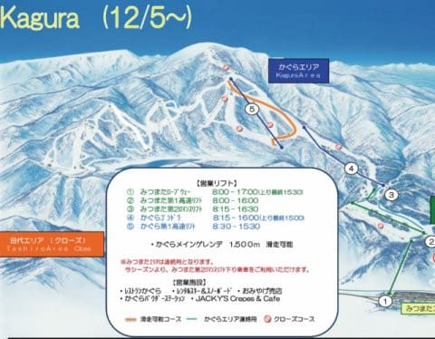
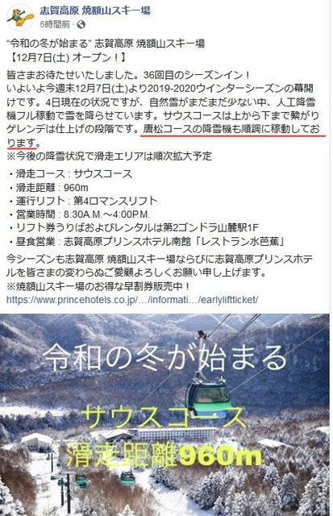
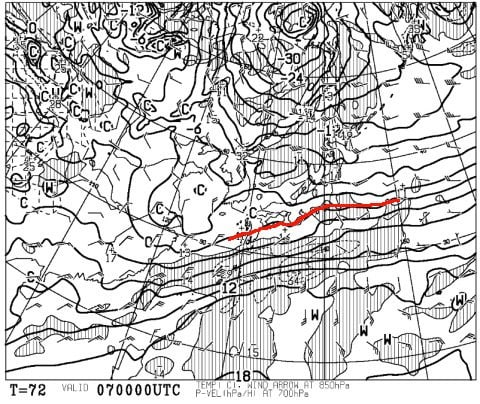
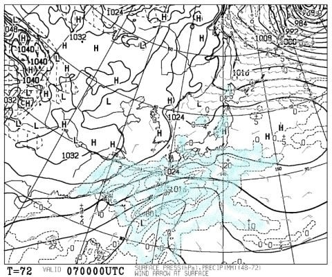
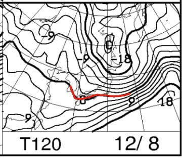
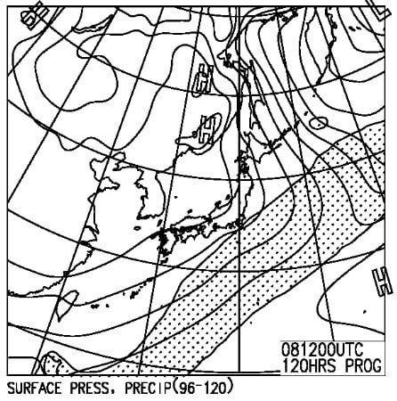

# 12月7,8日の週末の志賀高原スキー場の天気は？…そこそこ冷えて，土曜は曇り，日曜は晴れ～曇り．積雪の積み増しは無いけど，人工雪は打てるよ！

📅 投稿日時: 2019-12-05 01:29:34

🏷️ カテゴリ: [スキー天気予想](c6554f5c3c106093b511a8daae23757e8.md)

えー．

昨日の記事で．

4日，5日は新潟方面ではちょいと

積雪がありそう…

と書きましたが．

4日の昼間は降雪が無かったようです（涙）

でも．

夜から降り出して，明日までに

積もりそうなうえ，

人工降雪の積み増しもあったので，

かぐらは明日から，クワッドリフト

再開のようです！

（[かぐらHP](https://www.princehotels.co.jp/ski/kagura/winter/)より）

丸沼も無事5日にオープンのようですし．

…そして，我がホームゲレンデの焼額も，

今週末に向けて，第4ロマンスリフト沿い，

サウスコースの人工降雪は順調なようです…

（[焼額山FB](https://www.facebook.com/yakebitaiyama/photos/a.533933973368620/2558792287549435/?type=3&theater)より）

…赤下線部分に注目すると．

なんと．4ロマだけじゃなく．

ちゃんと第2高速リフト沿い，

唐松コースでも人工降雪を開始しているようです！

…今週末までに，第2高速も動いてくれると

嬉しいんだけど…

ただ．

やはり西風が強すぎて．

4日夜～5日にかけて，新潟は降りそうですが，

志賀高原は積もらなさそう（涙）

…でも．昨日の予想通り．

5日夜くらいから6日にかけて，

積もってくれることを期待…！！！

ってなことで．

昨日は週末までの天気を予想しましたが．

本日は，週末の志賀高原の天気を

予想してみましょう～！

えー．

まず，7日土曜日の850hpa気温を見てみると…

ふむ．

赤い0℃線は太平洋側まで

南下していて．

志賀には-3℃線がかかっているので．

6日までの激冷えよりは気温が

上がりますが．

この日，雨の心配はなさそうですね…

で，土曜の地上天気図を見ると．

うーーむ．

南からちょいといやらしい降水域が

近づいてきてますね…

とはいえ，志賀高原に降水域は

かかってないので，この日は終日

曇り空というところでしょうか．

まぁ，降ったとしてもこの日の

気温なら雪だろうから，

大丈夫かな…

で．

日曜8日の850hpa気温を見てみると．

この日も赤い0℃線は，太平洋

近くまで南下しており，志賀は

-3℃線がかかる程度．

まぁ，ぼちぼち冷えてる感じ…

そして．日曜の地上天気図は…

降水域の網掛けは志賀高原に

かかってないので．

この日は曇り～晴れ，という

感じかな…

だもんで．

まとめると．

7日(土)：朝の道路は，前日の雪が残る

　積雪路，真冬の道．

　朝イチの気温は-5℃程度と

　そこそこ冷え，昼間は0℃

　前後まで気温が上がるか…

　天気は朝から曇り．終日曇り空．

　午前中は時折雲の間から

　日がこぼれることも

　あるかもしれないけど，

　午後は雪がちらつくかも…

　雪質は人工雪に，わずかに6日に

　降った天然雪が混じる．

8日(日)：朝は-5℃以下に冷え込む．

　昨晩からの積雪は無し(涙）

　なので，朝イチは人工降雪が

　圧雪された，締まった固めのバーン．

　昼間もそれほど気温が上がらず，

　雪はそんなに緩まない．

　天気は朝のうちは曇り，

　午後は晴れ間もあるかな．

　午後になると，急斜面部は

　硬い人工降雪の下地が出てきて，

　ところどころツルツルになるかも…

ってな感じの予想です．

ううううーむ．

とりあえず，土日とも，全く積雪が

なさそうですが…

まぁ，冷えてくれるので，土日とも

人工降雪はフル稼働可能！

気温が上がらず，雪が解けることは

なさそうなのが救いかな．

しかし．

土日が吹雪の悪天候になってもいいから，

積雪が欲しい…（切実）

## 💬 コメント一覧

### 💬 コメント by (オバチャンスキーヤー)
**タイトル**: Unknown
**投稿日**: 2019-12-05 09:25:46

はじめまして。いつもこっそり コメントもせずに読み逃げしてました。失礼してましたm(__)m

今日は 志賀高原の奥志賀に外資系のメルコリゾーツが入り開発されるというニュースを知り なんだか 志賀高原もニセコのように なってしまうのかと ちょっと心配してます。

焼額からのあの秘境感が 好きだったので残念です。

### 💬 コメント by (若杉勲72)
**タイトル**: Unknown
**投稿日**: 2019-12-05 12:21:58

熊の湯な団体800人は.今日の昼で帰りました。

明日は、

う、は、う、は

### 💬 コメント by (おおすぎ)
**タイトル**: Unknown
**投稿日**: 2019-12-05 19:41:50

週末天気予報も、だんだん楽しみになって来ました‼️

でも…

もしかしたら、今週末は、関東南部(東京。神奈川、千葉市辺り⬅️実はわたしの存在地)に降雪の予報が出てきました‼️

関東の方は、当たって欲しくは無いんですが…(数年前に雨からだんだん寒気を引き寄せて、大雪になった天気図と似ているのは、私だけ？！でしょうか…)

### 💬 コメント by (Skier_S)
**タイトル**: 今週末も志賀は積雪が期待できないのか…
**投稿日**: 2019-12-06 01:55:34

＞オバチャンスキーヤーさま

はじめまして～！

コメントありがとうございます．

いつも読んでいただきありがとうございます…

奥志賀，またオーナーが変わったようですね．

しかし，もともと長電⇒中国系資本(？)⇒謎のファンドと

持ち主が変わり続けているので，あまり大きくは変わらないのではと

思っています．

＞若杉さま

明日からゲレンデ混雑緩和ですね．

あとは，明日の朝までに積雪があればよいのですが…

＞おおすぎさま

…予想より雪が少なくてがっくり来てます…

今週末，関東に降雪があるとしてもごく一部，

7日の夜から8日の朝にかけてで，昼間は雨になると思います…

積雪するほどではないと読んでいます．

