# 2023/3/11(土)の志賀高原は…晴天！だけど気温が高く雪はゆるゆる（涙）．4月下旬並みの気温

📅 投稿日時: 2023-03-12 00:09:44

🏷️ カテゴリ: [2023スキー滑走日記](cd943df30cfcc3d0896469e2ff98720cd.md)

ということで．

本日も志賀高原にやってきましたが．

今日は見事な晴天だったけど…

でも，4月下旬並みのザブザブ雪

でした…（涙）

あぁ…季節が進むのが1か月以上早い

感じ…（激泣）

朝はすっきり晴天だったのはいいけど…

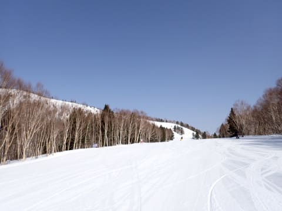

なんてったって，

通常営業開始の8:30の山頂の

気温がすでにプラス(泣)

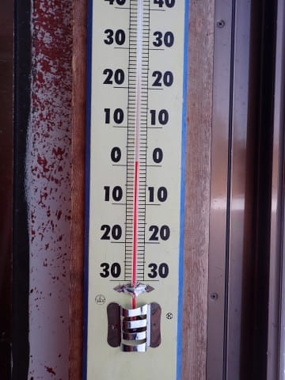

朝イチのシマシマも，ちょいと緩み気味…

というより，表面が軽く固まったのが

ボロボロ崩れていくような，グリップが

弱い感じで．

せっかくの晴れ晴れシマシマなんだけど，

ちょっと快感度が低め…（残念）

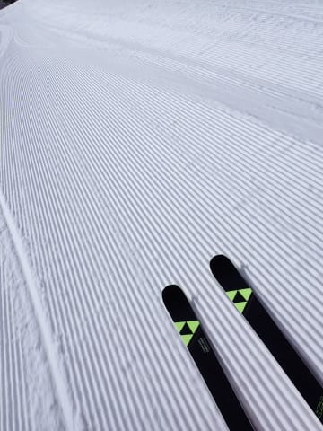

とはいえ．

朝10時くらいまではそこまでザブザブに

なったりゆるゆるになることもなく，

やわらかめながらも，適度にエッジが食い込み

楽しめるバーンでしたが…

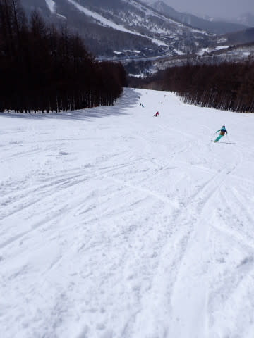

3月上旬の志賀高原の朝と考えると，残念ながら

ちょっと重めの雪でした（泣）

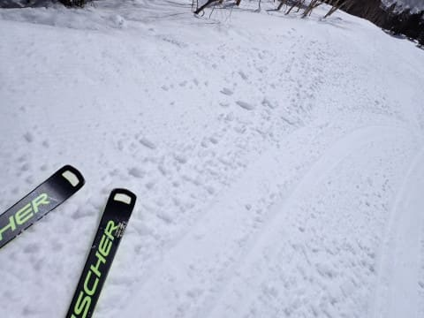

そして，意外とコースの人口密度も

そこそこ高めで…

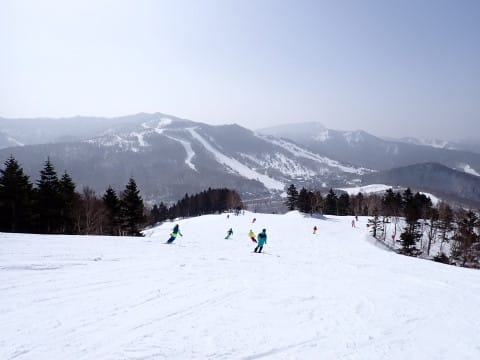

朝10時頃には，焼額第1ゴンドラも

5分くらいの待ち時間が出てきました（涙）

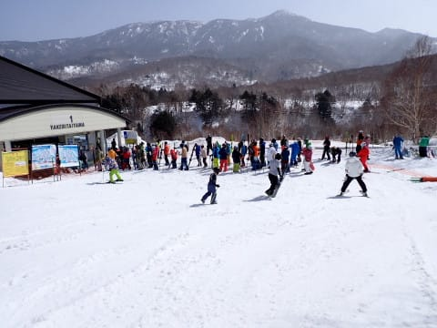

とはいえ，リフトはそこまで混まず，せいぜい

このくらいだったので，混んでる時間の

ゴンドラを避ければ待ち時間少なく

滑れましたよ～！！

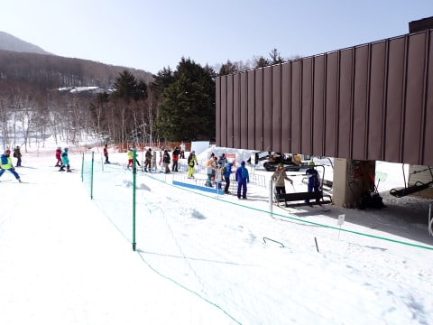

そして．

今日は東斜面の焼額が，強烈な朝日を浴びて

午前中に雪が緩んできたのてしまったので．

焼額の呪いが解けて，今シーズン初めて

焼額を脱出しました…！！

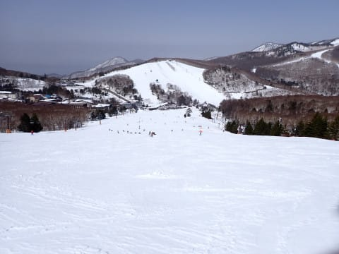

全山共通シーズン券をGetしておきながら，

3月まで一度も焼額を脱出しなかったとは…

とりあえず，寺小屋に脱出してきましたが．

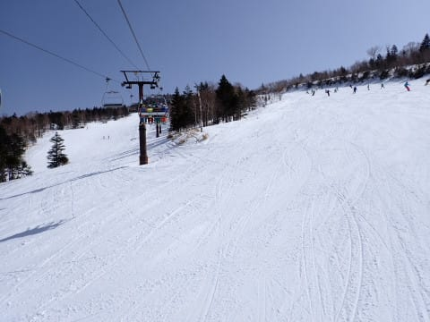

寺小屋は午前中は良かったようですが．

午後1時ごろにはちょっとだけ雪が

緩み始めていて…

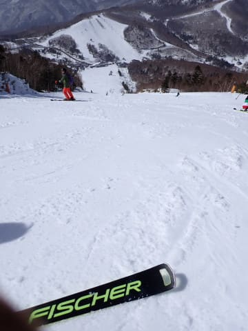

それよりも，リフト待ちが結構すごく．

5分を超える待ち時間になってしまった

ので，潔く脱出．

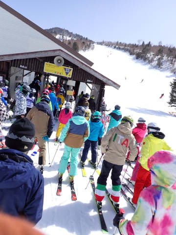

一ノ瀬ファミリーは…

こちらも午前中はカリカリアイスバーンだったようですが．

午後2時には，かなり緩んだ凸凹行雪で，

小回りレーンも数か所発生してました…（泣）

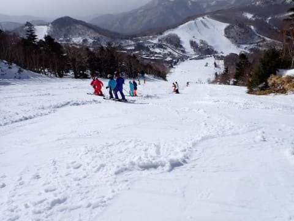

そして．

午後3時過ぎに一ノ瀬から焼額に戻ってくると，

朝日を抹消面で浴びる焼額のほうが雪の

ゆるみがひどかったみたいで．

焼額のコースはかなり凸凹になっています…

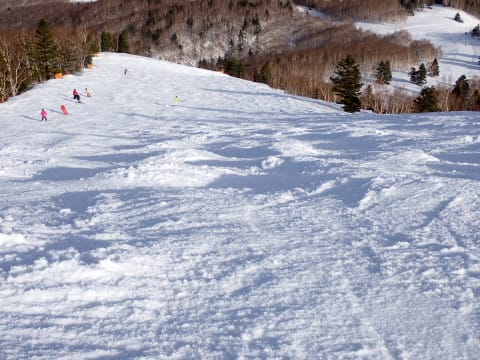

うむ…これはちょいとひどい凸凹…

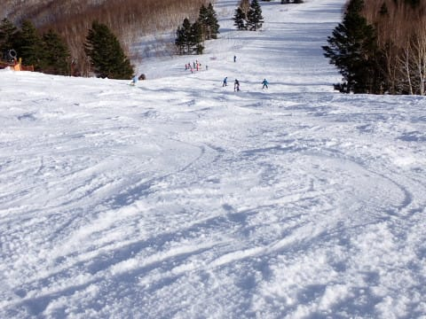

ってなことで．

今日は天気が良く，日差しも強かったので．

こういう日は，やはり焼額はちとバーンが

荒れてきますね…（ちょい泣）

と，夕方費をくれるに従い，ちょいとずつ

硬くなっていく荒れ荒れバーンを苦しみつつ，

いつも通り夕方まで滑ったのでした…

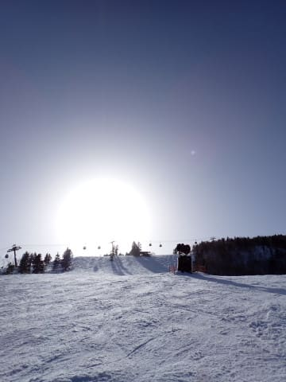

…が．

今日はなぜか．

16:15で終わる焼額じゃなく．

全力で瞬間移動し，一ノ瀬の営業終了の16:40まで，

滑り倒したのでした…

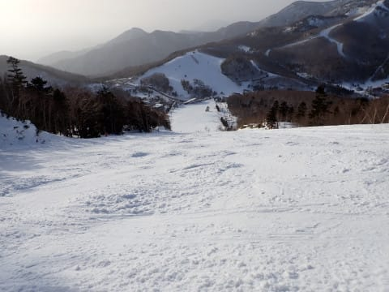

しかし．

明日も今日と同じような，

晴天高温

の予想…

なんてこった…

そろそろドサドサ雪が降ってほしいんですが…

## 💬 コメント一覧

### 💬 コメント by (マルハバ)
**タイトル**: あ～・・
**投稿日**: 2023-03-14 12:06:25

Sさんこの時寺小屋に来てたんですね・・

ウチのクラブがOB大会やってた時みたいですね、

ゼッケン付けた人が見えます。

私は残念ながら午前中のポール練習で一般客と激突負傷して棄権してました。

4年前にもここで自爆、救急車で病院送りになりました。

今回は自力で帰れる程度で済みましたが、次にここへ来るときはお清めの塩持参であります。（涙）

### 💬 コメント by (Skier_S)
**タイトル**: ＞マルハバさま
**投稿日**: 2023-03-16 06:42:30

回答遅くなりました～！

寺小屋では，確かにゼッケンをつけたポール練習してる皆さんがいました…

滑ってらしたんですね！

しかし，負傷しちゃったんですか…

自力で帰れた程度だったのは不幸中の幸いですが，

お気をつけて…

お祓いが必要かもしれませんね（祈）

