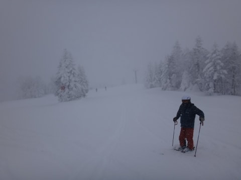
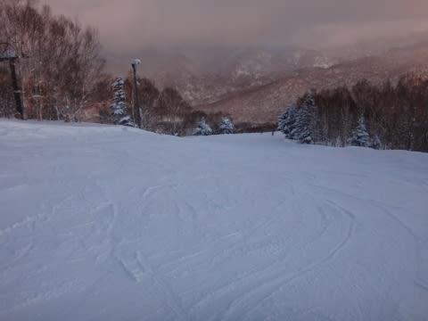

# 12月27日の，志賀高原，焼額山の状況は…夕方まで雪だった…

📅 投稿日時: 2014-12-27 23:52:50

🏷️ カテゴリ: [2015スキー滑走日記](c09ea645cfc085f86dfcd80f49599dd89.md)

えー．

本日も，当然志賀高原に来ているわけですが．

今朝は，予想通りに雪が降り積もる中，志賀高原まで上ってくると…

あれ？？

第2ゴンドラ，また故障で運休？？

うーむ．

この12月だけで，3回目の故障のような気が…

…結局，12時ごろに動き出しましたが．

…そろそろ，第2ゴンドラもやばいかも…

で．

動いている第1ゴンドラで山頂へ上ると，

当然山頂も雪が降り続いているわけで．

気温もマイナス14度と，冷えひえっ！！

圧雪コースも，上に10cmほど新雪が積もっていて，

新雪を蹴散らして，気持ちよく滑れるよっ！！

…これは，新雪をすべりに行かないとっ！！！！

と，オリンピックコースへ行ってみると…

うははははは！

ひざパフだ！

昨日からの積雪は，私の予想は30cmだったけど，

実際は40cmくらいかな？

ってことで．今シーズン初の，本格パウダーだっ！

いただきます～っ！！

深い！ふかいよ！

でも．

ちょっとだけ重めだったかな…

ってことで．

午前中はひたすらオリンピックコースをぐるぐるしてたんだけど…

なんだか．

午前10時半には．

がーん．

ゴンドラ，10分待ち（涙）

第2ゴンドラが動いてないので，ここに人が集中しちゃったか…

でも．

ゴンドラを待ったのは2回ほど．

11時過ぎには，またがらがらに戻ってました．

でも．

今日は，コース上も一日中，人が多めで．

うーーん．

先週までが，良すぎたなぁ．

今週からはもうトップシーズン．

こんな人口密度が続くんだろうなぁ…

で．

オリンピックコースは，12時近くまで，結構パフパフが残っていて…

午前中たっぷり，パフパフが楽しめるのはいいけど．

…

…おかしい．

予想では，そろそろ雪がやむはずなんだが…

結局，この日は，午後に薄日が差すタイミングもあったものの．

午後も雪が降り続け，

結局晴れたのは，4時近くでした（涙）

まぁ，午後に晴れる，という予想自体は外れていないとしても．

しかし，予想より3～4時間，晴れるのが遅かった…

…今回の天気予想，ちょっとはずしたか…（残念）

でも．

午後に向かって，ゲレンデがぼこぼこになっていくという

予想に関しては，残念なことに当たってしまい．

午後はかなり体力を消耗するバーンだったなぁ…

と，言っておきながら．

ナイター照明がつく，午後5時のリフトストップまで滑ってしまい…

それだけじゃなく．

ええ．行っちゃいましたよ．

皆さんの予想通り．

ナイターへ．

…とりあえず．

今シーズンの私の初ナイターは，

シマシマの超最高の超快楽の脳内麻薬でまくりバーンで．

最高のナイターでしたよっ！！！

って感じで．

今日は，昼間に日が差さなかったのはちょっと残念だったけど．

朝の新雪からナイターのシマシマまで，たっぷり楽しめて．

結構おなかいっぱい楽しんだ～…って感じになれた，

一日だったのでした…

＃帰りの車の温度計が-17度…ナイター，寒かったわけだ．

