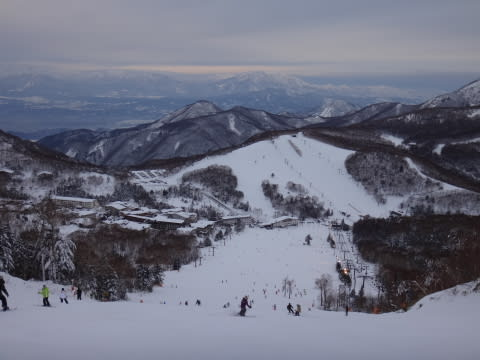

# まだ続く，１月3日の志賀高原は…終日晴天っ！コンディション最高っ！

📅 投稿日時: 2014-01-03 21:57:26

🏷️ カテゴリ: [2014スキー滑走日記](c992167609b6415052179ee69ea1ea7d8.md)

志賀高原に住んでるんじゃないの？

と思われてそうな，Skier_Sです．

もうそろそろ皆さん飽きてるころかもしれませんが…

まだ続く，志賀高原レポート．

…の前に．

あした，あさっての志賀高原の天気を簡単に．

…4日の志賀高原は．

…かなり微妙ですね～．

天気図的には，雪雲が流れてきて，雪がちらちら降りそう

なんですが…

もしかすると，風向き的には晴れ間も覗く可能性も．

うーん．微妙だ．

とりあえず．

終日曇り，時々雪がちらつく，って程度にしておきますか．

気温は昼間も氷点下なので，雪質の心配はないでしょう．

朝イチはきれいな圧雪，午後にぼこぼこになるパターンかな．

あさっては，午前中は雪が残るかもしれませんが．

昼前後から，晴れそうですね．

気温は低め．

この日も，終日雪は良いでしょう．

って感じで．

本日の志賀高原のレポートをば…

…でも．

実は本日．

いろいろな大人の都合(笑)で，朝イチに出遅れて．

11時ごろからの滑走開始となりました…

そーゆー日に限って．

朝からすごい晴天で．

…朝イチは，すごい良かったに違いない…

むちゃくちゃ良かったに違いない…

楽しかったに違いない…

って感じの，晴天＆ Goodコンディション．

あーーー．

朝イチから滑りたかった…(涙）

しかし．

そこはぐっとこらえて．

11時から焼額第1ゴンドラをぐるぐるします．

ピークの11時ごろでも，ゴンドラ待ちはほとんどなし．

昼間は日が射して，ちょっと暑く感じるくらいだったけど．

でも，昼間でも，気温はマイナスだったので．

（12時の山頂温度計)

雪質は今日もいい感じっ！

…でも．

やっぱり，昼すぎには，コース全面凸凹になってきてるなぁ…．

まぁ，雪が冷えてていい感じだし．

凸凹もこの程度で，それほど気にならなかったけど．

…でも．

コース上の混雑は．

この正月休みで一番だったかも．

（一の瀬ダイヤモンドから見たファミリースキー場） 

大晦日，元日は滑る人が少ないけど．

3日あたりになると，そろそろ滑りに行こうか…

という人が出てくるんでしょうかね～．

まぁ，朝から天気が良かったってのが，大きいでしょうね…．

…しかし，どのリフトもほとんどリフト待ちはなかったので．

混雑って言っても，まぁ許せるレベルですが．

ということで．

今日は終日晴天で，雪質もよく．

超Goodコンディションな一日で．

たっぷり日暮れまで滑ったのでした～！

…朝から滑りたかった(ぼそり）
