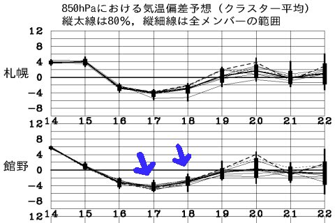
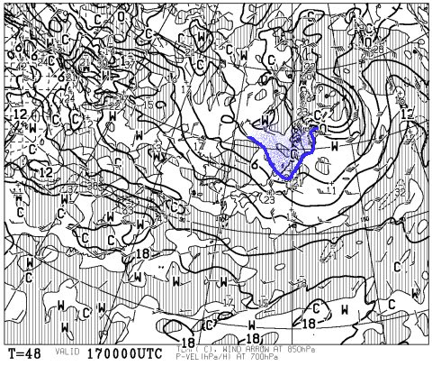
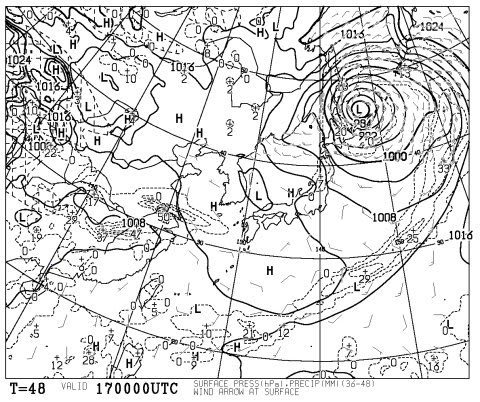
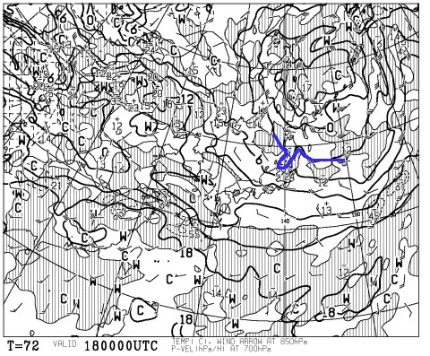
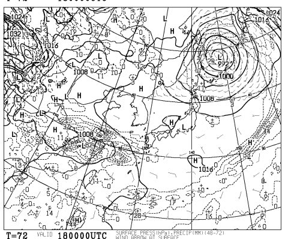

# 今週末のかぐらの天気は…この時期にしては，冷えそう！

📅 投稿日時: 2014-05-16 01:42:22

🏷️ カテゴリ: [スキー天気予想](c6554f5c3c106093b511a8daae23757e8.md)

えー．

今週末は，土曜にかぐらに出没しようと考えている，

Skier_Sです．

ってことで．

おそらく．

もうほとんど読者がいないであろう，

この週末の，スキー場の天気予想をば…

＃読者がいなくても．待っている人がいなくても．

＃自分だけのためであっても．

＃それでも，予想をするっ！なんて偉いんだっ！←別に偉くないから

えーっと．

ふむふむ．

…

…ん？

うむむ？？

…これは．

850Hpa気温予想を見ると．

冷えます．

冷えますね．

例年より4度くらい低くなりそうな感じ！

で．

土曜の朝9時の850hpaの気温図は，こんな感じで．

…この時期としては低めの，3度線がかぐらや志賀を

覆ってますよっ！

おそらく．

17日の朝．

ゲレンデは凍りかけて，結構しっかり締まった

バーンになる可能性が…！

いや．

それどころか．

16日の深夜には，ちょっと雪がちらつく可能性も…

まぁ，17日は終日，気温がそんなに上がりません．

で，地上天気図はこんな感じなので…

晴れそうですね～．

18日の日曜日も，こんな感じで．

850hpaの3度線が，かぐら近くまで伸びてます．

まぁ，土曜よりは気温は高めですが．

朝は割と締まり気味のバーンになるかな～．

日曜日も地上予想図を見ると…

うむ．

晴れそう．

ってことなので．

土曜日：朝のうちちょっと雲が残るかもしれないけど，晴れ．　

　気温は低く，朝は寒いよ！朝イチは，山頂で0℃近くにまで

　冷えてるかも．

　朝から滑る人は，ウェアのジャケットをもっていった方が

　いいかも…

　昼間も，例年よりは寒め．

　昼間はさすがに雪は緩むけど．

　朝はしっかりバーンが締まって．

　まぁ，いい感じのスキー日和でしょう．

日曜日：朝から晴れ！

　朝の気温は例年より低めだけど，5度程度かな．

　土曜ほどは冷えないよ！

　昼間は10℃近くまで上がるので，そこそこ

　暑いくらいに感じるかも．

って感じでしょうか．

まぁ，土曜の朝は，今シーズンラストの

ちょっと固めのバーンを滑れるチャンスかな？？
