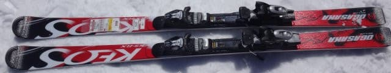
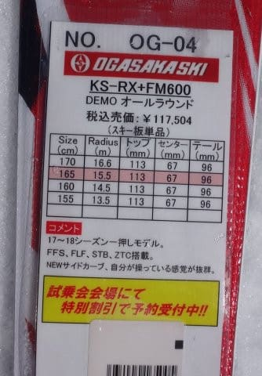
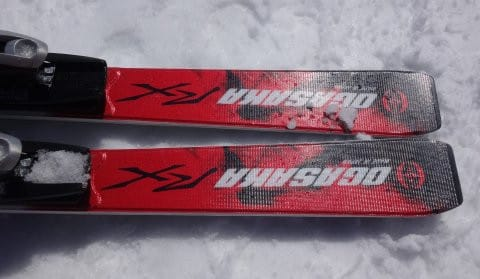
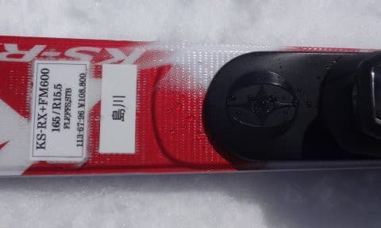
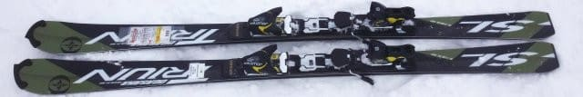
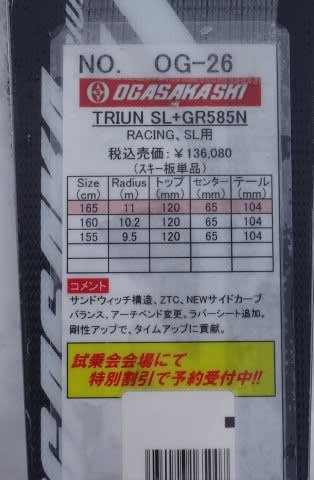
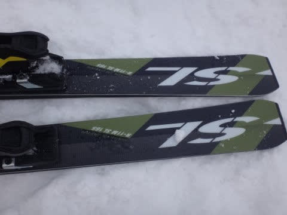
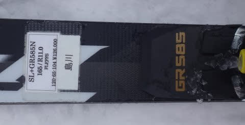
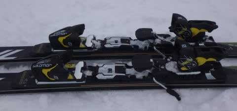

# 2018シーズンモデル，スキー試乗レポート第8回…OGASAKA編その2

📅 投稿日時: 2017-05-12 01:48:53

🏷️ カテゴリ: [スキー板試乗](c0bd8048615710cee890e403a36cc9a2b.md)

ということで．

やはりこの土曜は，朝から雨降りに

なってしまいそうな今日この頃，

皆様いかがお過ごしでしょうか．

で．

スキー三昧の日々を過ごしたGW中．

読者が飽きるんじゃなかろうか？？

と思うほどの，連日怒涛の志賀高原レポート

が続いたため．

しばらく中断していたスキー板試乗レポート．

復活です…！

本日は，オガサカ編です．

では，どうぞ～！

---

○OGASAKA KEO'S KS-RX+FM600プレート　165cm

基礎オールラウンド

オガサカのエキスパート向けモデル，KEO'sの

上級モデルRX．

これに弱めのFM600プレートを付けたモデルになります．

弱めのFMプレートというのもあり，

エッジがどうしようもなくがっつり効く感じではなく，

どちらかというと動かしやすさ・ずらしやすさを

主体に，エッジを食わせようと思えばエッジに乗って

行くこともできる…という感じ．

しっかり抑えていけばカービングするけど，

プレートが弱めってのもあり，

トップスピードでガンガン攻めると，エッジが

ちょっとじりじり逃げていく感じを受けます．

165cmとショートターン向けの長さですが，

サイドカーブはR15.5と比較的大きく，

気持ちよいのは中スピードのミドルターン．

板は動かしやすいので，板を動かして迎え角を作って

いっての小回りも問題なく行けます．

がっつり飛ばすわけでないけど，時々そこそこの

スピードで気持ちよくカービングもしたい…

という人にい板かな．

そんなにガツガツ滑るわけでない人が，

オールラウンドで使うには，疲れなくていい感じの

板でした．

OGASAKA Triun SL+GR585プレート　165cm

SL競技用．

SL競技用のTriunSに，

最も強いGR585 プレートを組み合わせた，

この板ですが．

サンドイッチ構造だけど，

サイドウォールを見ると，板の厚みが

かなりあって，

見た目からも分かるほど，フレックスがかなり強く．

さらに，かなりずっしりした重みもある板です．

重く，強い板なので，安定感が半端なく．

小回り板と思えないほどのどっしり感．

山回りでテールに乗っていくと，しっかり

エッジグリップしてぐぐぐっと回っていく．

ガッツリエッジグリップマシン．

ちょっと傾け始めたところから，

エッジにのってオンザレール感覚できれいに

気持ちよくするする回っていき，

荒れた斜面でもどっしりした安定感から，

オンザレール感覚で，エッジに乗って

ゲレンデを切り裂いていきます．

ただ，フレックスが強すぎるので，柔らかい雪で

はたわませられない感じ．

本来，谷回りでがっつりトップを抑え込んで

たわませていく板なんだろうけど，

自分の技能＆この日の雪では，この板を

たわませることができず，本来の性能を

発揮させられていなさそうな感じ…

でも，

この強さゆえ，どこまでもスピードを出しても

耐えそう．

スピード耐性はすごく高いです．

かなりレベルの高い，ガッツリエッジグリップの

超ハイスピード小回り～中回りマシンでした．

## 💬 コメント一覧

### 💬 コメント by (茶色いねこ)
**タイトル**: Unknown
**投稿日**: 2017-05-14 12:31:56

はじめまして。偶然現れたので、今日初めてブログを拝見しました。普通の人から見たらバカじゃないの⁉と思える滑走日数にすごいなぁとうらやましさを感じます。私は雨の日は滑らない程度のスキーヤーです。もし、良かったら教えて下さい。試乗会で注文すると普通に夏頃買うより安く買えるのですか。(ｵｶﾞｻｶが買いたい訳ではありません。)

### 💬 コメント by (Skier_S)
**タイトル**: 茶色いねこさま
**投稿日**: 2017-05-16 02:11:24

ようこそ，我が駄文置き場へ…

かなり濃い人たちが集まる志賀高原ですので，

私などはまだアマちゃんです．

滑走日数100日とか，シーズン滑走標高差100万m越え

とか，人間と思えない人たちがいっぱいいます．

ちなみに，Alpenでの試乗会での購入時．

モノが届くまでに，他店でより安い価格が

あった場合，そのレベルまで落としてくれる

とのことだそうです…

その他，商品券などが出たりするので，

結果的に夏に普通に買うより安くなるかと．

### 💬 コメント by (茶色いねこ)
**タイトル**: Unknown
**投稿日**: 2017-05-21 09:29:06

参考になりました。

ありがとうございます(=^ェ^=)

でも、試乗会場が遠かったらﾁｬﾗですね(^_^;)

私は試乗しても違いがよくわからないかもしれないので。

### 💬 コメント by (Skier_S)
**タイトル**: 茶色いねこさま
**投稿日**: 2017-05-21 21:27:23

試乗会は，参加してみると

面白いものですよ～！

自分の知らない発見ができたりして…

また何かありましたら，コメントください！

引き続きのご愛読お願いします…

