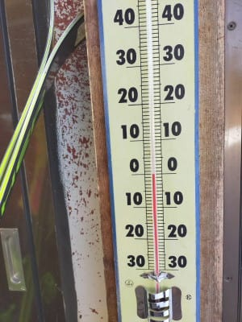
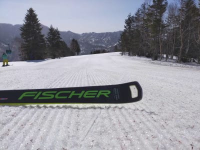
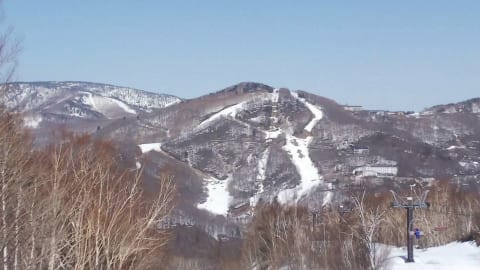

# 本日で焼額第1ゴンドラ終了(涙）．西舘，東館，ブナ，丸池蓮池サンバレーも終わったよ…

📅 投稿日時: 2021-04-01 04:03:32

えー．

本日3月31日をもって．

我が住み家，焼額第1ゴンドラが

終わってしまいました(涙）

私が今シーズン最後に1ゴンに乗れる日と

なるはずだった，

[先週の日曜は強風で運休](ea958e2bee5068545fe7e6203c804e311.md)となり，

不本意な今シーズン最後のお別れとなった，

第1ゴンドラですが．

今シーズンは．

かつてこれほど1ゴンに乗らなかった年は無い

というシーズンでしたね

そもそも志賀高原に来てない時期も

長かったし．

さらに志賀に来ても，乗車人数制限のために

激混みだった1ゴン．

昼間はほとんど他のリフトに

逃げてましたからね～．

普通のシーズンなら，

1シーズンで600回くらい乗って，

1ゴンのシーズン乗車回数の１，２位を

争う私が．

今シーズンは100回も乗ってないかも．

普通のシーズンなら，多い日で

一日だけで35回くらい乗車することも

ある第1ゴンドラなのに…

それくらい，今シーズンは1ゴンに乗らない

年でした…

あぁ．

来シーズンは乗車定員制限が解除されて．

ガンガン1ゴンに乗れるようになって欲しい…

ということで．

本日，ラストの焼額第1ゴンドラに乗ってきた

特派員からレポートが送られてきました！

…まず．

朝から見事な晴天！

…って．

今日はおこみん特派員，大量の

おこみんを連れての撮影だったようです(笑)．

親子のおこみん一家でしょうか？？

あさイチの1ゴン山頂気温は0℃．

…この温度計とも，今日でしばし

お別れですね…（涙）

で．

放射冷却で早朝は冷え込んでたらしく．

ゲレンデはかなりの硬さに仕上がっていた

ようです！！

ただ，あさイチのガチガチアイスバーンは

すぐに緩み始めて，いい感じに

なってきたみたいですが…

逆に10時半ごろには緩みすぎたようで，

ちょっと快感度が落ちたのかな．

寺小屋方面は昼近くまで締まっていた

ようですが…

さすがに晴天の日差しで，昼を過ぎると

雪も緩み．

人工降雪の無い寺小屋は，残念ながら

例年最初に雪がはげる部分，もう

雪が解けて穴が開きかけてきたみたいです…

早い…

まだ3月なのに，寺小屋で穴が開くって，

ちょっと早くないかい？？

そのほか，一の瀬も昼には緩んでしまい．

パーフェクター上部にも，土が出始めて

来ちゃいましたよ…(泣）

で．

本日で終わりの東館．

これも，最後のジグザグコース

部分はもうかなり土が出ちゃってるし．

ジャイアントから西舘方面を眺めると，

…これはもう結構土が出てますね(涙）

ただ，北斜面のジャイアントは，まだ

土が出て来てませんね！

そして，サンバレーから見る

ビワ池も，もう氷が完全に解けてますね…

サンバレーも，もうかなり土が出てきてますが．

まぁ，今日で営業終わりですから…

ってなことで．

ラストは特派員たちがラストのイチゴンを

惜しむために焼額に集まったようですが．

昼間の気温は+8℃くらいまで上がった

ようで．

これだけ気温が上がって．

かつ晴天の強烈な日差しが降り注いだ

ので．

GSコースはもうかなり緩みきってますね…

かなりザブザブな感じ(泣）

さらに，この日差しで．

GSコースの最下部，ゴンドラの下を

くぐっていく狭い急斜部分．

雪がかなり解けてしまい…

この部分は，営業終了を待たずに

閉鎖になったようです（涙）

とはいえ，それ以外の部分は

まだ完全に真っ白で．

オリンピックコースも，まだまだ

全然余裕で滑れる積雪量です…

これで，今日で終わりとは…

もったいない！

もったいなさ過ぎる！！！！

絶対もったいないお化けが出るぞ！！！

せめて春休みの今週末までやって

ほしかった…

ってなことで．

もったいないお化けが大量に襲って

きそうな，まだまだ雪がたっぷりある

余裕で滑れるバーンを惜しむかのように．

特派員の方々は，今シーズンの1ゴン営業

ラストを見届けるべく，最後までしっかり

滑ってきたようです…

ということで．

今シーズンは例年ほどではなかったとはいえ．

焼額第1ゴンドラ，お世話になりました！

また来シーズン，戻ってくるよ！！

## 💬 コメント一覧

### 💬 コメント by (レインボー73)
**タイトル**: Unknown
**投稿日**: 2021-04-01 11:41:44

木曜日の志賀高原情報

朝の上林見忘れ　蓮池２℃。１号トンネルの手前だけがしっかり凍っている。０℃前後の時は、特にトンネルは気をつけましょうね。

2ゴン上3.5℃。パノラマの壁以外は、カラマツも硬め。サウスがこんなに快適なのは記憶にない。（記憶は常にとんでるから）。

ダイヤモンドも硬めとの情報も。

パノラマ、サウスにはまた別の団体が。

白樺の真っ白な雪が、パノラマにまかれて有効活用されてる。お疲れさまです。

4ロマも休止なのでゴンドラ待ちが。私の前は５人で５籠。超早上がりして山菜でも採ろうかなあ。

そう思っていたら友人から『妻が転倒。不発弾は処理不能の可能性あり』という重大連絡が。

折れていなければいいのですが！

### 💬 コメント by (うえいと)
**タイトル**: Unknown
**投稿日**: 2021-04-01 12:20:48

ダイヤモンド冷えて硬め。しかも珍しくポールバーン専有が真ん中ではなく初中級側に！

2本で緩み始め焼額山へ。二高降りて下るとイチゴン休止の看板なく連絡側へ滑うとする人も。危うく降りそうになり後ろを止めるも相方ネットに玉砕。

看板はもっと手前に出さないと危険です。

### 💬 コメント by (アリス)
**タイトル**: Unknown
**投稿日**: 2021-04-01 16:31:59

S様

本日より、志賀高原参戦しています🎵

朝イチは、オクシースタート、やケビ、高天ヶ原と車で移動しながらです🎵

10時過ぎると、かなりバーンが荒れて来ますが充分満足しています☺️

自己流の、妖怪対策の効果が出て自己満足しています🎵

### 💬 コメント by (新米パパ)
**タイトル**: Unknown
**投稿日**: 2021-04-01 21:46:56

いつもブログありがとうございます。

って、、1日ゴンドラ35回って、

可能なんですか？

1回券で計算すると38500円分かあ。

シーズン券、2日で元とれるんですね？！って、、

出来るかー！笑

### 💬 コメント by (レインボー73)
**タイトル**: Unknown
**投稿日**: 2021-04-02 15:33:59

金曜日の志賀高原情報

朝の上林７℃　蓮池５℃、2ゴン上５℃。暖かい晴天。

パノラマ、カラマツはやや硬めの極楽。何本もこの状態を続けてくれい！

願い空しく一本ごとに快感度がトーンダウン。また寺子屋だ！

いつものように10時寺子屋。でも、フェンスが！

寺子屋も土日だけなのか！

がっくり肩を落としてファミリー二本。だけどいいぞ！丁度いい硬さ。凹凸はないし合格点をえげよう。

タンネはやっぱりストップ。ところが高天が意外といい。

銀嶺のご主人によると、高天は来週から平日運休、土日だけだって。だから銀嶺も右にならえ！

私のような身分ともなると（貧民街の育ちですけど）、平日の贅沢に慣れきっているので、これだけ寸断されたらもはや未練はないかなあ。まもなくエス様や皆様とも永の別れだあ。お騒がせしました。

でも、いいことが一つだけ。昨年あれほど増殖した妖怪板つかみが、コロナに弱かったのか、妖怪ホイホイにやられたのか、二つに一つ？？？

今日も巡り会えませんでした。ですから、悪条件を当たり前に思っておられる週末スキーヤー様なら、妖怪がいない楽園を、さぞかし満喫できることでしょう。

西たての連絡橋も閉鎖してました。明日からは大阪の指導員研修もあります。早めのヤケビ脱出が得策かと、

午後は高天を二本。このゆるゆるは、昨日の山菜採りで疲れたももにこたえます。

狙いのパーフェクタは、ポールがセットされたままの休憩。今日はあきらめました。

そしてレインボーまで１時間も残して、失格スキーヤーは去っていったのであります。

### 💬 コメント by (Skier_S)
**タイトル**: コメント回答遅れました
**投稿日**: 2021-04-02 21:24:47

＞レインボー73さま

妖怪板掴みがあんまり出てないようで，良かったです…

実は私が妖怪ホイホイを仕掛けておきました!（噓）

で．

しかし，そろそろシーズンも終わりですね．

レインボーさんのレポートが見れなくなって寂しがる人がたぶん1000万人くらいいますよ（笑）．

＞うえいとさま

コメント回答遅れました…すみません．

イチゴン運休看板，かなり手前に出しておかないと

サウスから勢いつけて突っ込む人いますよね…

注意しないといけませんね．．．

＞アリスさま

日曜まで滞在ですか？

土曜はヤケビスタートの予定なので，焼額でお会いしましょう！

＞新米パパさま

35本は普通に可能です…

ちょっとでも休んだら負けですが．

奥志賀ゴンドラは一日48本乗車の記録がありますし，

焼額も早朝からで第1ゴンドラ乗車一日で47回の記録保持者がいます…

