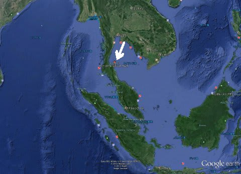
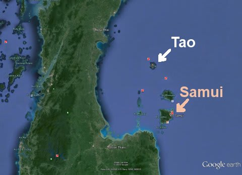
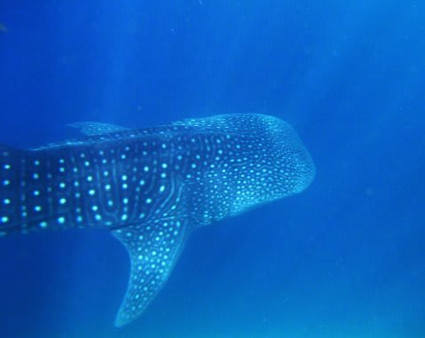
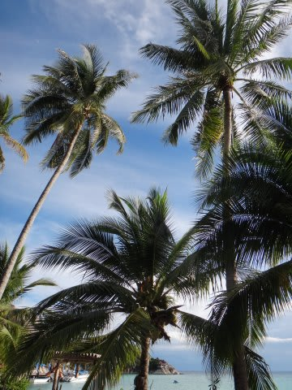
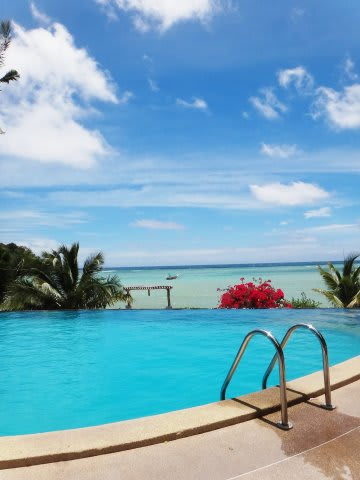
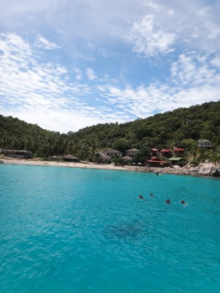

# 2013年9月　子連れタイ・タオ島ダイビング旅行記　プロローグ

📅 投稿日時: 2013-09-30 00:25:55

タイ，タオ島．

…そこは，マレー半島の東側，タイ屈指のリゾートであるサムイ島から，

さらに船で約2時間ほど行ったところに浮かぶ，周囲20kmほどの小島．

ダイビングで知られたこの島は．

そこそこの確率でジンベエザメを拝める

という事実でも有名な島．

かねてより，

「ジンベエみたい～！」

と言っていた，妻．

子供が生まれてからは，あきらめの境地に入っていたけど…

我が家の子供も5歳になり，

シュノーケリングをマスターした娘は，一日中ダイビングボートの

上に乗せていても，暇をもてあそぶこともなくなって．

ダイビングボートに一緒に乗船させてもらえさえすれば．

どこに行っても大丈夫…

と，子連れダイビングの行き先の自由度がかなり広がった今年．

そろそろ，ジンベエを見れる海に行けそう…

と思ったらしい妻は．

なぜかいきなり，かなり重度の

『突発性ジンベエを見たくてガマンできない病』

を発症したのだった…．

＃『突発性ジンベエを見たくてガマンできない病』とは，

＃有効な治療薬や対症療法はなく．

＃海で本物のジンベエを見るしか治療法がないという，難治な病気なのだ…！

妻は，この病気発症以降．

もう，それはそれは．

いろいろとジンベエにまつわる情報をかき集め．

ジンベエが出ると言う海のショップやら，ホテルやらの

Webページをひたすら見まくり．

「じんべえ…じんべえ…」

とつぶやき続ける毎日．

…で．

今年の夏休みの日程が決まると．

一も二もなく，かねてからの既成事実でもあるかのように．

行き先をタオ島に決定，

日本人向けのダイビングショップで，子連れ乗船可能と言う

ダイビングショップまで探し出し．

いつもとは全く違うありえない手際よさで，

すべてのブッキングを完了してしまっていたのだった…

…しかし．

…なんだか．

タオ島って．

透明度もそんなによくなくて．

サンゴもそれほどきれいではない，

という印象が，私にはあるのだが…

まぁ，ジンベエが見れるのなら．

それらも許せるか…

ということで．

子連れ海外ダイビング旅行も5回目となる今回．

ジンベエ様は．

我々の前に姿を現してくれるのか．

妻の「突発性ジンベエを見たくてガマンできない病」

は，完治するのか？

…果たして．

海の神様は，我々に微笑んでくれるのかな？？

と言うことで．

子連れタオ島ダイビング旅行記の．

はじまり，はじまり～
