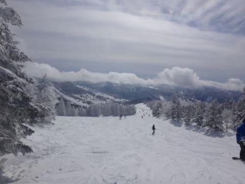

# 2月18日（土）の志賀高原は…曇りのち晴れ．冷え冷え，意外と雪は良かったかな…夜は降ってます！

📅 投稿日時: 2017-02-19 00:39:51

えー．

昨日も睡眠3時間で出発し．

今日もナイターまで滑った後

今までみんなで酒を飲んでいた

Skier_Sです．

…眠い…

…でも．

でも．

ちゃんと今日のレポート更新！えらい！！←自分でほめておく

とりあえず．

金曜は雨降りだったとのことなので．

中野の町中の道路は積雪なしでしたが．

上林のチェーンチェックから先は，

完全雪道．

それも，たちの悪い「高温で融けた氷の上に雪」

という大変滑りやすいコンディション．

途中，息絶えている車多数…

で．危険な雪道を無事登り終えて．

焼額のゴンドラ山頂に登ると…

朝の気温はマイナス10℃ですか．

ゲレンデは，おそらく昨日の雨でやられて．

それがこの-10℃で冷やされた．

カチカチの悲惨なバーンかな…？

と．思ったら．

上に10㎝程度の新雪が乗っており．

その新雪がきれいに圧雪されて，シマシマですね…

いや．

シマシマ…！

いやーー！

これはいいんでないかい？？

…と，焼額第1ゴンドラをぐるぐるしますが…

10時ごろには．

あれ．

ありゃ．

人が…

ゲレンデ上の人が，

おそらく今シーズン最高レベルに多いよ！！

ちょいと快適度は低め…（涙）

ただ，ゴンドラは駅舎の外にわずかにはみ出るか…

というレベルで．

ゴンドラ待ちはそれほどじゃなかったのが

救いだけど．

うーむ．

なぜかゲレンデはかなりの混雑に…（涙）

長野県民向け割引チケットが新聞折り込みに入っていた

らしく，それが原因で今日は混んだのでは…？？

という話もあったけど．

でも．

人は多めだけど．

昼間も最高気温は-5度程度までしか上がらず．

雪質はいい感じ！

そして…

午後になると

ををを！

晴れ間も出てきたよ！！！

…これは．「絶対のスキー日和」ではないですか！！？？

そして．

天気は良くなって，日が差して来たのに…

雪質はかなりいいよ！！

でも．

夕方になると，さすがバンピーになっていき…

そして，予想通り．

金曜の雨で，ちょいと固くなった下地が…（涙）

でも．

ツルツルアイスバーンじゃなく．

ある程度エッジが利く，ザラっとした感じの，

雪が硬くパックされて固まった感じだったので．

まぁ．ゲレンデ全面ツルツルアイスバーンという

最悪事態を考えると．

今朝にかけて積もってくれた10㎝の雪の

おかげで，かなり助かったのかな…

でも．

おかげで．

コブ溝の一部を除けば，かなりいい雪質が続き．

夕方は，多少バンピー＆溝がところどころ

固めの雪が出てきたとはいえ．

夕方まで天気よく，

結構楽しく滑れたのでした…

…

そして．

はい．

皆さんの予想通り．

本日もナイターです～！

それも．本日はサンバレーナイター．

いや．

今シーズン，サンバレーは距離が長い

クワッドリフトでナイターをやっているということで

来てみたのですが…

営業開始時はガスで前が全く見えず（涙）

そして，コース全面の圧雪が荒いなぁ…

と，滑ってみたら．

…うぎゃーーーー！！！

コース全面，硬い氷のコロコロでおおわれてます…（泣）

なんということだ（残念）

と，思っていたら．

30分ほどでガスはあがって…

そして，新雪が積もり始め．

うむ？？？

コースコンディションが一気に回復しましたよ！！？？？

うはーー．

これは．

これはいい～っ！！

距離の長いクワッドリフトで，

気持ちよく滑れるナイター，最高っ！！

いやーー．

昔のクワッドでナイター営業してたころの

サンバレーナイター，大好きだったけど．

10年ほど前から，遅くて短いペアリフトナイターになり．

ダイヤナイターをメインにしていたけど．

久しぶりのクワッドリフトのサンバレーナイター．

ダイヤナイターよりいっぱい滑れるし．

すんごい良かった！

…しかし．

ホームページでも「ペアリフトで営業」

と書かれていて．

おそらく，ほとんどの人が高速クワッドで

長いコースをナイターで滑れることを知らないんじゃないかな…

だもんで，人も少なくてガラガラ．

もったいない．

クワッドで営業していること，もっと大々的に

案内すればいいのに…

と，ナイターにしては超快適ロングコースを

効率よい高速リフトでグルグルしながら思った

Skier_Sなのでした…

んで．

今晩も雪が降ってるので．

明日の朝もブーツパフの軽い新雪を滑れそうだな！！

## 💬 コメント一覧

### 💬 コメント by (はなげ親分)
**タイトル**: そうだったんですか～
**投稿日**: 2017-02-19 21:39:34

サンバレーがクワッド稼働とは知りませんでした!

!私は何時ものヤケビナイターだったんですけど、ゼッケンの団体にコースを占領され、う～んって感じでした。

丸池に宿泊していたのに、サンバレーは盲点でした。次は参加してみようと思います！

明日は雨or雪の予報のようですが、今シーズン初のボードデイなので適当&程ほどに飲んじゃおうかな(笑)

### 💬 コメント by (まいる)
**タイトル**: 岩手にいました
**投稿日**: 2017-02-19 22:31:45

Sさん、お疲れ様です

志賀高原はよい感じですね-

今週末が楽しみです。

土曜の昼食後、Sさんと合流できればと考えています。

私は、18-19と岩手県の雫石、網張で滑ってました。

（リンク参照ください）

雫石は、１０年ぶりくらいですが、リストラ入ってて残電でした。

### 💬 コメント by (Skier_S)
**タイトル**: いい週末でした！
**投稿日**: 2017-02-20 02:05:36

＞はなげ親分さま

そうなんですよ．

私もクワッドが動いているとは知らず．

人から教えてもらい知りました…

正月明けぐらいからクワッドで

営業していたようです．

それを知っていれば…

サンバレーのクワッドナイターは，

ヤケビナイターより本数が滑れるのでGoodですよ～！！

明日は降り始めがちょっと一瞬雨～みぞれっぽい

感じで，すぐ雪になると思いますが．

ただ，風が強そうなので，

ゴンドラ止まらないか心配です…

＞まいるさま

雫石は，ゴンドラ2本あって世界選手権を

やったスキー場だった…

とは思えない寂れようになりましたよね（涙）．

昔は年に一回は必ず行ったものなのですが．

ちなみに，私は網張スキー場，結構好きです（笑）

リフトさえ早ければ文句ないのですが…

今は雫石よりいいかもしれませんね（^^;

今週末ですが，家族スキーで娘と

滑っていると思います…

申し訳ないですけど，一緒に滑る時間は

取れないと思います．ご容赦のほど…

でも，もし私一人で滑ってたら声かけてください！

＃天気が悪すぎたりすると一人で滑ってる

＃場合がありますので…

