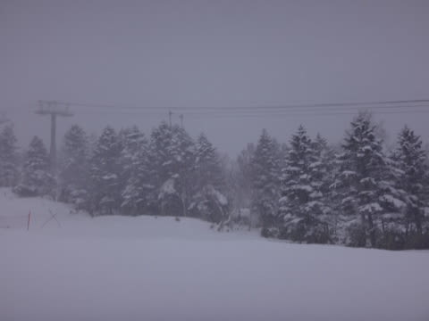

# 3連休最終日，1月9日の志賀高原速報モード…朝はブーツパフ＆ガスだったけど，午後はわずかな晴れ間も

📅 投稿日時: 2017-01-10 02:32:29

🏷️ カテゴリ: [2017スキー滑走日記](c7d777cecfc91bdf0fa464ad62c6d49ab.md)

なんてことだ．

ついに，3連休も終わってしまった…（涙）．

12月の3連休から本日まで．

18日中13日間滑りまくるという，

シアワセ期間が終わってしまいました（残念）．

ということで．

本日，3連休スキーから戻ってきたわけですが．

帰宅後，板の手入れだ片づけだしてると

こんな時間…

だもんで．

本日は，速報モードにて．

えー．

昨晩から雪が降り続いた朝．

朝はパフパフパウダーデーか？？

…と，期待して山頂に上がったところ．

うーむ．

せいぜいブーツパフ．

予想より雪が少なかったよ…（泣）

さらに．

午前中はかなり濃い目のガスが出て．

げ，ゲレンデが見えない…（涙）．

ゲレンデは，朝に積もった新雪が

蹴散らされ，モソモソの凸凹になってて．

積もった雪がはがれた下地は，

ちょっと固め…

この写真を撮った時みたいに，ガスが

出てない時ならいいけど．

ガスっちゃうと足元が見えずに，

かなり難し目のゲレンデ状況（涙）

でも．

午後になるとちょっと日が射すタイミングもあり．

午後は雪がかなり荒れてたけど．

でも，昼を過ぎるとゲレンデの人が

恐ろしいくらいパッタリといなくなり．

…午後は久しぶりの，ゴーストタウン化！

夕方は，またかなりの雪が降り積もり始めたから．

…明日は，いいパウダーなんじゃないかな～．

ってか．

11日から16日まで．

超冷え冷え祭りになりますっ！！！

…これは．

ここ2シーズンくらい出くわすことがなかったレベルの

寒気の到来ですね…

そして．

FEFE19の，これから1週間の天気図．

これから一週間の天気図がすべて冬型縦縞ってのも，

そうそうないレベルだな…

たぶん．

これから一週間，日本海側のスキー場は，

パウダー祭りが毎日続きそう…

来週末は大期待！

＃志賀もそこそこ積もるけど，今のところ

＃豪雪ってほどは降らなさそうな感じ

…ってことで．

今日のゲレンデ詳細は，また明日レポートします～！

## 💬 コメント一覧

### 💬 コメント by (同い年かず)
**タイトル**: お久しぶりです
**投稿日**: 2017-01-10 10:25:13

3連休ダメそうだったので全部仕事にしました　木曜から滑りまくります　水曜軽めの大雪期待してます

### 💬 コメント by (Skier_S)
**タイトル**: かずさま
**投稿日**: 2017-01-11 03:02:38

11日は降りますよ～！

12日も雪は降り続けそうです…

ただ，それぞれ20～30cmの積雪でしょうか．

ひざパフに達しない程度だと思います．

風向きがもう少し北寄りになれば，

ドサドサ積もりそうですが…

でも，冷え冷えいい雪が降り続き，

11日以降は雪は最高ですよ！

＃リフトに乗ってると冷凍人間化して死ぬかもしれませんが

