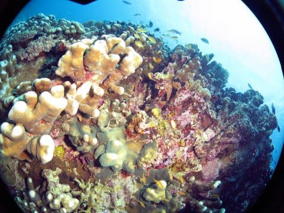
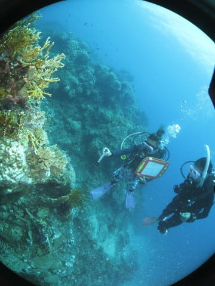

# 2019年8月，4度目のモアルボアル・小6の娘Cカード取得1周年！その30…本日2本目はトウアカクマノミ！

📅 投稿日時: 2020-09-17 01:07:30

🏷️ カテゴリ: [ダイビング日記](ce3a7a8d424d112fce83ee85c81a0e344.md)

ということで．

昨日は気づいたら寝てしまっていたわけですが．

…リモートワークになってから，

このパターンはしばらくなかったんだけどなぁ…

そして．

この週末は4連休ですが．

4日とも天気が悪そう…（涙）

なんてこった…！！

結局，この4連休もどこにも出かけずに

終わりそうな予感…

せめて山に登ったりしたいんだけど…

なぜか，ここ4週間ほど狙ったように

週末に天気が悪いんですが…!!（泣）

とりあえず．

今日はこのBlogも通常営業へ復帰．

いつものダイビング旅行記です…

では，どうぞ～！

ーーー

ということで．

やってきました，お目当てのトウアカクマノミ…！

ひとつのイソギンチャクに，かなりの数の

個体がいますね…

ちっちゃい子供もいて，一家みたいに

見えますが…

大きな親の周りを小さな子供が

泳いでいて．

ほほえましい家族の団欒？

イソギンチャクの上には

アカホシカクレエビもいましたね…

さぁ．どこに写ってるでしょうか？

トウアカクマノミは，私にとってまだ3-4回しか

見てない珍しい魚なので，

ついつい長居をしてしまいました…

トウアカを堪能した後は，ガイドのアイさんが

次から次へいろいろ見せてくれて．

これは，オシャレカクレエビ！

さらに砂地の上を泳いで行って．

ダテハゼやら，

普通のクマノミなんかを見ますが…

指先と比較すると．

一緒にいる子供が，超ミニサイズ

なのが分かるかな…

右下の方にも，もっと小さい子が

眼だけ見せてます．

そして，次にアイさんが教えて

くれたのは…ヒラテンジクダイですか．

確かに目は青いけど．

テンジクダイの類は，どれも同じに見える…

と，いきなりヒラテンジクダイの間に，

「おいらも撮って」

と言わんばかりにハマクマノミが

自己主張…

アイさんは，さらに次も何か示してますが…

ポップコーンシュリンプ！？？

確かに，頭の白いところがポップコーン

みたいに見えますね…

さらに進むと…後半戦は砂地ではなく，

サンゴが広がる場所になってきました．

いや…やっぱりサンゴがある海は

癒されますね…

そんなサンゴの隙間で，

またアイさんは何かを見つけたようですよ…？

…ナミスズメダイyg(若魚)？

ウミシダの間を指してますが…

何かいる？？

…って，こいつですか～！

これは小さい…！！

そして，最後はサンゴの上を

ゆったり流していきますが…

いい感じですね～！

うむ．

ここは初めて潜ったポイントだけど．

モアルボアル，4回来てもまだ知らない

いいポイントがいっぱいあるんだな…！

ってことで．

残念ながら，このダイビングも終了の時間…

うむ．

結構満足の1本だったかな！
