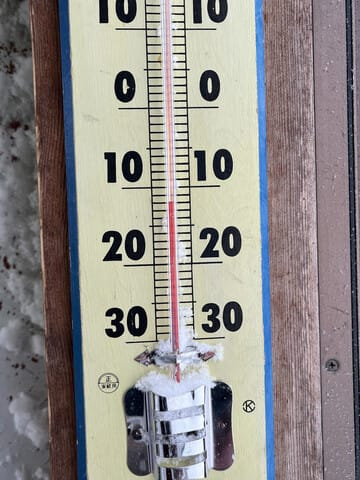
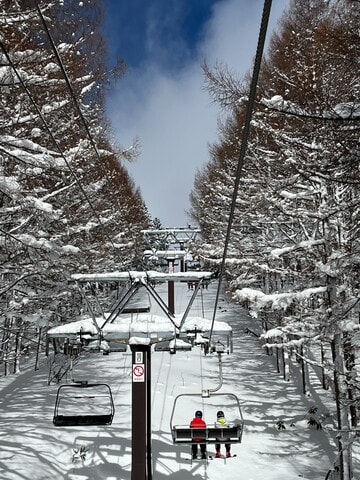
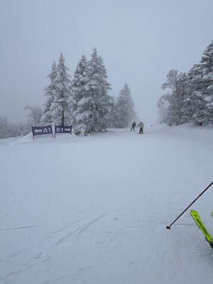
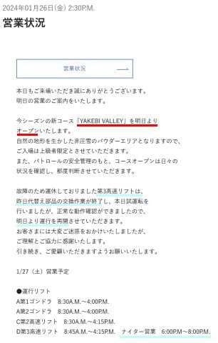

# 今週末も志賀高原…土日とも冷え冷えで曇り時々雪，うっすら日も差すタイミングも．積雪はほとんどないけど，雪は冷え冷えでいいコンディションのはず！

📅 投稿日時: 2024-01-27 00:57:04

えー．

本日も志賀高原特派員から写真が送られて

来ましたが…

あさイチは‐12℃と，結構冷えたみたいです！

ただ，積雪はそれほどでもなく，

前日からの積雪は数㎝程度と，ちょっと

残念な感じですが…

でも，日も差すタイミングもあり．

雪質は最高で，すごいいいゲレンデ

コンディションだったようです…！

ときどき雪が降って，寒い一日

だったようですが．

寒い分雪質もよかったみたいで，

滑りに行っているメンバーから，

今シーズンのベストコンディション

という目に毒なメッセージが飛び交い…

仕事中の私は，メッセージを見て悶絶

していたのでした…

うがーーー！！滑りたい…っ！！

で，今週は土日とも，大体同じ天気．

あさイチは‐9~10℃くらい，

昼間も‐5℃を上回らない冷え冷えで，

天気は曇り~雪．時折晴れ間も．

雪が降りますが，積雪は土日とも

せいぜい数㎝程度です…

土曜のあさイチは柔らかめの圧雪で

最高シマシマのはずだし．

日曜もあさイチはいい感じのトップシーズン

雪のシマシマバーンを楽しめるはず…！！

そして．

明日からは，下の案内の赤線部にあるように，

新コース，ヤケビバレーがオープンです！！

（[焼額山スキー場ホームページ](https://www.princehotels.co.jp/ski/shiga/winter/)より）

さらに，水色部分にあるように…

もしかしたら直らないんじゃないか？？

と心配していた第3高速．

無事治ったようで，

明日から第3高速営業再開！！！

第3高速ナイターも復活です…！！！

ってなことで．

今週末も志賀高原で滑ってます～！！！

いやーー．

久しぶりのトップシーズンらしい，

ベストコンディションの志賀で滑れそう…

…って，

もう1時近いじゃないか（涙）

明日また，3時半過ぎに出発なんだけど…

今日も睡眠2時間ちょいで滑りに

行くのか…（泣）

## 💬 コメント一覧

### 💬 コメント by (あきたか)
**タイトル**: Unknown
**投稿日**: 2024-01-27 14:44:43

ヤケビバレイオープン、第3高速復活しました！

めでたい

### 💬 コメント by (ねも)
**タイトル**: Unknown
**投稿日**: 2024-01-27 21:27:51

珍しく私も志賀高原⛷️

今日は焼額山から奥志賀に✌️　さほど混んでなくてうれしかった(^^;)

明日はいずこを⛷️？

### 💬 コメント by (Skier‗S)
**タイトル**: 今日はよかった…
**投稿日**: 2024-01-28 00:31:52

＞あきたかさま

ヤケビバレーオープン，とりあえず様子見してきましたが…大雪降ったら楽しめそうです．

第3高速復活はうれしい！ナイター良かったです！

＞ねもさま

今日はよかったですね～！！

明日も焼額一択です！！ひたすら焼額滑ってます！

