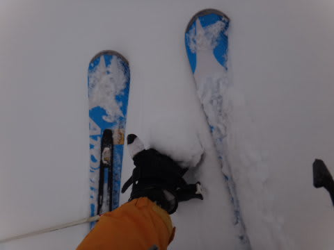

# 3月10日の志賀高原の状況速報

📅 投稿日時: 2013-03-11 01:23:05

…うむむ．

今日，帰宅したのが深夜で．

荷物を片付けてるともう1時になっちゃった…

だもんで．

申し訳ないですけど，今日は速報バージョン．

詳細は明日，ということで…

あー．

で．

朝のうちは，昨日と同じで．

あったかくてやわらかい雪でしたが…

[木曜深夜時点](ec51f407968f123986ca2d58d2dc863c7.md)で．

で．午後は，夕方に向かって崩れていきますね～．

夕方～夜にかけて，強風のまま冷え込んで雪になりそう．

って予想したのが．

寒冷前線通過，予想より5時間ほど早かった…

ということで．

予想よりかなり早い午前11時ごろから，雨→雪に変化して．

そのあと，気温もぐっと冷え込み，短時間に10cmほど積もりましたね～．

おかげで，どぼどぼの茶色い雪は，冷えたきれいな白い雪に完全に隠れました！

午後は比較的まともなコンディションに！（感動）．

…私の日ごろの行いがよかったからでしょう．←良かったことだけ自分の日ごろの行いってことか？

…雪が降る直前，雨が降ってきたときは，

「もう帰ろう…（涙）」

とか，一瞬思いましたが．←帰るわけがないって，みんな知ってるって

雨は短時間で雪に変わり．その後のかなりの降雪のおかげで．

午後は，比較的良い雪で（…あくまで，「最悪」の昨日と比べて…ってことで），時折日も射すなか滑ることができて．

とりあえず，ちょっとは救われたかな…

＃速報バージョンでも，十分詳しい気が…

＃とりあえず，詳細レポートはまた明日

## 💬 コメント一覧

### 💬 コメント by (aqura)
**タイトル**: Unknown
**投稿日**: 2013-03-11 12:27:00

あれあれ、私が帰った後で、やっぱり？天気良くなりましたか。気温がいきなり下がった段階で、子供達？にリタイヤされてしまいました。

何か、日曜の午後って、コンディション良くなりますねぇ。

### 💬 コメント by (ひろりん)
**タイトル**: Unknown
**投稿日**: 2013-03-11 16:15:30

3/9～10は暑かったですね～（下界）

東京では夏日とかｗ

自分は16日から山篭りできそうです。

私は行いがすこぶるいいのｄ（ｒｙ

### 💬 コメント by (mari)
**タイトル**: 気温が下がって
**投稿日**: 2013-03-11 22:39:10

うちの下の子供も熊第三の寒さに泣きが入ってリタイアしたんですが…そのあとかまくらのとこで雪遊び始めたら夢中になって延々と遊んでました。寒い～って泣いたのは何だったのだろうか。付き合ってた私のほうが冷えきってしまった…

### 💬 コメント by (Skier_S)
**タイトル**: 日曜はめまぐるしい天気でしたね…
**投稿日**: 2013-03-12 00:25:51

>aquraさま

いやー．

天気が良くなったり悪くなったりで，スカッと晴れたわけではないんですが．

まぁ，結構日が差すタイミングもありましたよ～．

確かに，みんな帰るころに天気良くなってるかも(笑）．

>ひろりんさま

あー．

下界も暑かったんですか…

行いがすこぶるいいかどうか，16日からの天気が

明らかにしてくれるのかと…(笑）．

>mariさま

うちの娘も，寒くなると「もう滑れない～」って言いますが，なんでか下に下りてくると

雪遊びはじめたりするんですよね…

「寒かったんじゃないんかい！」

って突っ込みを入れてます．

いずこも同じなんですね～．

