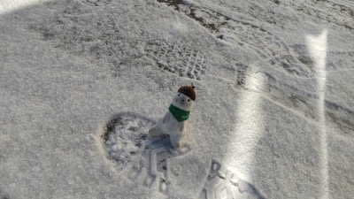
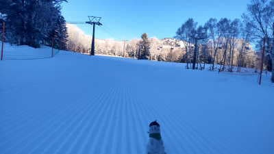
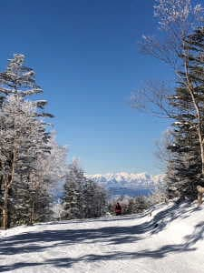

# 1月21，22日の週末の志賀高原スキー場の天気は…21日は雪だけど，積もって10～20cmかな．22日は曇り～晴れ．それほど積もらない週末

📅 投稿日時: 2023-01-20 06:39:42

今週末は…

今週末こそ，ちゃんとスキーに行くぞ！！

と，強く心に近い．

週末に仕事を残さないように頑張って

いるわけですが…

今日もこんな時間になったよ（泣）

ほぼ徹夜だよ…

月，火も睡眠2時間だったし．

今日も夜10時まで仕事が続くし．

この状態で，今日の深夜出発でホントに

スキーに行けるのか？？

と心配しながら．

それよりも，

今日，来週月曜までの仕事を突っ込まれたら

どうしよう

という心配をしているSkier_Sなのだった…←それよりスキーに行ける体力が残っているか，自分の体の心配をしようよ…

ってなことで．

今日…というか．

もう，昨日か．

木曜も，おこみん特派員を初めとする，

各特派員からの志賀高原の写真が

送られてきました～！！

今日の志賀高原は見事な晴天！！

昨晩から，1cm程度の積雪があったようで…

あさイチの気温は-7℃と，この時期にしては

それほどの冷え込みではないけど，

十分な冷え冷え！

バーンは志賀のトップシーズンとしては

硬めのバーンながらも，上にうっすら

新しい雪も乗り，結構楽しめる状態

だったみたいですね…

コメントにも，シーズンベストという

書き込みもあり．

雪が降ってないながらも，志賀高原は

十分楽しいコンディションみたいです！！

うらやましい…

今週末こそ滑りに行くと！！

と，週末の志賀高原の天気を読み解く

わけですが←そんな暇あったら早く寝ようよ…

21日土曜の天気図を見ると…

をを！！志賀高原には水色の-12℃線が

近づき，この冬一番の冷え込み！！

…だけど．

あんまり降水量が多くない…

志賀高原ではせいぜい朝までに

10～15cm程度の積雪かな…

そして，22日日曜の天気図を見ると．

志賀高原には水色の-6℃線が近づいて

いるので．土曜の-12℃線より6℃

気温が上がってますね…

でも，十分な冷え込み．

ただ．この日も降水域は志賀には

かかっておらず…

高気圧が本州を覆っているので．

朝は曇りかもしれないけど，

この日は晴れそうですね…

ってなことで．

まとめると．

21日(土)：朝は10～15cmの積雪．

　朝から雪が降ったり止んだり．

　朝は-15℃を下回る激冷え！！

　あさイチはいい感じのシマシマ

　圧雪の上に数cmの冷え冷え新雪で

　最高のコンディション．

　ただ，午後はバーンがモサモサに

　荒れて，斜度がきついところでは

　硬いところ＆モサモサのコブが

　入り混じった難しいコンディションに

　なるかも．

　昼間もかなり寒いよ！！

　昼間も5cmほど積雪があるかな…

22日(日)：朝早くは曇ってるけど…

　おそらくリフト営業開始の頃には晴れ．

　残念ながらこの日の積雪は無し．

　あさイチの気温は-10℃．

　昼間は-3℃くらいまで上がるかな？

　土曜に比べれば，日も射すので暖かく

　感じる．

　あさイチは最高シマシマバーン！！

　おそらく絶好のスキー日和．

　昼間も晴れ～曇りの中，

　トップシーズンの志賀らしい

　雪を楽しめる．

　夕方は一部斜面でちょっとコブに

　なるかも…

って感じでしょうか．

この週末は残念ながら積雪の積み増しは

それほどではないですが…

まぁ，土曜に20cm程度積もってくれるので，

コンディションは良さそうかな．

で．

そのあと．

…降ります！！！

23日から26日くらいにかけて．

結構降りそうです…

特に，24，25日の地上天気図を見ると…

うほー！！

見事な冬型！！！

そして，850hpa気温図を見ると…

なぬ！！

本州にかかることが滅多にない，

水色の-18℃線が本州にかかってる！！

それも，24日は中国地方にかかってるし…

西日本，ありえない冷えと雪になりそう．

さらに25日の-18℃線は志賀にもかかってて．

25日は志賀は-20℃近くまで冷えるよ！！

とりあえず．

23日以降の積雪に期待！！

まだ積雪量がどのくらいか正しく

読めないけど．

24，25日はパウダー祭りになるかも…？？

## 💬 コメント一覧

### 💬 コメント by (a-island4138　ゆうさん)
**タイトル**: Unknown
**投稿日**: 2023-01-20 12:08:22

ああ、本来は志賀高原で滑ってたはずだったのに…　25日から本格的に雪も積もりそうなので❄楽しみですね🎿　それまでちゃんと身体を休ませ元気になっててくださいませね。　期待しております。

### 💬 コメント by (副院長)
**タイトル**: Unknown
**投稿日**: 2023-01-20 12:24:35

先週、五竜からシーズンインしました。今週からは志賀に出勤します。日曜日から厳しい修行になりそうですね。ゴンドラ動くかしら？火曜日は車掘り出し修行が待ってそうです。でも、うれしいです。日曜日お会いできたらよろしくお願いします。

ところでS様の会社では「働き方改革」って単語はないのでしょうか？

### 💬 コメント by (レインボー75)
**タイトル**: Unknown
**投稿日**: 2023-01-20 16:09:01

金曜日の志賀高原情報

朝の蓮池-8℃。今日も晴れ渡って、北信五岳(北から「まみくとい」斑尾妙高黒姫戸隠飯綱)が綺麗。

朝は冷え込んだけど帰路(２時過ぎ)は蓮池で+2℃。

そしてゲレンデは、シーズン30日目でベスト。幸せすぎて、これまでの人生全てが肯定されてくる。圧巻は奥志賀第三。最近の練習の成果が！雪が良すぎて勘違いを体感できる極楽バーン。

さらにお昼は、分不相応にも皇室ご利用のグランフェニックスで、海鮮寿司(2100×5/6=1750円)美味しゅうございました。

午後はヤケビ第二のキッズパーク(今年から無料)でスクーターの練習。スキーより難しい。汗びっしょり。

最後は第三(ミドル連絡コース？)で仕上げ。今日も楽しくレインボー(２時まで)できました。

明日はどれだけ降るのかなあ？

### 💬 コメント by (アリス)
**タイトル**: Unknown
**投稿日**: 2023-01-20 19:08:37

S様

こんばんは😃🌃

週末の志賀高原参戦を祈っております🎵

日頃の仕事のストレスを存分に発散出来るといいですね☀️

今日も志賀高原はヤケビブルーのスタートで朝一の3本は幸せ一杯です🎵

そのうち人が増え密度が高まりゲレンデはどこも、ジャガイモの大安売り状態😅

（リフト、ゴンドラは飛び乗りです）

三高のイーストは終日シマシマもあり、貸し切り状態で良かったです☀️

ニ高から唐松を滑走しているレインボーさんを発見❗️エイトマンのようにかっ飛びです😅

フェイスマスクの下はどんな表情なのかな⁉️

鬼の形相かな（ごめんなさい😅）

私はと言えば、山本リンダの「狙い打ち」を口ずさみながらの滑走です☀️ウララ、ウララ🎵

楽しく充実した一週間の志賀高原でした😆🎵🎵

次回は2月に出直しです✨

積雪を期待したいです‼️

### 💬 コメント by (レインボー75)
**タイトル**: Unknown
**投稿日**: 2023-01-20 20:14:26

お借りします。

アリス様、発見できずにごめんなさい。

マスクの下は、状況良すぎて嬉しくてへらへら笑っていたかと。それにしても今日は良かった。奥志賀第三も是非。雪は一番ですよ。

二月まで来ないなんて、勿体なさ過ぎでしょ！私は多分生きていれば二月は皆勤予定です。またお声掛けくださいね。

### 💬 コメント by (レインボー75)
**タイトル**: Unknown
**投稿日**: 2023-01-20 20:39:38

たびたびごめんなさい。

アリス様、山本リンダでは歳がわかりますね。できればさらに速いテンポの曲を口ずさめば、私に抜かれなくてすむかと！

### 💬 コメント by (Skier_S)
**タイトル**: 今週末はゲレンデ復活！
**投稿日**: 2023-01-20 23:13:24

＞a-island4138　ゆうさん

24，25はすごい積もりそうですよ…

私は明日からゲレンデ復活です！

＞副院長さま

月曜はまだ大丈夫だと思います．

荒れるのは，火曜と水曜です…

パウダー祭りになりますよ！！！

で，働き方改革ってなんでしたっけ？聞いたことがない単語ですね…

でも，うちの職場は普通の人にはかなりホワイトな職場です．

＞レインボー75さま

今日は一部の人からは雪が硬くてコロコロと報告があったのですが…

一部のスピード派は楽しめるかも？？とのことだったのですが，レインボーさんは楽しめたのですね（笑）

さすがスピード派！！

明日は冷え冷え雪が積もりますよ！！（10cmちょっとだけど）

＞アリスさま

今週末は無事参戦できそうです！（払った犠牲＝失った睡眠時間は大きかったけど…）

今日はコロコロバーンだったんですね…

明日は回復するんですが，残念ながら今日で一旦滞在終了ですね．

また2月にお会いしましょう！！

