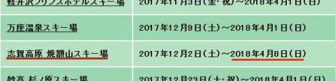

# なぬぅ！！？？来シーズンも焼額は4月8日で終了（涙）．その他2018シーズンの志賀高原情報が続々と…

📅 投稿日時: 2017-09-21 00:34:16

えー．

本日，会社から帰宅してから．

いつも定例のネット巡りをしていた時…

うむ．

プリンス系列のスキー場の，プレミアムシーズンチケットの

情報が出ているなぁ…

（[焼額山HP](http://www.princehotels.co.jp/ski/shiga/)より引用）

と，リンクをクリックして．

ふむ．10月1日より発売で，

来シーズンもお値段10万円ね…

でも，志賀だと焼額以外滑れないから，

まぁ買うことは無いかな～．

と，画面を下にスクロールしていったとき．

…ふむ？？

う，うぅん！？？？

…ええええ？

っえええっえぎょええええ！！！！

なんだーーーーー！！

来シーズンも，

焼額は4月上旬で終わっちゃうのか～っ！！！！！！

がーーーーん

がーーーん

がーーん

がーん

がーん

がーん

…

ショック…

ショックだ…

しばらく立ち直れない…

来シーズンこそ，GWまでやってくれると信じていたのに…

あぁ…

残念だよ…（激烈にあふれ出て止まらぬ涙）

なんということか．

まだ，焼額のホームページには一切記載がありませんが．

どうやら，来シーズンも．

春は悲しい思いをすることになりそうです…

…そして．

志賀高原リゾート開発のホームページへ移ると．

こちらでは，来シーズンの[リフト営業予定](http://www.shigakogen.co.jp/cms/wp-content/uploads/2017/09/d24b1b11c196db17a25d4025a0ad8afe.pdf)と

[ナイター営業予定](http://www.shigakogen.co.jp/cms/wp-content/uploads/2017/09/1080bc4e621120bdb0fee796179418e6.pdf)が公開されていましたが．

リフト営業予定を見ると…

シーズンインは，

一の瀬エリアが12月1日オープン，

ファミリークワッド・高天ヶ原クワッドは12月9日オープン，

寺子・西館・ブナ・ジャイアント・丸池・蓮池等の

一の瀬エリア以外は12月16日オープン…

という予定で．

シーズン終了は，

一の瀬エリア＆寺子屋が5月6日，

それ以外は4月1日までのようです…

まぁ，志賀の中央エリアの営業は．

大体昨シーズンと同じですね．

…で．

山の神リフトが，12月16日まで動かないようですが．

うーむ．

焼額は12月2日から動いていて，ダイヤモンドが

12月9日から動くんだし．

焼額との連絡のため，山の神も9日から

動かしてほしい…というのが，ゲストの

一般の願いだと思うんだけど…

スキー場都合の，微妙な判断ですね（涙）．

ちなみに，山の神の終了の方は，

ヤケビの終了予定と同じく4月9日です．

そして…

ナイター予定ですが．

ここも昨シーズンと同じ．

丸池，高天ヶ原は正月前後のみ．

ファミリーは12月23日から3月23日まで毎日，

ダイヤはファミリーナイター営業期間中の土曜日＆正月，

そして…

心配していたサンバレーですが．

12月29日から3月17日までの毎土曜日．

クワッドでナイター営業のようです～！！

…良かった…

本日，唯一のいいニュースだ…

そして，[中央エリアの早朝営業](http://www.shigakogen.co.jp/cms/wp-content/uploads/2017/09/9d10c9aaa8392d94ebc997201619740e.pdf)は．

一の瀬ファミリー，高天ヶ原，ダイヤモンドで

GW期間中のみ，営業するようです…

ということで．

スキーシーズンインまで，あと2週間ちょいと

迫ってきましたが．

本来なら，気分が盛り上がってくるはずの

この時期だけど．

…来シーズンも，焼額が4月上旬で終わると聞いて．

テンションがかなり落ちてしまった，Skier_S

だったのでした…（涙）．

## 💬 コメント一覧

### 💬 コメント by (しんちゃん)
**タイトル**: 残念
**投稿日**: 2017-09-21 01:07:55

ヤケビ、GW営業しないなんて。。。

残念です（泣）

### 💬 コメント by (Skier_S)
**タイトル**: しんちゃんさま
**投稿日**: 2017-09-21 01:41:50

ホント，残念です…

残念すぎます…（涙）

### 💬 コメント by (ぴよ＠太田市)
**タイトル**: かぐらにおいでよ！
**投稿日**: 2017-09-21 12:19:06

みんな揃ってかぐらにおいでよ！

苗場では当日限定の場内利用券、かぐらではシーズン中ず～っと利用可能だよ(^^♪

### 💬 コメント by (はなげ親分)
**タイトル**: 大変です！
**投稿日**: 2017-09-21 23:45:38

プレミアムシーズンチケットの焼額山のところ

なんと！

5月6日までと訂正されてます！！

本当ならば神様に感謝です

### 💬 コメント by (Skier_S)
**タイトル**: なんとGWまで営業に訂正！良かった～！
**投稿日**: 2017-09-22 01:10:42

＞ぴよ＠太田市さま

はなげ親分さんからのコメントにあるように，

GWまで営業になりました～！

良かった…

最近，かぐらは5月にならないと行かなく

なりました…

昔はシーズン中も，ちょくちょくかぐらに

行っていたのですが．

＞はなげ親分さま

このコメント見て，慌てて見直しました．

ホントに訂正されてましたね～！！！！！

感動～！！

良かった～！！！！

これで，GWのヤケビ早朝をまた楽しむことが

できます…

とりあえず，プリンススタッフに感謝！

