# プロジェクトX2第2章…LEVORG E型にKENWOODナビ取り付け…リアカメラ，無事動作！

📅 投稿日時: 2018-08-28 00:28:56

🏷️ カテゴリ: [車](cba0e8330b3f2ded7c1addfacc75d4547.md)

ってなわけで．

本日も座間味で，娘と一緒にダイビングをしていますが．

とりあえず，ダイビングがどんなだったかは，

帰ってからのダイビングレポートで報告

します～！←間違いなく来年，ヘタすると再来年になったりして…

ってことで．

本日はナビ取り付け記事の続きです．

では，どうぞ～！

---

ってなわけで．

ナビ本体への配線がすべて終わったので．

次は．

純正リアカメラ先行配線のどのピンにどの信号線が来ているかを

テスターで当たって配線を解読する

作戦を実行に移すわけですが．

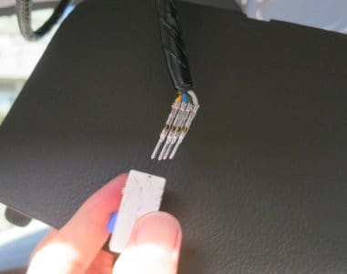

電源線は+12Vが来てるはずなので，

GNDとの電圧が+12Vとなる線がACC電源線．

そして，カメラ信号線は75Ω同軸線なので．

ナビ側で75Ω終端されているはず．

だもんで，GNDとの抵抗が75Ωなのが

信号線のはず！

ってなわけで．

テスターで当たってみたところ…

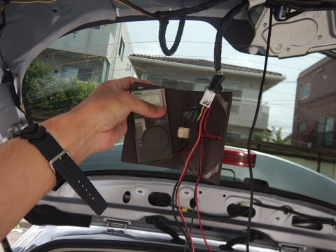

どうやら．

純正バックカメラ用先行配線は

こんな感じで．

コネクタの位置と重ね合わせてみると．

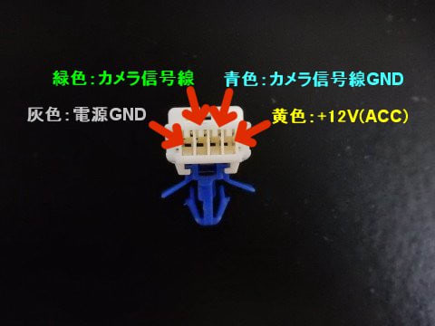

ケーブル色が

灰色：電源GND

青色：カメラ信号線GND

緑色：カメラ信号線

黄色：ACC電源

というのが，読み取った結果です…

とりあえず．

読み取った配線をもとに．

自作カメラハーネスに差し込んでみます．

各ピンがショートしないように，各ピンの

先端以外には絶縁テープを巻いておきましょう．

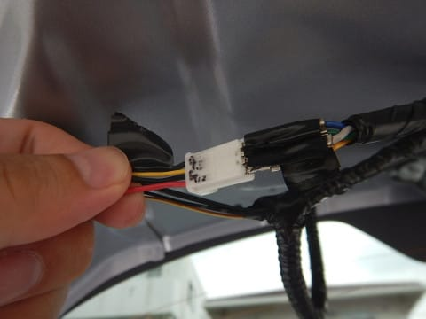

この写真左側の，C型LEVORGまでの先行配線用コネクタを

利用した，自作カメラハーネスのコネクタ．

写真の上から

GND，

カメラ信号線，

信号線GND，

ACC電源

の順なので．

コネクタ形状は変わっても，ピンの並び順は

変わっていないようですね…

もしかしたら，カメラ信号線GNDと電源GNDが

逆かもしれませんが．

これを入れ替えてもどっちでも映ったので．

まぁ，どっちでもOKです…←いい加減

ってことで．

読み取ったピン配置をもとに，コネクタを

繋いでみたので…

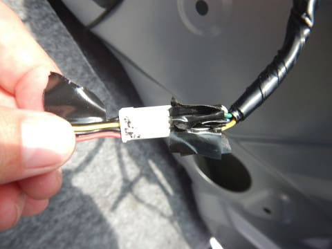

ナビを起動して，リアカメラ画像を写してみます…

さぁ．ドキドキの一瞬．

ちゃんと映るのか…っ！？？？

ををををを！！

無事，映った！！

映ったよっ！！！

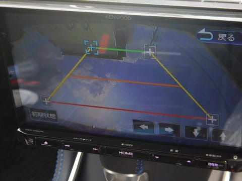

いやーーー．

一時はカメラの買い替えか，配線を買いなおして

全部作り直しかと思ったけど．

無事映ったよ…（感動）

でも．

え？

ちょっと待て．

これってよく見ると…

画像が上下逆じゃないかっ！？？？

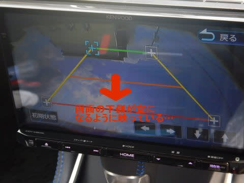

空が下に映ってるんですけど！？？？

なんということか．

カメラの上下を間違ってつけてしまったかっ！！！

…しまった～っ！！

どうしよう…？？

…と，一瞬焦りましたが．

よく見ると，このカメラ．

台座に左右からねじ止めされている

だけだったので．

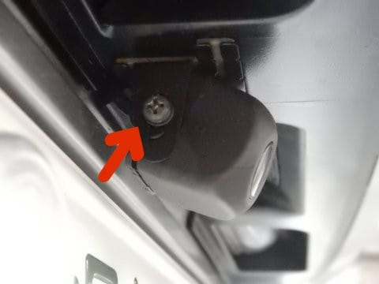

このネジを外して，カメラの上下を入れ替えて…

もう一度ねじ止めし直せばOK！

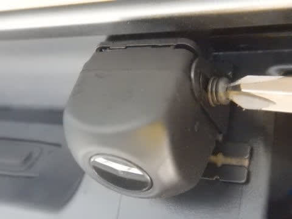

あー．焦った．

これで無事，正しくカメラが写るように

なりました…

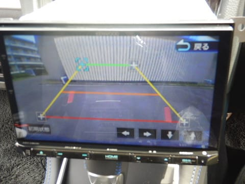

一安心…

ってことで．

無事カメラも動いたので．

ピンを刺した，リアカメラコネクタ周りを．

絶縁テープでぐるぐる巻きにします．

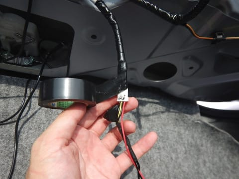

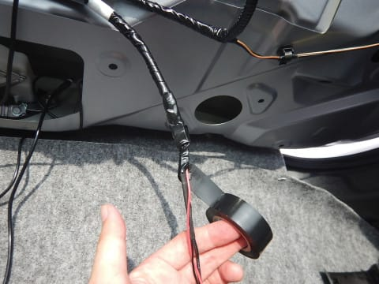

そして，グルグル巻きにしたケーブルを…

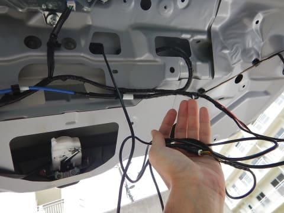

こんな感じで，適当にテープでリアゲートに

固定します．

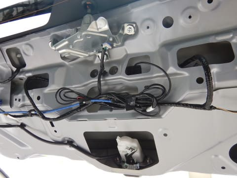

これで，長きに渡ったリアカメラの取り付けも

無事終了！！！
