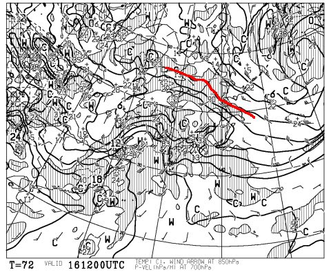
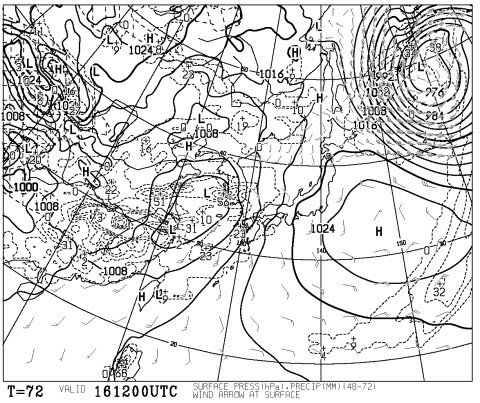
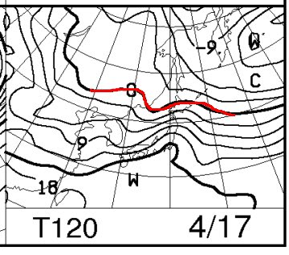
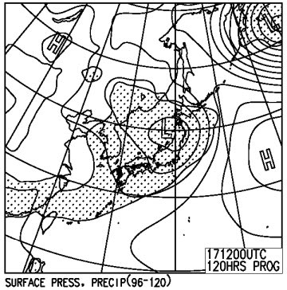

# まだ続く！今週末の志賀高原の天気は…土曜はマシだけど，日曜はゲレンデ壊滅の雨（涙）．

📅 投稿日時: 2016-04-14 03:50:11

🏷️ カテゴリ: [スキー天気予想](c6554f5c3c106093b511a8daae23757e8.md)

あぁ．

今日も帰宅が遅い…

マズい．

Blog更新している場合じゃないんだけど…

でも．

水曜定例の週末のスキー天気予想にいくのだっ！！！

＃もう，スキー場の天気を気にする人も

＃減ってる気がするけど…

えー．

土曜日，16日の850hpa気温図ですが．

はい．

もう，0℃線ははるか北ですね．

すごいあったかいですね．

…もう，春ですねぇ…

土曜の地上天気図はこんな感じで，

一応高気圧の勢力下．

…だけど，なんだか．

西からひたひたと，低気圧が近づいてきてます…

で．

日曜17日ですが．

相変わらず，850hpaの0℃線は，北海道あたり．

志賀高原は，+12℃線がかかってます…（涙）

+12℃線が志賀高原って…

これは，GWでもめったにないレベルに気温が上がってます．

あったかい，というより．

異常に暑いレベルです（泣）．

で．

日曜の地上天気図は…

…

…

…

…

…

オーマイが――――ッ！！！！！！！！！！！

…これは，降水量が予想される網掛けが，

日本全土を覆っていて…

雨です．

これは，雨ですっ！！（涙）．

それも，異常に気温が高い中の雨だから…

これは，日曜午後には，ゲレンデはすごいことになるかも…

ってことで．

まとめると．

土曜：朝から晴れ．気温は…まぁ，4月下旬並み．

　　朝は，放射冷却で心持ち締まり気味のゲレンデか

　　もしれないけど．

　　朝早いうちから気温が上がり，雪はザブザブに緩む．

　　午後は，もう雪が解けまくって危ないレベルの

　　荒れ荒れゲレンデになりそう…

　　天気は終日日が射すかな．

日曜：朝は曇り．気温が冷えないので，朝から雪は

　　ザブザブでスタート．

　　この日は…いつからか雨が降り出す．

　　今のところ，降り始めは昼～午後か…

　　運が良ければ，リフトストップ近くまで雨が

　　降らずにもつかも．

　　気温は，今年一番の高温か…？というほどに

　　上がるけど．天気が悪く，雨になるかもしれないので

　　肌寒く感じる．

　　高温の雨で，ゲレンデはほぼ壊滅か…（涙）．

という感じで．

この週末，日曜はかなりやばそうです…（涙）．

おそらく，今週末でほとんどのゲレンデはクローズに

なりそうな勢いです…

あぁ…

まだ，GWまで3週間くらいあるのに．

まさか，もうこんな雪になってしまうとは…っ！！

一の瀬正面バーン，奥志賀エキスパートも今週末が

最後の可能性がありますので．

悔いのないように滑りましょう…（泣）．

## 💬 コメント一覧

### 💬 コメント by (はなげ親分)
**タイトル**: 滑る！
**投稿日**: 2016-04-14 16:12:59

あー、今シーズン何度雨具の用意をしただろう…。

でも滑る！絶対滑る！

都合で日曜日のみの参加ですが、来シーズンの好コンディションを神様にお願いしながら滑ってみます。

### 💬 コメント by (Skier_S)
**タイトル**: はなげ親分さま
**投稿日**: 2016-04-15 01:55:25

滑りましょう！！！

…しかし．

土曜じゃなく，日曜日帰りってところが…

ちょいと残念ですね．

お会いしたら，シルバーシールお渡しします～！

