# 1月29，30日の週末の志賀高原スキー場の天気は…うーん．晴れるか曇るか微妙．少なくともパウダーデーではないよ．

📅 投稿日時: 2022-01-27 00:34:55

🏷️ カテゴリ: [スキー天気予想](c6554f5c3c106093b511a8daae23757e8.md)

ってなことで．

いつも通り，本日も志賀高原特派員

から写真が送られてきましたが…

朝は微妙な曇り空でスタートしたらしい

本日．

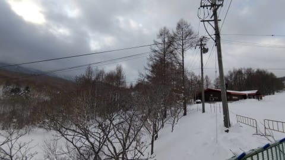

朝の気温は-6℃程度と，比較的高め

だったようですが…

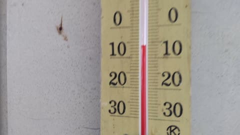

でも，営業開始からしばらく経つと，

青空が見え始め…

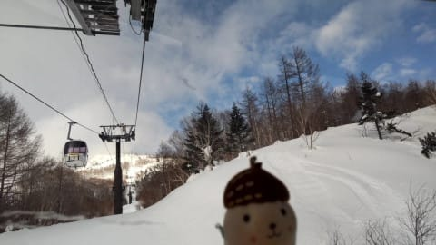

午前9時ごろから午前いっぱいは，

晴天が続いたようです！

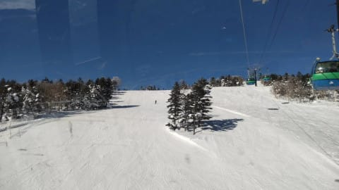

ただ，午後になると雲が増えて，

晴れたり曇ったりの天気になった

ようです…

まぁ，

　朝のうちは晴れるかもしれないけど

　昼前後から曇り空

という予想はおおむね当たったかな？

ただ，本日の志賀高原中央エリア．

山ノ神，ファミリー正面下部，西舘方面などは

圧雪がかかっておらず，昨日のバーンの

まま放置されていたようです…（泣）

こういうところにも，コロナでお客さんが

減った影響が（涙）

あ，でも，焼額と奥志賀はしっかり

きれいに圧雪がかかっていたみたい

なので，ご安心を！！

ってなことで．

いろいろ悲しい状況になりつつありますが，

とりあえず，水曜深夜定例の，週末の

志賀高原の天気予想をば…

えー．

まず，27日(木)の850hpa図を見ると．

志賀高原には水色の-9℃線が近づいて

いるレベルなので…

朝は-10℃以下．昼間もマイナスキープで，

雪が緩むような気温ではないですね！

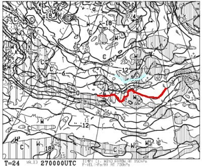

そして，この日の地上天気図を見ると．

うーん．微妙．

新潟近辺にうっすら降水域が予想

されてるけど．

志賀高原まで降水域はかかってないので…

それほど降らず，曇り時々雪がぱらつく

感じかな？

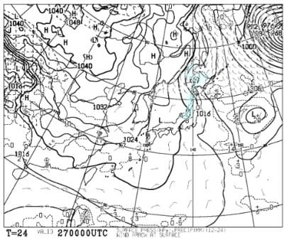

続いて，28日(金)ですが．

この日の850hpa気温も，水色の

-9℃線が志賀高原に近づくレベル

なので…

まぁ，木曜とおんなじ感じですね．

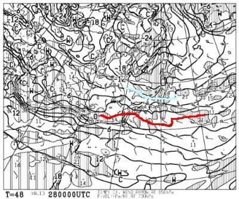

そして，金曜の地上天気図は…

うーん．微妙．

この日も北陸～東北の日本海側に

降水域がかかってるけど，

志賀高原までは雲がかからないかな…

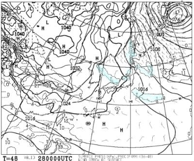

で．

肝心な週末の，29日(土)の850hpa図は…

この日の志賀高原も，水色の-9℃線が

近づくレベルなので．

この日も朝は-10℃以下，

昼間も-5℃くらいまでしか気温は

上がらなさそうなので，雪質はGood！

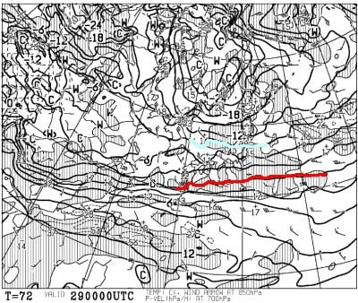

土曜の地上天気図は…

うーん．微妙．

この日も，本州の日本海沿いに

降水域が予想されているけど．

志賀高原近辺は，プチ高気圧に

覆われているから，晴れ～曇りかな．

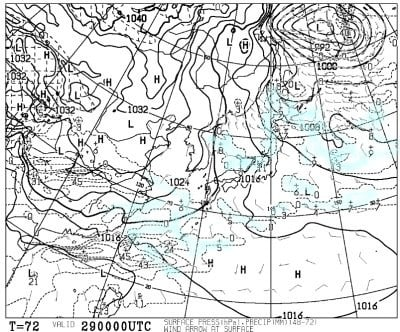

続けて，30日(日)の850hpa気温を見ると．

この日も引き続き，水色の-9℃線が

かかっているので…

まぁ，冷えそうな一日ですね．

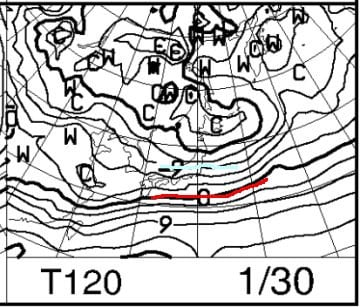

そして，日曜の地上天気図を見ると．

うううーむ．微妙…

冬型が弱まってるし．

降水域が全く日本海側に予想

されていないので…

運がよければ晴れ，時々雲に太陽が

隠れるかな…って程度でしょうか．

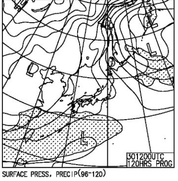

ってなことで．

まとめると．

1/27(木)：朝は曇り，午前中は

　時々雪もぱらつく．

　午後は時折日が射すタイミングもあるか？

　朝は-10℃以下，昼間もマイナスキープ．

　朝イチシマシマは最高．

　終日冷えて雪質はいい感じ．

1/28(金)：雲は多めながらも，

　朝は日が射しそう！

　時々雲が飛んできて，

　もしかすると時々雪もぱらつく

　タイミングもあるけど，

　雲の隙間から日が射す天気．

　あさイチはこの日も最高シマシマ．

　朝は-10℃程度，昼間もそこそこ冷えて

　終日雪はいい．

1/29(土)：この日も朝は雲が

　多いかもしれないけど…

　志賀は日が射しそう！

　白馬，新潟は雪がぱらつくかな．

　朝の気温は-12℃程度．

　あさイチは，締まり気味の

　スピードが出る最高シマシマ！

　天気は曇ったり晴れたり，

　雪が締まり気味で，昼間も気温は

　-5℃くらいまでしか上がらないので，

　雪は終日しっかり締まった圧雪で，

　午後になってもゲレンデは荒れない．

1/30(日)：うーん．朝は晴れるかな？

　微妙．

　この日も，曇ったり晴れたりかな？

　気温はこの日も-10℃以下に冷え込み，

　昼間も-5℃程度までしか上がらない．

　しばらく積雪が無いので，雪は

　結構しっかりした，エッジが嚙む感じの

　締まり気味の圧雪バーン．

　この日も，午後まで雪があれずに

　済みそう…

という感じで．

これから日曜までの4日間は，

ほぼ積雪はなさそうなので，

ゲレンデは結構締まった，スピードが

出るバーンになっていきそうな感じ…！

ただ，天気が曇るか晴れるか微妙．

今のところ，土日の志賀高原は

晴れベースになるんじゃないかと期待！

少なくとも，

根性の無いスキーヤーふるい落とし機能

が働いたりしない，穏やかな週末に

なりそうです…

…しかし．

12月から正月にかけては，ずっとパウダー

が続いたけど．

正月休み以降，週末は晴れるパターンが

続くし．

積雪量は問題なく，冷え冷え踊りも

踊らずに済んでるし．

今シーズンは，恵まれてる…！！

## 💬 コメント一覧

### 💬 コメント by (通りすがり)
**タイトル**: Unknown
**投稿日**: 2022-01-27 11:55:38

西館は，正月1/9に行ったときも，フードクワッド沿いは林間だけ圧雪かかってましたが，左右の中斜面は圧雪無しの前日以前の荒れたままで非常に残念でしたね。

あそこの朝イチが気持ち良いので発哺の宿にしたので，何のために？となりました。

下のクワッド沿いは，上からみて右側は閉鎖，左側は圧雪かかってて，ココが気持ち良かったので何本か滑りましたが。。。

### 💬 コメント by (レインボー74)
**タイトル**: Unknown
**投稿日**: 2022-01-27 14:23:21

木曜日の志賀高原情報

朝の上林-1℃　蓮池-7℃。

ニゴンパーク3cmさらさら新雪。

朝から振りだした雪で、パノラマ、カラマツは3cmかなあ。ファーストget! 気持ちいいです！

オリンピックは新雪10cm。まずはゆるゆる降りました。

GSは新雪5cm。ずーっと雪が降り続いている。寒いので一ゴン回し。

二高の獅子で昼食してたら、「いつ帰ってもいいよ」　隊員の一言が決め手となって終了。若い私達には明日があるので無理しない。今年は友人が何人も怪我してるので、

「転ばぬ先のリタイア！」

### 💬 コメント by (Skier_S)
**タイトル**: 3，4月もスキー場は冷え冷えでいてほしい…
**投稿日**: 2022-01-28 02:18:34

＞通りすがりさま

最近，中央エリアの圧雪車オペレータが足りないようですね…

西舘が圧雪かかってないってのはちょっとがっかりですね．

うーん．昔もダイヤナイターに圧雪がかかって無くて「シマシマが滑れると思ったのに…お金返せ～！」

と思ったことがあります…

圧雪かかってないと分かってれば，ナイター滑らなかったかも←いや，それでも滑っていたはず

＞レインボー74さま

意外と今日は新雪積もってたんですね…！

明日以降も，曇ったり雪がぱらついたり，という天気が続きそうです…

### 💬 コメント by (ロシアリクガメ)
**タイトル**: Unknown
**投稿日**: 2022-01-28 06:55:49

いつも、天気予想参考にさせてもらってます！

今年は雪も多く、週末天気に恵まれて、楽しんで滑れて、最高です。

### 💬 コメント by (Skier_S)
**タイトル**: ＞ロシアリクガメさま
**投稿日**: 2022-01-28 23:39:35

参考にしてもらってありがとうございます～！

今週末の予想は難しいので，外してしまいそうです…（涙）

