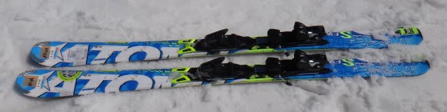
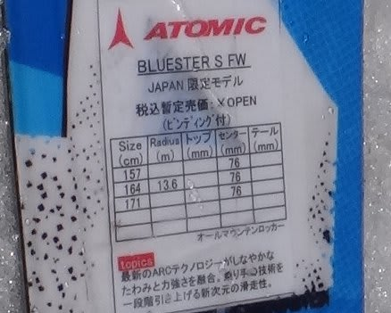
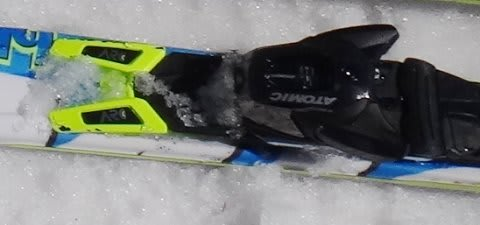
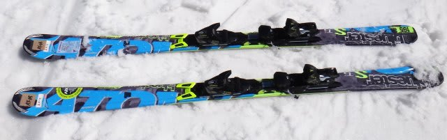
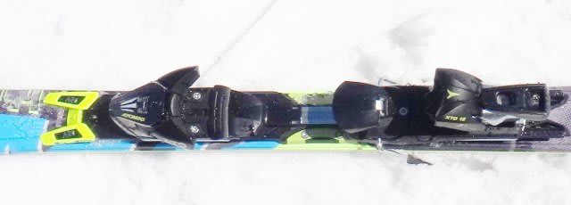

# 2014シーズンモデルのスキー試乗レポートその3…ATOMIC編パート1

📅 投稿日時: 2013-03-27 00:15:00

さてさて．

試乗レポート，続きます．

今度はATOMIC編です～

ATOMICは4種類乗ったので，そのうちBLUESTER Sシリーズの2機種です～

----

○ATOMIC BLUESTER S FW 164cm 

ATOMICのオールラウンドモデルってことでしょうか…

「DEMO」の名称はついておらず，価格もDEMOシリーズより下になるみたいです．

ビンディングは，SALMONっぽい…つーか，SALOMONのビンディングですね．

ビンディングの前についてる黄色い部分…これはSALOMONの，SMARTRACKでは？

で．ビンディングをとめているのがセンターのみなので，

「弓のようにしなる」って広告に書かれているけど…

滑ってみたところ，この板，フレックスよりトーションが弱めに感じます．

たわみを出していこうとするけど，エッジがグリップを失っていくので，

たわませられない．

雪のせいかな～？

トップとテールのグリップが弱めで，板をたわませて小さな半径で曲がっていくのは難しい．

むしろ，ずらしてまわしてやるとコントロール性がいい．

グリップを求めずに，板が逃げていくのにしたがって回していくといい感じ．

ぐぐっとたわんで，圧がたまってキュンキュン走っていくような板ではありません．

…あんまり上級用の板ではないのかも…

あと，ビンディングがセンター部分でだけ固定されているからか，

トップを押さえてテールを押さえても，センター近辺にグリップが集中し，

トップとテールのエッジをあまり使えない感じ．

…なんだか．昔のSALOMONの，初代Pilotを思い出してしまいますね…

○ATOMIC BLUESTER S TI 165cm

ATOMICのBLUESTERのARC採用モデルはS TIとS FWの2種類あるようですが．

こっちのほうがフレックスがより強い上級機種になります．

…こいつもビンディングはSALOMONですね．

…基本的には，乗り味はS FWと同じ．

トップとテールのグリップがさほど強くなく，たわみを出せなかった…

ただ，フレックスはS FWより強い感じ．

ウッドコアなのかな？メタルの強いばね感による張りというより，心材がしっかりした

感じの張りがあります．

…でも，フレックスはそこそこ強いんだけど，S FWと同じでトーションが弱いのか，

トップとテールのグリップが弱く感じる…

トップがグリップしてぐぐぐっと回転してくるような板ではありません．

むしろ，迎え角を作って，ズレの中で動かしていったほうが扱いやすい気がしました．

…この板に乗ったときは，荒れた雪で，きれいな整地じゃなかったからかな？

とりあえず，この日の雪では，圧がたまる感じもないし，ギンギンに切っていく

板ではないように感じられます．

うーん．このSシリーズ，TIもSWも，ATOMICっぽくない感じを受ける板でした…．
