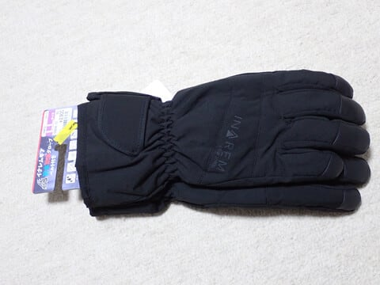
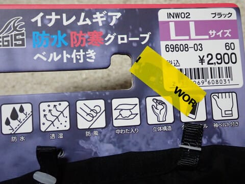
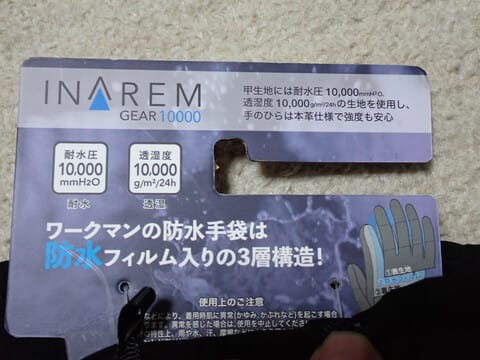
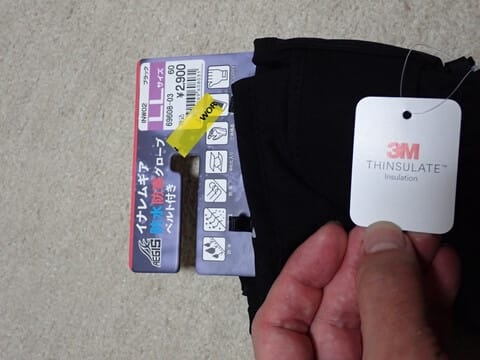
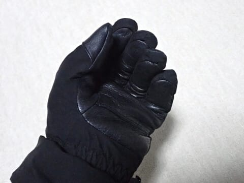
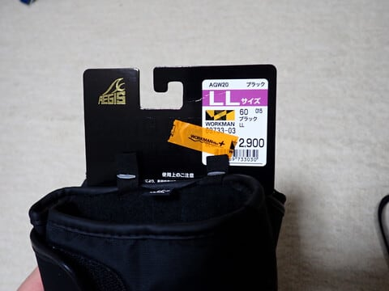
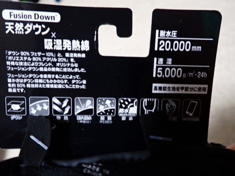
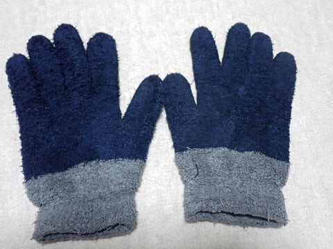
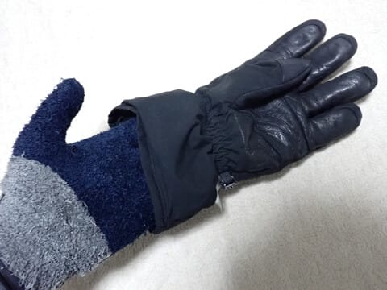
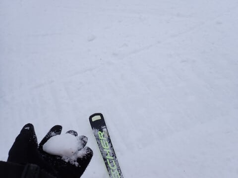

# ワークマンで買った手袋をスキーで使ってみたけど，これで十分だよ…！！

📅 投稿日時: 2025-01-08 01:24:24

えー．

8，9，10日と，またかなり激冷えになり，

大雪になりそう…

というニュースが流れてますが．

ただ，8，9日と風が西風…（泣）

志賀高原はそこまで積もらないと思います．

とはいえ，9日の冷え込みはかなり強く，

根性のある雪雲が北アルプスを越えて

くるレベルなので，そこそこは降ると

思いますが…

日本海側や東北がガンガン積もりそう

ですが，志賀はそこまで積もらず，

ディープパウダーにならなさそう…

うーん．

しいて言えば10日は北風になるので，

10日の朝は志賀高原でもまぁまぁ積もって

いる可能性がありそう．

…でも，太ももパフとか腰パフとかは

行かず，脛パフレベルのような気が…

とはいえ．

週末に向かってまた雪が積もってくれて，

週末は天気が回復していきそうなので，

深いパウダーは狙えないまでも，この

土日はいいコンディションになりそう…！

あ，月曜は南岸低気圧が近づく可能性が

あって，微妙ですけど…

ということで，本題へ．

[以前にも記事にした](e5bd0f1f4125aec650ff3cf94b57af47e.md)ように，ワークマンの

アイテムはかなりスキーで使えるものが

多いのですが…

今回，また新しくワークマンでグローブを

買ってみました～！

しばらく使ってみたので，使ってみた感じを

レポートしてみようかと…

まず．

今回買ったのは，この防寒グローブ．

一見何の変哲もないグローブですが．

1900円のモデルもある中で，

お値段高めの2900円のモノです．

ちなみに，以前一度1900円のモデルを

買ってみましたが．

防寒性や防風性が弱すぎて寒いのと，

防水性が弱すぎてすぐに水が染みてくるので，

1900円のグローブはスキー用には止めた方が

いいです…

ということで．

この2900円の高い方のグローブを買ってみた

わけですが．

高いとはいえこのお値段で

耐水圧10000mm，透湿度10000g/m^2は

なかなか．

そして，手のひらは本革と書かれてますね！

さらに，断熱材は3Mのシンサーレートが

入っていて．

手のひら本革，防寒はシンサーレートって，

スキー用グローブとすれば，そこそこの

高級グローブの部類ですね…（笑）

確かに，手のひら側の見た目は皮に

なってますね…！

ちなみに，前回の記事で報告したグローブは，

同じ2900円のモデルでしたが…

こちらの古いモデルは，耐水圧が20000mmと，

新しいモデルより数字は大きくなってますね…

でも，手のひら部分も布だったので，

ゴンドラに乗る回数が多い私は

何度も板を掴むために手のひらの布が

エッジで切れてきて，1シーズンでダメに

なってしまったという経緯があります…

なので．

耐水圧は落ちたけど，手のひらが布→皮に

変わったこのグローブを期待して使って

みたのですが…

ちなみに私が実際に使う際は，こんな

100円ショップで売っている，安い毛糸の

手袋をインナーグローブに使っています！

で，こんな感じで毛糸の手袋の上に

ワークマングローブをはめるわけですが…

実際使ってみたところ．

手のひらが皮だからか，以前のモデルより

ストックを握った時の感覚が良いです！！

7000~8000円でスキー用として売っている

安売りグローブと変わらないレベルで，

ストックを握った感触は不満がないですね…

そして，

防寒性も以前のモデルより上がった気が…

寒さは感じません．

正月休みの-12℃を下回る気温でも

防寒性は十分！！

そして，手のひらが布から皮になって

暑さも増したからか…

冷たいものを握った時の断熱性も

上がった気がする？？

シンサーレートが効いているのか，

2900円のグローブとしては予想を

大きく上回る暖かさ！

という感じで．

スキーで使うには結構いい感じで

コストパフォーマンスが高いこの

グローブですが．

一つ欠点が…

それは．

透湿性が悪い

ということ．

寒い日は全く問題ないけど，

暑さを感じで汗をかくような日は，

手からの汗がグローブから蒸発せず，

グローブの中がしっとりと濡れてきます…

寒いといいんです．汗をかかないから．

暑い日に，手袋の中がしっとりしてくるん

ですよね…

まぁ，暑い日なので手袋の中が

多少しっとりしても寒さを感じることは

ないし．インナーグローブをしていれば

そこまで直接濡れている感がないので

いいのですが．

滑り終わった後，かなり手袋の中が

濡れた感じになってて，しっかり干さないと

いけない感じ．

しかし，以前のモデルより透湿性は

数字が良くなってるんだけど…

どうやら，手の甲部分は透湿性があっても，

手のひらの方の透湿性が悪いのかな…？？

とはいえ．

汗をかきそうな日は別のグローブを使えば

いいし．

ストックの握り，防寒性，手のひらの皮の

耐久性ともに，2900円とは思えない

性能なので…

問題なく冬のメイングローブとして

使えるレベルです！！

2900円なら，十分な合格レベル！！

何にしろ，年間500回以上ゴンドラに乗り，

板の次に早く消耗するのが手袋だという

私にとって（注：FISCHERの板を履くように

なってから，板の寿命はグローブより長く

なりました），安いのですぐ穴が開いても

精神的ショックが少ないのはすごく

いいので…

おそらく，今シーズンはこのグローブを

メインで使いそう…！！

うん．

ワークマン，やっぱり使える…！

## 💬 コメント一覧

### 💬 コメント by (そらぴち)
**タイトル**: Unknown
**投稿日**: 2025-01-08 16:07:39

私も全く同じワークマンのグローブ、バイク用に使ってます

バイクで使ってても全然寒くなくて、雨もはじいてしみてこないので、これスキーで充分使えるなぁと思ってました😅

### 💬 コメント by (Skier_S)
**タイトル**: >そらぴちさま
**投稿日**: 2025-01-08 23:02:47

コメントありがとうございます～！

バイク用で使ってますか…確かに防風・防寒性能が強いのでバイク用にもよさそうですよね．

最近のワークマン，スキーだけじゃなくバイクで使えるものもいっぱい売ってますよね…

### 💬 コメント by (らくちゃん)
**タイトル**: Unknown
**投稿日**: 2025-01-13 23:37:10

僕もスキー用のメインにしています。さらにもう１つ色違いも買いました。寒さには十分合格ですが、使用後の中のしっとり感が気になっていました。

### 💬 コメント by (Skier_S)
**タイトル**: ＞らくちゃんさま
**投稿日**: 2025-01-14 01:05:30

コメントありがとうございます～！

そうなんですよね…やっぱり透湿性が悪いから，使った後に中がしっとりしますよね…

しっかり乾かさないといけないのが欠点ではありますが，このお値段なら許せます．

でも，しっかり干せなかったら次の日に中が濡れたままで冷たいのはいただけないですが…

### 💬 コメント by (アツシ)
**タイトル**: Unknown
**投稿日**: 2025-01-14 21:23:55

大変ですよ！ウチの近辺のワークマンから同じ手袋が売り切れてしまいました！私もゴンドラ乗り降りが増えたせいでグローブが破れてしまい、新しいものを探していた矢先の本記事だったので、それならばと思い仕事帰りにワークマンに寄りました。サイズLや、黒でなくカーキ色のLLとかはあるのですが、職場から家までにある間のワークマン、5店舗を巡るも黒のLLはどこも売り切れでした。このブログの影響力も恐るべしですね〜😱

### 💬 コメント by (Skier_S)
**タイトル**: ＞アツシさま
**投稿日**: 2025-01-15 01:59:16

ええ！売り切れですか…やっぱり保温力とコストパフォーマンスは優れてますから…

しかし，売り切れたのはさすがにこのBlogの影響力ではないんじゃないかと（笑）．

