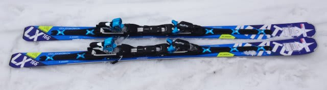
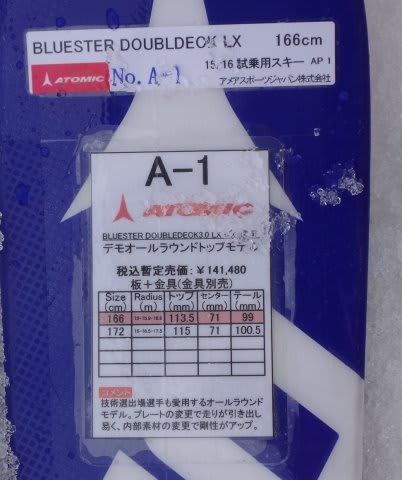
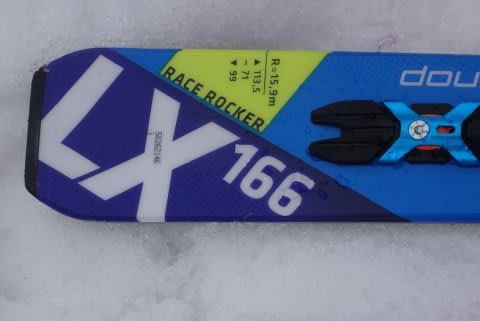

# 1週間ぶり！2016シーズンモデル，スキー試乗レポート第2回…ATOMIC編その2

📅 投稿日時: 2015-03-18 00:20:58

どれだけウェアを変えても，滑りですぐわかってしまうらしい，

Skier_Sです．

＃多くの人から言われるので，

＃かなりクセのある滑りをしているのかな…（汗）．

さてさて．

先週の五竜で試乗した，2016シーズンモデルのスキー板の

レポート，続きます．

本日もATOMIC編です．

では，どうぞ～！

○ATOMIC BLUESTER Doubledeck3.0 LX +X12TL 166cm

基礎オールラウンド．

LXという名前が示すように，ロングベースの板ということで，

Redster GSをもとにした板なんですけど…

長さが166cmってこともあり．

縦に落としていく感じの，ロングの板っぽい挙動では無いです．

大回りメインで考えるなら，172cmを選ぶべし．

旋回性はSXほど強くないけど，166cmの長さだとミドルっぽい

感じで回っていきます．

グリップはそんなに強くなく，ターンのすべての局面で比較的

板を自由に動かせます．

谷回りだけでなく，山回りに入っても自由にずらしに行ける

気楽な自由さがあります．

また，板の返りもそれほど強くなく，強いエネルギーが

板に溜まって一気に解放…って板ではなく，

体の下をすっと通過して切り替わっていくような感じで，

強い返りに体が置いて行かれてしまうといったリスクは少ない板です．

そのため，中低速でのコントロール性はよく，すごく気楽に

履ける感じです．

逆に言うと，昔のATOMICの「ガッツリグリップ」イメージは

あまりないですね～．

もう少しグリップしてくれてもいいかな？…って思います．

ホントのトップスピードまでスピードレンジを上げていくと，

やはりトップのグリップが多少抜けていく感じ…

これも，ビンディングがX12TLではなく，X12VARにすると

もう少ししっかりした感じになるのかな？

あと，プレートが変わってヒール部が低くなったからか．

荷重ポイントが今シーズンモデルまでの極端なテールよりから，

心持ちセンター寄りに変わった気が…（気のせいかな？）

うーむ．

'14モデルのSXに慣れすぎた体にとっては．

スピードレンジと要求体力がワンランク優しくなった感じの

板に感じますが．

逆に言えば，「誰でも履ける，扱いやすい」板になったのかと

思います…
