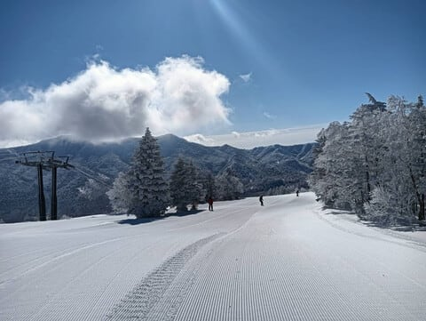

# 特派員によると3月18日(火)の志賀高原スキー場はゲレンデ状況完全復活！…そして，100円だった志賀中野道路も16日から無料になったよ！

📅 投稿日時: 2025-03-18 10:08:56

🏷️ カテゴリ: [日記](cc4b5682fb7b8b144980957a978653fb0.md)

やはりだめだ…

月曜はダメだ…

昨日の夜は，0時前に職場から帰宅後，

お風呂に入ってBlogのコメント返して，

さて，Blog書こうか…

と，1時半過ぎに，Blogを途中まで書いて

いたところまでは記憶があるんですが．

その後，気づいたら電気をつけたまま

床に倒れていて．

朝までそのまま寝てました…

2時間半睡眠で土曜志賀で滑って，

夜は宿で宴会した後に日曜は最後まで

滑って，その後運転して帰宅，

朝3時まで仕事やっつけてたから．

まぁ眠たくなるのは仕方がない…

でも，どうせなら布団で寝たかった(泣)

ということで，最近多い，月曜は夜更新

じゃなく火曜の朝更新ですが．

本日3月18日，すでに特派員から写真が

送られてきていて…

うぎゃーーーーーー！！

すごいいい天気じゃないですかっ！！！

そして，最高のシマシマじゃないですか…！！

どうやら昨日の積雪で，完全にゲレンデは

トップシーズンのコンディションに戻った

らしく．

今日は最高のバーン状況と天気になった

ようです…

うがーーーー！！目の毒！！！

こんな日に滑れる人がうらやましい…！！

ということで．

今日の朝はいい天気ですが．

18日は昼頃から雲が増え始め，

夕方ごろから雪がぱらついてきて．

…そして，今晩から荒れます．

吹雪きます．

うーん．

19日の水曜は，朝は強風でゴンドラが

動くかどうか…

というか，また動かないリフトが多発する

かも．

昼頃からは回復していきそうですが，

とりあえず，荒天ながらも19日は冷えて

雪は20cm以上積もりそうな感じなので．

明けた20日はコンディションいいと思います！！！

…あと，話題は変わりますが．

こないだの日曜，3月16日から，毎回100円を

取られていた志賀中野道路が無料化されました～！

…まだ知らない人も多いのか，思ったほど

混んでいませんでしたね．

これで有料道路を迂回しなくてもよくなるし，

料金所渋滞もなくなるし，志賀高原の

アクセスがちょっと便利になりました～！

ということで．

いつもと違う朝更新でした！

## 💬 コメント一覧

### 💬 コメント by (レインボー77)
**タイトル**: Unknown
**投稿日**: 2025-03-18 14:06:26

火曜日の志賀高原情報

朝の蓮池-7℃。爽やかなヤケビブルーで久々に晴天用ゴーグル選択。スキーってこういう日にやるもんだと幸福度満点の完璧な日。

白樺5点、唐松5点。唯一朝圧雪のオリンピックは、フラットアイスに新雪5センチ。全く落とされずに気持ちよく滑れた5点。広々5てんのGSから奥志賀へ。

ダウンヒルも完璧5点。第３は少しだけ荒れてて4点。エキスパも楽しく5点。でも、あまりの好条件で力が入りすぎたのか、エキスパ３本目から太ももパンパンで、急に滑れなくなっちゃった。こんなときは老人保養所イーストへと移動するも、ここでも違和感。若いはずなのに11時過ぎに終了。今夜はしっかり寝て明日の新雪に備えます。

### 💬 コメント by (レインボー77)
**タイトル**: Unknown
**投稿日**: 2025-03-18 19:46:42

＞ レインボー77 さんへ

＞ 火曜日の志賀高原情報... への返信

レインボーさん

私の現在地は湯田中です

自分も明日の新雪が楽しめるでしょうか？（笑）

### 💬 コメント by (kyotoヒロシ)
**タイトル**: Unknown
**投稿日**: 2025-03-18 20:04:51

＞ レインボー77 さんへ

＞ レインボーさん... への返信

また

間違っちゃった

kyotoヒロシです

### 💬 コメント by (Skier_S)
**タイトル**: 明日は吹雪
**投稿日**: 2025-03-18 23:52:24

＞レインボー77さま

今日は良かったみたいですね~！！

明日は吹雪きます…新雪は積もるけど，ゴンドラ動かないかも…

＞kyotoヒロシさま

明日は気温は低く，雪質はいいと思いますが，風が強いのでゴンドラが動かないかも…

ヘタするとリフトも動かない可能性が．

明後日の20日はいいてんきになりそうなんですが…

