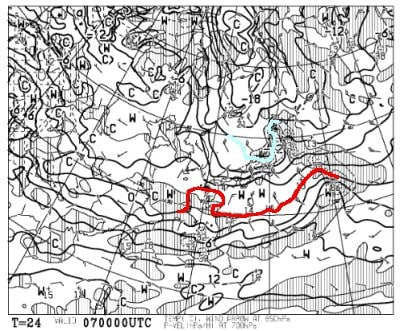
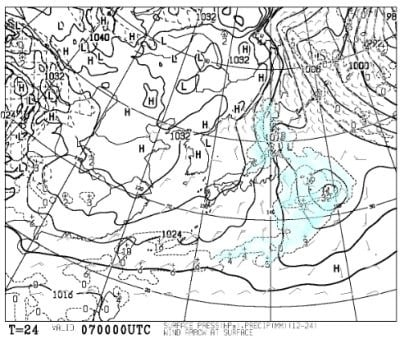
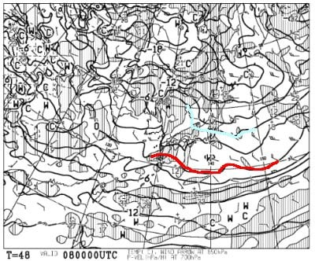
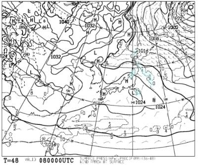
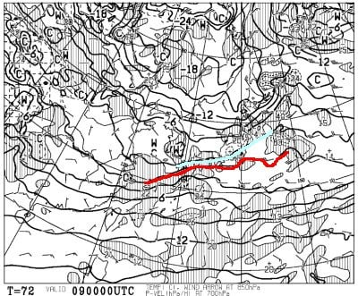
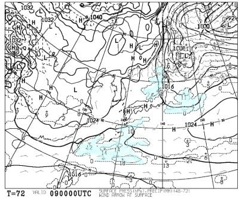
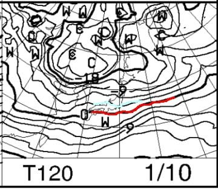
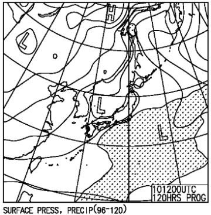

# 1月8，9，10日の3連休，志賀高原スキー場の天気は？…年末年始とうって変わってそんなに冷えず，晴れ～曇りで積雪ほぼ無し

📅 投稿日時: 2022-01-07 02:19:33

🏷️ カテゴリ: [スキー天気予想](c6554f5c3c106093b511a8daae23757e8.md)

ということで．

天国のスキーしまくりの6日間を終えて

現実に戻ってきたわけですが…

12月25日からの1月4日までの

11日で9日間スキーする

という天国の生活だったので．

復帰初日からフルパワーで働かされた

昨日は死ぬかとおもいました…

…だもんで，Blog更新できませんでした

(意地で朝に更新したけど)

しかし，また明日仕事に行けば，

今度は3連休です！！

…ありがたいんだか，人間を堕落させる

のが目的なのか良く分からない，

冬休み明けの3連休がやってきます！

…結局，私にとっては．

12月25日から1月10日までの

17日間で12日スキーする

という，天国の年末年始なんですが…

果たして3連休後，社会復帰できるん

だろうか？？

ってなことで．

この3連休の志賀高原，どんな天気になるのかを

また天気図を見て予想してみましょう…

まずは明日，7日(金)の850hpa図は…

うはー．水色の-12℃線が志賀に

近づいているレベルなので…

これは，冷え冷えです！

そして，この日の地上天気図は…

等圧線が縦縞で，日本海側に

降水域もかかっているので，

志賀高原も雪が降りそう…

で．

次は3連休初日，8日(土)の850hpa図ですが．

この日は志賀高原にかかっているのは，

水色の-6℃線．

まぁ，この時期としては標準的な気温で，

昼間も気温はマイナスキープするレベルの

冷えですね．

この日の地上天気図は…

かすかに日本海側に降水域があるものの．

本州はおおむね高気圧に覆われてるし，

500hpa図の風向きも完全な西風なので，

志賀高原は晴れそう！

続いて，連休中日，9日(日)の850hpa気温は，

うーん．この日は水色の-3℃線が志賀より

わずか南にあるレベル．

それほど冷えなさそう…

地上天気図を見ると…

この日も，網掛けの降水域が志賀に

かかってないので，この日も晴れそう

ですね…

続けて，3連休最終日の10日(月)ですが．

850hpa図を見ると，この日も水色の

-3℃線が志賀高原よりわずかに南．

この時期としては，それほどの冷え込み

とはならなさそう．

そして，地上天気図は…

網掛けの降水域が志賀高原には

かかってないけど…なんだか低気圧が

近づいているので，志賀高原は

おそらく朝は晴れてるけど，

時々曇りって感じかな…

ってな感じで，まとめると

7日(金)：朝は-15℃クラスの冷え冷え！

　朝の積雪は10～20cm，ブーツパフくらい．

　圧雪コースも柔らかい圧雪の上に

　うっすら新雪．

　天気は雪が降ったりやんだり．

　日が射さない，寒い一日．

8日(土)：朝の気温は-10℃近くまで冷える．

　朝から晴れ！

　柔らか最高シマシマバーン．

　終日晴れて，昼間は0℃近くまで

　気温が上がり，暖かく感じる．

　午後は急斜面は荒れるかもしれない

　けど，終日晴れていい雪質を滑れる

　スキー日和！

9日(日)：朝の気温は-5℃程度．

　この日も雲は多めかもしれないけど，

　朝から日が射す天気で，朝イチは

　おそらく最高の締まり気味の圧雪の

　快楽シマシマバーン！

　天気は時折太陽が雲に隠れることも

　あるかもしれないけど，基本的に晴れ．

　この日も昼間は0℃近くまで気温が

　上がり，日が射す南東斜面はちょっと

　雪が緩むかも…

　でも，この日も天気も雪もいい感じの

　スキー日和！

10日(月・祝)：朝は-5℃程度，晴れそう．

　ただ，雲が多く，午後は曇っていくか…

　気温は昼間も0℃を上回らず，さらに

　8日から積雪が無いので，バーンは

　締まり気味のいい感じ！

　この日も朝イチは最高雪質のシマシマ

　バーン！午後もそれほど荒れず

　終日フラットバーンを楽しめそう…

…ってなことで．

この3連休，志賀高原は基本的に晴れで

（新潟は9日は雪になりそうだけど），

吹雪いたり荒れた天気にはならなさそうで．

パウダーがないのは残念ですが，

スキー日和の3日間になりそうです！！

ちなみに3連休のあとは．

11日昼ごろから雪が降り始め，

12日，13日と，量はそれほどじゃないけど

雪が降り続けそうな感じ…

12日はパウダー10cm程度くらい積もるかな…？

なんだか，見事にこの3連休だけ

晴れてくれそうな感じです…！！

ふはははは．

正月休みにひたすらパウダーで楽しめたのも，

3連休が連日の晴天シマシマになるのも，

すべて私の日ごろの行いがいいおかげなので，

皆さん感謝を！！←晴れても降ってもあなたのおかげ？？

　逆に言えば，正月が連日の吹雪になったのはあなたの

　日ごろの行いの悪さのせいなのでは…？？

## 💬 コメント一覧

### 💬 コメント by (西舘)
**タイトル**: Unknown
**投稿日**: 2022-01-07 08:21:27

してるしてる感謝してるー（棒）

1月1日は前日からの豪雪で、

中央エリアほぼ全てのリフトが運休になり、

あぁこれは私の脚がお疲れだから

ゆっくり寝とけとのお達しに違いないと、

日頃のS様の行いに感謝したのでした。

### 💬 コメント by (ダウンヒル)
**タイトル**: Unknown
**投稿日**: 2022-01-07 11:27:25

志賀高原における自然への影響は...

Sさんの日頃の行いにかかっているのかっ!!

恐るべし破壊力だっ!!

お会いしたときに、お賽銭とお供え物を献上しようかな...

### 💬 コメント by (レインボー74)
**タイトル**: Unknown
**投稿日**: 2022-01-07 14:14:40

金曜日の志賀高原情報

五時頃圧雪車の音で目を覚ましました。湯田中は雪で、20cm積もってる。我らは全員太板です。

上林-4℃　蓮池-10℃。なんでこんな寒いところに足が向くんだろう？

焼額に着くと、やったあ！ウハウハの新雪様がたっぷりでのご歓迎！

ニゴンから一目散にGSサイドへ。30~40くらいかなあ。一番乗りです。と～～っても快適。下手は下手なりに楽しめるのがスキーのいいところ。

二本やってスーパーへ。

スーパーは長い距離を楽しめる左端がお勧め。これもまた未踏の地だ。幸せすぎる。これも二本やって再びGSサイドへ行くも賞味期限切れ。みんながオリンピックへ流れる間に、私は見事あぶらあげを釣り上げました。(オリンピックの下でゴキブリほいほいになるのが怖いからかも？)

でも寒さには勝てず、軟弱レインボー隊員全員一致で、昼前に尻尾をまいて退散。エス様には不可能な英断を下して、関英ドライブインで豪華定食(安い)を堪能したのでした。

私「明日は太板かなあ？悩ましすぎる。今の悩みはこれだけだね」

隊員ひろ「平和じゃのう！」

### 💬 コメント by (大阪のK)
**タイトル**: Unknown
**投稿日**: 2022-01-07 18:04:02

明日からの三連休、仲間4人と志賀高原へ参ります。

還暦4名のため、まったりしたツアーになりますが、焼額山でお会いしたらよろしくお願いいたします🙇

### 💬 コメント by (スシネコ)
**タイトル**: Unknown
**投稿日**: 2022-01-07 21:25:35

コメ欄お借りします。

レインボーさん、NHKバーンのこと、ありがとうございました。よくポール貸切になってるところですね。

でもなんでNHKなんでしょうか。お会いしたときにまた、お聞かせください。

### 💬 コメント by (Gokuraku Skier)
**タイトル**: レインボー様、横槍申し訳ございません
**投稿日**: 2022-01-07 22:12:58

スシネコさま

NHKバーンですが、かれこれ45年位前にあそこにNHKのアンテナが建てられたのが由来のようです。

バーンができたのが先か、NHＫのアンテナが先だったのかは？？？ですが、いつしかそう呼ぶようになったと、Goku妻が申しております。

### 💬 コメント by (アリス)
**タイトル**: NHK理解しました
**投稿日**: 2022-01-07 22:28:38

S様

勝手に使い申し訳ありません♪

長年の私の疑問をGokuさんが答えてくれました・・

さすが志賀高原のスーパースターです♪

高天原スキー場の前のホテル数軒のオーナーに聞いても知らぬ、存ぜぬでした・・・

### 💬 コメント by (Gokuraku Skier)
**タイトル**: Unknown
**投稿日**: 2022-01-07 22:38:10

余談ですが、その昔志賀では東京の電波しか受信できなくて、長野ローカルのテレビは見れませんでした。

by Goku妻

### 💬 コメント by (Skier_S)
**タイトル**: 3連休はいい天気！
**投稿日**: 2022-01-08 00:45:21

＞西舘さま

信じる者は救われる…

はい．感謝してください！！

リフト運休も私のお告げです！！（なんのこっちゃ）

＞ダウンヒルさま

はい．志賀高原の天気は私が決めてます！（やけくそ）

お供え物を忘れずに…（笑）

＞大阪のKさま

また焼額スタートでしょうか？

焼額でお会いしましょう！

＞レインボー74さま

意外と，30~40cmも積もりましたか！

明日以降の3連休は雪が降らなさそうなので，これが今後3日間の下地になりそうです…

最高のシマシマバーンが楽しめる3日間ですよ！

＞Gokuraku Skierさま

NHKアンテナが由来だったのですね．

さすがGoku妻さま，よくご存じで…

＞アリスさま

やはりGoku妻さん，すごいですよね…

高天ヶ原のホテルのオーナーもご存知なかったんですね…

