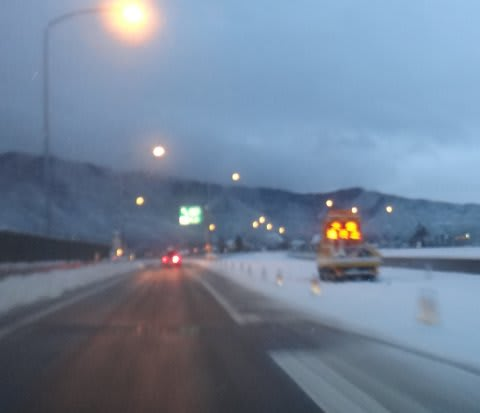

# 1月14日…大雪交通パニック！涙・涙の帰宅物語

📅 投稿日時: 2013-01-17 02:17:26

えー．

緑の板レポートを期待している人も多いでしょうが…

あまりにも衝撃的な一日だったので．書かずにはいられない．

大雪交通パニックに陥った14日の．

スキー場から帰宅するまでの．

涙・涙の物語です…

＃むちゃくちゃ長いよっ！！！！

---

…運命の3連休最終日，14日．

上信越道：長野～松井田妙義間通行止め

関越道：本庄児玉～練馬間通行止め

というニュースを見ても，

「まぁ，じきに通行止めは解除されるさ！」

と，たかをくくって夕方まで滑っていた私．

…でも，なかなか通行止めは解除されず．

「ちょっとやばいかな…」

と思い．

リフトストップまで滑る私には珍しく．午後3時には切り上げ，

3時半，志賀高原を出発．

…ここから，これだけの道のりが待っていようとは．

このときは露も思わず…

信州中野インターから高速に乗ったものの…

やっぱり，長野インターで通行止め(涙)．

午後5時．長野インターを降りて下道へ．

…ここからが．

長い戦いの始まりなのだった…

長野～更埴間の国道18号は，とうぜん，すーーーーんごい渋滞．

うーん．こんなことなら，須坂長野東で降りて，菅平回ったほうが早かったか？

とか思ったけど．

「まぁ，じき高速が通れるようになるはずだから，なるべく高速から離れないほうがいいよなぁ…」

と．

今から振り返ってみると，極めてきわめて甘～い考えを持っていたので．

とりあえず，更埴まで裏道攻撃．

狭いし道路は雪が洗濯板状態だし，かなりつらい…

でも，超渋滞でほとんど動かない国道18号よりまし．

…とはいえ．松井田妙義までこのまま裏道で行ったら死ぬなぁ．

と，思いつつ．

6時過ぎに更埴通過．

…まだ，高速はオープンしないか…

一旦国道18号へ出てみると…

やっぱり，超のろのろ運転で．10分で数10ｍしか動かない…（涙)．

再び裏道攻撃開始．

時折見える国道のテールランプの列を横目に，すれ違いも厳しい，

除雪もされていない畑や森の中の道を運転し続けること1時間ほど．

上田坂城バイパスは，そこそこの速度で車が流れてたので，バイパス始点から国道に乗り…

7時半，上田通過．

すでに運転時間は4時間．

長期戦を覚悟して，中野市街で買い込んだ食糧を食べつつ，

国道18号を避けて，浅間サンラインへ．

…しかし．

浅間サンラインも詰まってるよ…

上田～東部湯の丸間は，菅平から東部湯の丸ICへ抜けるときに

使う，比較的快適な2車線道路を迂回．

ここは順調に流れ，再び浅間サンラインに合流．

…浅間サンラインに入ったところで，車が詰まって平均時速20km程度にがた落ち．

…まぁ．でも．止まらずに流れているだけでもめっけもんだな…

9時，小諸通過．

…そして．

長野から5時間，ひたすら一人で運転に疲れてきた夜10時ごろ，

軽井沢手前，浅間サンラインが国道18号と合流するところで．

ついに，浅間サンラインでも，歩くより遅いくらいの速度に…(涙)

10分で10m進むか進まないか…ってほど，全く動かない超のろのろ運転(泣）．

ここから再び，裏道パワー炸裂．

大浅間GCの裏から軽井沢の町を抜け，

11時前，碓氷バイパス到達．

…そろそろしんどくなってきた．

下道運転もぶっつづけで6時間．

買い込んだコーヒーも3缶目．

碓氷バイパスはかなりつるつる．

上り・くだりとも歩く程度ののろのろ運転．

…でも，国道旧道は通行止めで．碓氷バイパスはほかの迂回路もなく．

仕方なく，のろのろ運転に付き合います…

上りでは，坂を登れなくなったのか，かなりの台数の車が

雪が積もった状態で放置されてました…

んで．

碓氷バイパスも抜けて，もうすぐ松井田妙義．

ようやく高速に乗れるぞ！

と，思った11時過ぎ，

通行止めだった，長野～松井田妙義間の高速がオープンとの情報がっ！

がががががーーーーーん．

さ，最悪のタイミングっ！！！！

高速通行止め区間を下道でひた走り，

ようやく高速がオープンしているところまで

まさに達しようとする，その瞬間に．

それより手前の通行止めがすべて解除されるとは…っ！！！！！！！！！

な，なんというタイミングっ！

ひ，日ごろの行いが悪すぎたか？？

長野インターを下りて，雪深い裏道を一人ひたすら運転してきた

これまでの6時間はな，なんだったんだ～っ！！！！(心の叫び)

まさに，まさに最悪っ！！

かなりげっそりと気落ちしたけど．

まぁ，本庄児玉から練馬までの通行止めも同時に解消し，

一気に練馬インターまで，すべての高速がオープンしたみたいだし．

これでやっといつもどおり，高速で帰れる…

夜2時過ぎには帰宅できるなあ…

と．

このときは．

まだまだまだ甘い考えを持っていた自分だったのだった…

11時半，松井田妙義IC.

…高速ってありがたい…(感泣）

と，高速道路のありがたみを噛みしめつつ．

全く渋滞することもなく，新座料金所まで快適に走行．

長野～松井田妙義までの100kmに6時間半かかったのに．

高速の松井田妙義～新座の120kmほど，1時間ちょいですむんだもんなぁ…

いやー．快適，快適．

1時前，新座料金所．

しかし．

だが．

ここからが．

まだまだ長くなるとは，このときは露も思わなかったのだ…

首都高が全面通行止めで，都内の道路も麻痺状態のため．

練馬インター手前で，車がぴくりとも動かなくなってしまいました…．

新座料金所から練馬インターに達するまで，約1時間半．

な，なんということだ．

松井田妙義から新座料金所まで1時間半かかってないのに．

新座料金所から練馬インターまでの3kmに，それ以上の時間がかかるとはっ！！

…どういうことっ！？？

2時半，練馬IC.

…疲れた．

疲れたよ．

(放心状態)

でも．

…我が家，高速使っても，ここからまだ1時間半以上かかるんですけど…

第三京浜も，首都高も，まだすべて通行止めですかっ！！

いったい，ここから家まであと何時間かかるんでしょうかっ！？？

とりあえず，練馬インターから環八までは，さらに数10分を

要しそうだったので．

一番最初に曲がれる交差点を曲がり．

ひたすら都内の裏道を疾走．

都内は，環八とか甲州街道とか，大きい通りはすごい車の量で詰まっていたのに．

普通の街中の道は，雪深くてみんな恐れをなしているのか，怖いくらい

交通量がないよ…．

スキー仕様のわが車では何の苦もないがらがらの道を通って，

1時間ほどで都内を抜け．

3時半，神奈川県突入．

…すでに運転12時間目．

もう，頭は何も考えられません．

反射で車を運転しているような状態…

東京は積雪路だったけど，神奈川県内は凍結路面．

「うひょ～！(汗）」って感じで，何度もABSを効かせながらの走行．

まったく交通量がなく，周りに車がなかったからいいものの…

そんな，神奈川県内の下道をひたすら走り続けること1時間半．

朝4時半，帰宅．

か，帰ってきたよ～．

無事，家に着くことができたよ…

志賀高原を出てから13時間．

夕食も車の中で済ませ，トイレ休憩3回以外はひたすら

一人で運転し続けた13時間．．

事故することもなく，家に着いたよ…

この日は，結局23時間近く起きていたので．

布団に入って死んだように寝たのでした…

＃でも，睡眠3時間で会社へ．

＃死ぬかと思った

## 💬 コメント一覧

### 💬 コメント by (miya)
**タイトル**: 大変でしたねー
**投稿日**: 2013-01-17 17:45:07

はじめまして。

いつも楽しく拝見しています。

プール好きの娘の年齢が近いので、夏のレポートも楽しんでいますよ。

14日は家族で水上高原にいて、翌日の小学校登校を考慮して12時すぎに出発。

関越にのった直後に通行止めになり、本庄児玉で下ろされ（下りるのに1時間くらい？）、開通していた圏央道青梅ICを目指して下道を激走しました…。

国道はどこも大渋滞。地図とナビを頼りに訳のわからない裏道を走り、青梅IC-高尾山IC-16号経由で横浜の自宅に戻ったのは22時。10時間の運転で済んだのはよかったみたいですね。。

### 💬 コメント by (Skier_S)
**タイトル**: miyaさま
**投稿日**: 2013-01-18 00:54:54

はじめまして～！

夏・冬両バージョンの読者は珍しいです…

海もよく行くんですか？？

しかし．

あの日．

10時間で帰宅できたならラッキーなほうかと…

うちは今回子供をつれてなかったから大丈夫でしたが，

子供を13時間車に閉じ込めていたら，ちょっと大変な

ことになっていた気がします…

また，今後ともよろしくです～

### 💬 コメント by (いか)
**タイトル**: 運転お疲れ様でした
**投稿日**: 2013-01-18 01:07:11

はじめまして。

私も14日にバスツアーで白馬に行っていたのですが、昼ごはんのときに高速通行止めを知り、諦めてガッラガラのスキー場をひたすらぐるぐるしていました。

現地出発が17時だったのですが、バスなので高速から大きく外れたルートを取ることも出来ず、19号→20号→大月IC→新宿というルートで、新宿で解放されたのは翌日の朝11時でした(笑)　まさか白馬から18時間もかかるとは思いもしませんでした。運転手の方も大変だったことと思います…。

緑の板のレポート楽しみです。

### 💬 コメント by (Skier_S)
**タイトル**: 18時間！お疲れ様でした…
**投稿日**: 2013-01-18 01:47:28

18時間ですかっ！！

…それは，かなりの長期戦でしたね…

バスのシートで18時間は，かなりの拷問かと．

しかし，翌朝の11時って，仕事は完全に遅刻ですね(笑）．

緑の板のレポートは…来週になりそうです…

今しばしお待ちを(汗）．

### 💬 コメント by (ひろりん)
**タイトル**: Unknown
**投稿日**: 2013-01-18 17:41:28

おつでした♪

私は静岡なので韮崎から南下なんです。高速沿いの道はアウトであると予想し、高速復活は捨ててました。

菅平は雪が深いと思ってましたが、18号がクルマであふれてると読んだので・・・まぁ、運転は私じゃなかったし（爆）スタッドレスは新品だし、ドライバーはレーシングドライバー（本物）だったのでｗｗ

小諸＞佐久で19：30くらいに少し18号走りましたが通過に30分。。。orz

その後小海(ここで夕食休憩1時間、出発20：45）＞野辺山（21：15）＞清里＞韮崎（コンビニ休憩で22：00）とガラガラでした。

### 💬 コメント by (Skier_S)
**タイトル**: ひろりんさま
**投稿日**: 2013-01-18 22:29:59

なるほど．

静岡だと，都内の混乱に巻き込まれず済んだので，

うらやましいところです…

私も昔，超大雪の日に車をぶつけてしまった

人を長野まで迎えに，菅平から長野往復

したことがありますが…

深雪ががんがん積もっていく中，

ラッセル状態で結構エキサイティングな

道になっていた思い出が…

しかし，素直に18号を通り続けた人は

何時間かかったのかなぁ．

