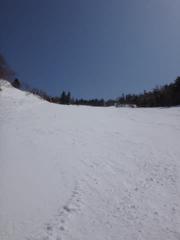
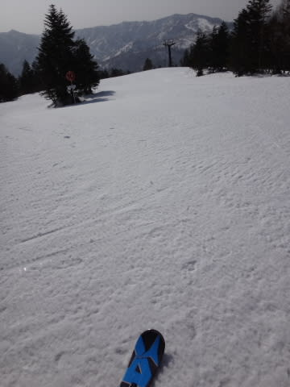
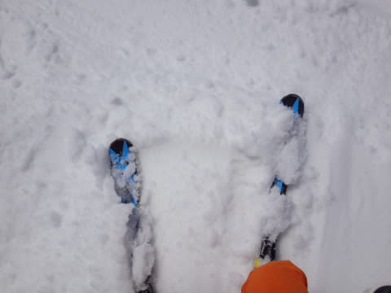
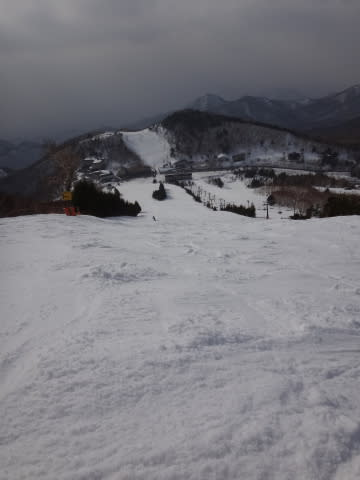
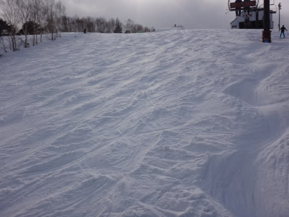

# 3月22日の志賀高原，速報モード…晴天，ポカポカ陽気の春スキーの一日

📅 投稿日時: 2015-03-23 02:12:28

🏷️ カテゴリ: [2015スキー滑走日記](c09ea645cfc085f86dfcd80f49599dd89.md)

なんだか．

今日は，高速道路がすごく混んでいて．

帰宅したのが午前1時近くという…

久しぶりに，関越道100分渋滞とかいう表示を見ましたよ…（死）

ってことで．

今日は帰宅がありえないほど遅かったので．

超速報モードで…

えー．

本日は，午後は予想通り雲が増えたものの．

朝は快晴で始まり，午後まで基本的に晴れが続いた

一日で．

…朝のうちは，ガチガチアイスバーンとまで行かないまでも，

結構固めの斜面がお出迎え．

…だったんだけど．

強い日差しのせいで，予想より早く緩みはじめ，

10時前にはゲレンデ全面が緩んだザラメになってしまいました．

柔らかくなった雪は，あっという間に荒らされて，

凸凹＆小回り道斜面になり，昼頃には結構残念な

状態に…

とりあえず．

午後は，重い雪の荒れ荒れ斜面をひたすら滑り．

むちゃくちゃ疲れた一日だったのでした…

ああ…先週と違いすぎる．

天国の先週から，一気にシーズン末期に突入してしまった感じが…（涙）．

今シーズンは，もうあんな雪で滑れないのかなぁ…（悲）．

…とりあえず．

また明日，詳細レポートします…

＃スキー場レポートはいいから，スキー試乗レポート早くやれ，

＃という声が聞こえる気がするが，聞こえなかったふりをしよう…
