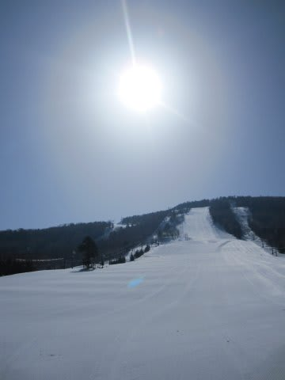
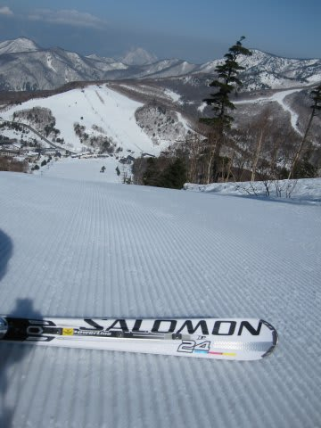
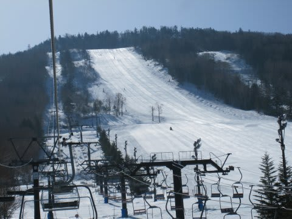
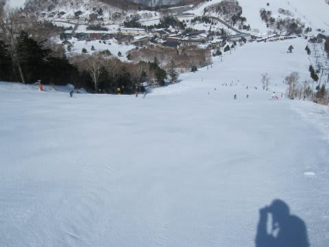
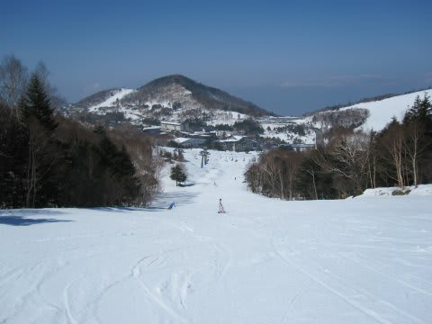
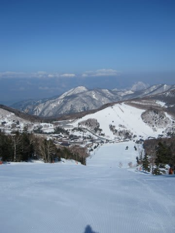
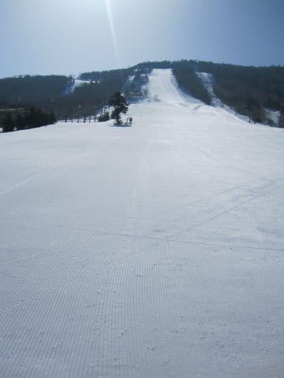

# 4月10日，日曜日の志賀高原は晴天

📅 投稿日時: 2011-04-11 01:29:49

🏷️ カテゴリ: [2011スキー滑走日記](ca488c98cfb9169941c3e73770dcefb56.md)

で．

一日中雨だった土曜日から一晩あけて．

日曜は．

朝から晴天！

朝のうちは，放射冷却でちょっと冷え込み，

気温はマイナス．

ゲレンデは，昨日の雨を吸った雪が

きれいに凍ってます．

てっぺんからふもとまで，すべて凍ってます．

アイスバーン祭りです．

リフトに乗っていても，ゲレンデを滑るスキーヤーが

立てる金属音が響き渡るほど…

晴天なので，お客さんは昨日より多いですね～

昨日はみんなどこに隠れていたんだろう？？

ってくらいのスキーヤーが出てきました．

リフト待ちが出るほどの混雑，ってわけではなかった

ですが，昨日の一の瀬メインバーンに1-2人しかいないような

寂しさが漂うゲレンデ状況とは違って，今日はそこそこの

人がいますね～

でも，一の瀬メインバーンは大回り可能な程度の

人口密度なので，例年より少ないですけどね．

9時半ごろにはゲレンデの下半分が，ようやっと

緩み始めましたか．

10時半には一の瀬上部も緩み始めましたが，

一気に緩むことはなく，表面がいい感じで緩んだ

滑りいい状態が昼ごろまで続きました．

晴天で日が照っていたのに，表面が適度に溶けた

滑りやすいゲレンデが数時間続いたので，

気温自体は低めだったんですかね．

さすがに，午後には結構緩んだ感じになりましたが．

それでも，張り付く雪にはならず．

一の瀬上部は，コブになるほど荒れもせず．

汚れが浮いて滑りにくい雪になることもなく．

晴天だったのに，これだけのコンディションで

滑れたということは．

4月にすれば，比較的恵まれた条件だったのかと…

しかし．

今シーズン．

雪は多いですね．

この時期，早いときは，ゲレンデ脇に土が出始めたり

するものですが．

まだぜんぜん雪はたっぷりあります．

GWまで，余裕で持ちますね…

もう営業をしていないサンバレーや丸池も，

雪はまだたっぷり．

営業していないのがもったいないくらいです．

あーーー．

そういえば，今週は．

帰り道，地震以来始めて，関越道が渋滞していましたね．

嵐山近辺と，高坂近辺．

最高30分近く渋滞していたみたいだし，

中央道は小仏で1時間ほど渋滞していたみたいですし．

そろそろ交通量が普段に近いくらい戻ってきたんでしょうか…
