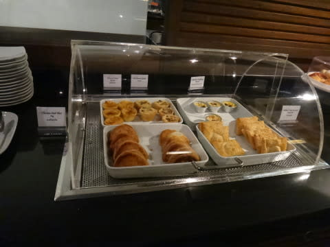

# 2013年9月　子連れタイ・タオ島ダイビング旅行記　その34…無事，帰国．

📅 投稿日時: 2013-12-11 04:01:06

🏷️ カテゴリ: [ダイビング日記](ce3a7a8d424d112fce83ee85c81a0e344.md)

えー．

残念ながら，本日…

…っつーか，帰宅が遅くてこんな時間の

更新なので．もう昨日ですね(泣）．

ということで，改めて．

…昨日の火曜日は，志賀高原でも朝方は雪だったのが，

昨日の予想通り，昼近くには雨になったらしく．

午前11時の志賀の状況を見てみると…

こーゆー感じで，渋峠も丸池も，「降雨…有」となってました…(涙)．

まぁ，それほどひどい雨じゃなかったのが救いで．

夕方からは雪になったようですが…

とりあえず，11日夜から12日はばっさばっさ雪が降りそうなので．

それに期待かな～．

…いや．

ちょっと待て．

なんだか今，天気図を見てみると．

12日だけじゃなく，13日，14日も降り続けるかも…

この週末は期待大だな．

って，本題が終わったところで．

おまけのタイ旅行記です．

…やっと帰国までたどり着いたよ…

-----

というわけで．

バンコクで乗り継ぎ待ちなわけですが．

バンコク→羽田の帰り便はANAなので．

スターアライアンスゴールドメンバーの我が夫婦．

ありがたくラウンジを利用させてもらいます…

うーむ．

アジアの空港のラウンジ．

食べ物も結構豊富で．

お酒も飲み放題だし．

コストダウンの激しい米国の空港よりずっといいなぁ…

…と，快適なラウンジで，乗り継ぎの3時間．

のんびり過ごさせてもらうと…

搭乗時間です．

…夜10時25分発の飛行機で，機内食が夜11時ごろに出るのですが…

飛行機大好きな娘は，寝ないで起きてますねー．

映画を見ながら機内食という，

娘にとってのシアワセタイムを過ごしているようで…

でも．

さすがに食後すぐ，撃沈してましたけど．

って感じで．

飛行時間約6時間．

娘は完全に熟睡している間に日が昇り…

そして，朝6時過ぎ．

無事，羽田に到着！！

で．

前日の朝にホテルを発って，それからひたすら移動を続け，

やっと帰国したばかりというのに．

旅行から帰ってきた余韻に浸る暇もなく．

一休みする間もなく．

帰宅後，軽くシャワーを浴びただけで．

いつもの朝と同じように会社に向かい．

…それから一日，いつも通りに仕事をこなす，長い長～い一日が，

始まったのでした…

（おしまい）
