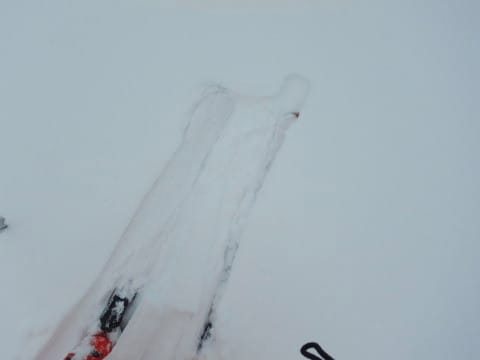
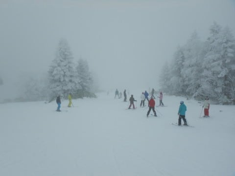
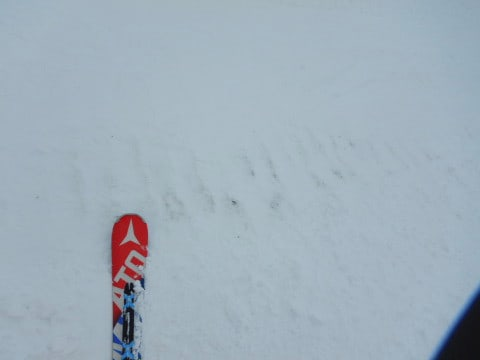
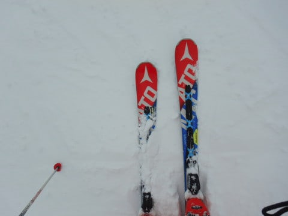
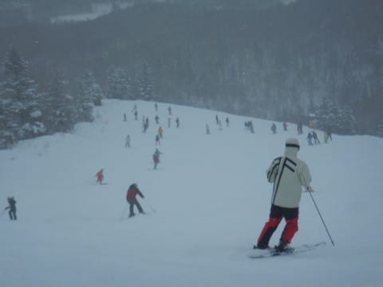
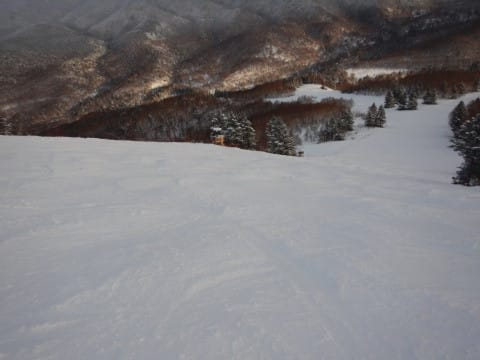
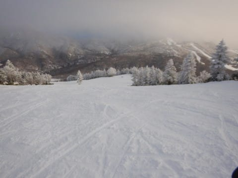
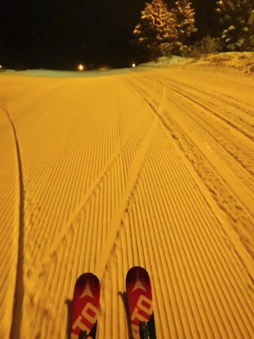
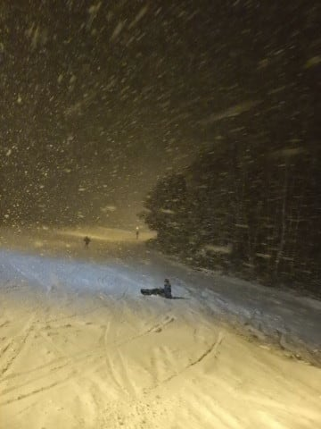

# 2020/1/4(土)の志賀高原スキー場，速報レポート！…朝10cm積もったけど，まだ多少ブッシュ有り．曇り時々雪，バーンモサモサの一日

📅 投稿日時: 2020-01-05 06:11:41

🏷️ カテゴリ: [2020スキー滑走日記](c282e9230de179e245c7334eabeb0a3b3.md)

ということで．

本日，1月4日までの6日間の志賀高原滞在だったわけですが．

つい先ほど，志賀高原から自宅に帰ってきました…

いつも通り，帰宅は深夜だったので．

本日は1月4日の志賀高原，

超速報モードにて！

えー．

本日はちょいと都合により，ゲレンデに出るのが

午前10時半過ぎと，遅めの出動になって

しまいました（ちょい涙）

…が．

昨晩から10cmほど積雪があったようで．

ゲレンデ脇には，新雪が積もってます！

昼間も雪降りの寒い天気だったけど…

でも．

ゲレンデのブッシュが完全に

隠れてくれるレベルの大雪ではなく．

大体ほとんどのブッシュは隠れてくれたものの，

コース上の一部，まだわずかに

ブッシュが顔を出している部分も

残ってます（涙）

とはいえ．

柔らかい新雪が，ゲレンデ全面に

乗っているので，

昼間のゲレンデは結構モサモサで．

さらに，ゲレンデの人口密度は，

今日も相変わらず高め（涙）

だもんで．

午後には，かなり多くのスキーヤーにより

やわらか新雪を削られて，コース全面凸凹に

なってきてしまいました…（泣）

でも．

夕方，リフトストップごろには

雪が止み，太陽も射してきて．

冷え冷えで雪質は良く．

結構滑り良くて，楽しいゲレンデコンディションに

なってきてました…

うーーーむ．

この冷え冷え雪のシマシマを滑りたいっ！！

今日は朝イチに出遅れたので滑れなかった，

ピカピカシマシマバーンを滑りたいっ…！！

…

…

あれ？？

これは，ナイター？？

本日は泊まらずに，K奈川県に

帰宅するはずなのに，ナイター？？

ってな感じで．

想定外のナイター参戦を

してしまいましたが．

いやーー．

ナイターは，冷え冷え最高雪質の

シマシマで．

人生こんなシアワセがあるのか…

というレベルの最高シマシマバーンを

堪能できたのでした…

そして．

ナイター途中からは．

かなりの勢いで雪が降り，

ナイターが終わるまでに10cmくらい

積もっていて．

まだ降り続けていたので…

明日の朝は，パウダーの最高

コンディションかも…

うーむ．

帰りたくない…

明日も滑りたい…っ！！

…と思いながらも．

家庭の事情で今日中に帰宅せねば

ならなかったので．

ナイター最終まで滑ったあと．

眠くて死にそうになりながら，

自宅まで300km運転して帰ってきたの

でした…

明日の朝イチ，志賀高原への道路は

かなり気合の入った積雪路だと

思うので，志賀に登る方は

お気を付けください～！

ってなことで．明日詳細レポートやります…！

## 💬 コメント一覧

### 💬 コメント by (ほっぽ)
**タイトル**: 1/4　志賀高原
**投稿日**: 2020-01-05 07:09:01

Ｓさん

今年もよろしくお願いいたします。

４日は１ゴン探しましたがお会いできませんでした。

昨日はサンバレーまで遠征して鍋焼きうどん食べてきました。

東館山よりサンバレー側はブッシュだらけで厳しかったです。

昨夜からの雪が３０ｃｍほど積もったようですので、ファットスキーは持参していませんが、

今日はパウダー満喫してきます。(^^♪

昨日の滑走レポートをＨＰにアップしておきました。

http://www2.tokai.or.jp/nana_hoppo/

### 💬 コメント by (Hide)
**タイトル**: Unknown
**投稿日**: 2020-01-05 08:34:03

S 様

今日は姿が見えないな・・・

と思っていたらめずらしく遅いスタートだったのですね。

圧雪しなかったようで、チョット雪が柔らかくモサモサでしたね。

6日行きたい・・・たぶんサイコーな予感。

### 💬 コメント by (五輪の書)
**タイトル**: Unknown
**投稿日**: 2020-01-05 10:48:37

明けましておめでとうございます

帰る日にナイターとは凄い

しかもラストまでとは凄すぎ

しかも即刻速報と言う名の詳細レポとは超人

### 💬 コメント by (michi)
**タイトル**: Unknown
**投稿日**: 2020-01-05 21:32:03

昨日はナイターまでお疲れ様でした。

良い雪でしたね。

そしてあんなに大人数でのナイターは初めてで楽しかったです。

しかし朝礼〜ナイターは久々で疲れました^^;

また来週宜しくお願いします。

### 💬 コメント by (ハリー)
**タイトル**: Unknown
**投稿日**: 2020-01-06 17:11:48

初めまして❗️

スキーは妻がよくやっておりました。色んなところで滑ったみたいです。

私は小学校の頃、学校から行っただけですが、初めてとはいえ、とても楽しかったのを、覚えています。

やがて社会人になり、その辺りのことをすっかり忘れていましたが、間もなく定年退職を迎え、新たにさまざまなことにチャレンジしてみたいです。もちろん、スキーにも。

夫婦で行けたら最高だなあ、と思っております✨

### 💬 コメント by (Skier_S)
**タイトル**: コメント回答遅くなってゴメンナサイ
**投稿日**: 2020-01-07 02:51:59

>ほっぽさま

5日は全面パフパフで良かったみたいですね…

うらやましいです…

＞Hideさま

4日は1ゴン駐車場着が10:30でした（涙）．

しかし，6日は最高だったようですね．

私も行きたかったです…

＞五輪の書さま

翌5日はどうせ休みなんだし，朝のシマシマを滑り

そびれたので，ここはナイターでしょ！

と，家族を巻き込みナイターで滑ってました．

しかし，夜の運転は死ぬかと思いましたが…

＞michiさま

4日はナイターまでお付き合いありがとうございました～！

ナイター最高でしたね！！

しかし，キッズたち速すぎ（笑）．

＞ハリーさま

はじめまして～！

コメントありがとうございます．

まもなく定年退職ですか…

志賀高原常連さんも，定年後に滑り続けているような

方が結構いらっしゃいます．

ぜひ，ご夫婦で志賀高原へお越しください．

スキーじゃなくても，夏の志賀高原もいいですよ～！

