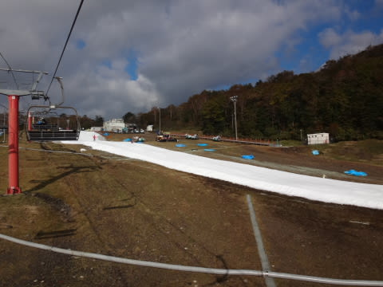

# 2014/2015シーズンついに開始！10月18日，オープン翌日のYetiに行ってきた

📅 投稿日時: 2014-10-18 22:10:48

🏷️ カテゴリ: [2015スキー滑走日記](c09ea645cfc085f86dfcd80f49599dd89.md)

ついに．

ついに来ました．

ついに，始まりましたよ～

スキーシーズンが！

ってことで．

昨日．

2014/2015シーズンの先陣を切ってイエティがオープンしたわけですが．

オープン2日目となる本日土曜日，

今シーズンの初滑りに行ってきました～！！

ついに，シーズンインですっ！！！！！

…まず，今朝．

うっすら冠雪している富士山を眺めつつ，イエティに向かうと…

イエティ付近の気温は10℃．

ふむ．それほど寒くはないですな．

8時オープン前から，リフト券売り場に並びますが…

チケット販売開始時，5分待ちくらいの感じかな～．

この時期，土日の一日券は2900円．

事前にメール会員登録をすれば500円割引になります．

が…

イエティに入るための有料道路．

昨シーズンまで500円だったのが．

510円に値上げしていていたよ…

駐車場代金は1000円のままでしたが…

リフト券は安いとはいえ，有料道路+駐車場代を含めると

結構な出費だな（涙）．

んで．

んで．

リフト券を買ったら．

もう，待ちに待った．

夢にまで見た．

禁断症状で苦しんだ．

雪の世界と，4か月ぶりのご対面だぁっ！！！

うははっははははっはっ！

雪だっ！夢にまで見た雪だよ！←アイスクラッシュの氷でしょ（冷静なツッコミ）

もう，耐え難きを耐え，忍び難きを忍び…

ついにこの日が，やってきたっ！！！

オープン直後，ゲレンデはガラガラっ！！！

シーズンの一本目，大切に行こうかと思ったけど．

4か月の禁断症状の後に，このガラガラなコースを見て，

すでに理性は吹っ飛んでます．

ぐおおお！

行くのだ！

人が増えない，クリアラップのうちに，行くのだっ！！

そして，リフト待ちがない8時台のうちに，ガシガシ滑るのだっ！

…ってことで．

9時過ぎまではこの程度の混雑具合．

雪質は，結構締まり気味の，板が良く走るいい感じの雪．

朝のうちは天気も良く，富士山もすっきり見えて．

気温が上がって，雪がザブザブになっちゃうかな～，

…と，心配してたけど．

なんだか，9時過ぎにはちょっと曇りだしてきて…

気温も，ミドルウェアでもいいけど．

ウェアのジャケットを着てきても良かったかな？

ってほどの寒さに．

天気は終日曇り，時々日が射す…って感じだったので．

強い日差しで雪が解けてしまうことがなく，

結構板が滑る雪だったのでラッキーっ!

9時半ごろには，ちょっとゲレンデの人口密度は増えてきたけど…

でも，リフト待ちはこのくらい．

午前中は，大体こんな感じの，最大3分待ち程度

でしたね～．

夕方が一番人が多かったけど．

ピークでもせいぜいこの程度の待ちでしたので．

リフト待ち自体は最大5分強くらいかな？？

ただ，リフト待ちは少なかったけど．

コース上の人口密度は，それはやっぱりこの時期の

イエティなわけで．

うむ．

狭い廊下に，ちょっと人が多いですな…

でも．

許す．

雪があって滑れるだけで，すべて許す．

この時期に滑れるだけで，何でも許す．

午前中は比較的フラットだったコースも，

午後になると一部荒れだしてきて．

午後2時過ぎごろには，リフト乗り場前の

一部，ちょいと危険な感じになってきましたよ…

でも．

土が出てきてたのは，リフト乗り場近辺の，この部分だけ．

それ以外は，結構しっかり雪の厚みがあり，

土が出てきているところはなかったですね～．

という感じで．

初日の興奮のまま，

ひたすらひたすら

「うひょひょひょひょ～！！！！」

と，ヨロコビの滑走を続けていると，

気づかぬうちに8時間．

午後4時に昼間営業が終了し，ナイターへ向けての

圧雪のための1時間休憩タイムになりました…

…いきなり，この時期から10時までナイターやるのが

すごいなぁ…

でも，私は．

ナイターまで滑りたい気持ちを，ぐっと押さえて．

家庭の平和のため，この日は帰路に着いたのでした…

しかし．

パラオ帰国から中2日で．

さらに3時間睡眠でスキーって…できるかな？？

早めに帰って休もうかな？

って，出発前は思ったけど．

ゲレンデに立つと，すべて忘れちゃいますね～←単なるバカ

もう，帰りたくなくなりますよね～←白い粉中毒患者のたわごと

いやーーーーーー．

やっぱりスキーって，楽しいですねっ！！！！！！！

シアワセな一日でした…

## 💬 コメント一覧

### 💬 コメント by (komu)
**タイトル**: ありがとうございました
**投稿日**: 2014-10-18 23:44:38

結局、20時まで滑ってました。昼間より若干空いて、気温が下がったのでなかなか飛ばせました。で、途中でお風呂してただいま反省会してます。いや～楽しかった。またよろしくお願いします。

### 💬 コメント by (はなげ親分)
**タイトル**: うらやましい！
**投稿日**: 2014-10-19 01:03:58

シーズンインおめでとうございます。

私は２０日のナイターにてインの予定です。

地の利を生かし、仕事帰りのイエティをしばらくは楽しみます。

### 💬 コメント by (Skier_S)
**タイトル**: ついに始まりましたよ～
**投稿日**: 2014-10-19 01:29:08

>komuさま

いやー．

あれから，まだ3時間滑りましたか！

初日からいきなりやりますね～！

また来週からもお願いします～！

>はなげ親分さま

いやいやいや．

シーズンインしちゃいましたよ．

20日って，月曜平日のナイターですか？？

うらやましいです…

楽しんできてください！

### 💬 コメント by (ひろちゃん)
**タイトル**: 楽しかった
**投稿日**: 2014-10-19 01:47:52

S様の体力には、あっぱれです。外足荷重参考になりました。股関節大事、シーズンイン前に、手解きありがとうございました。また、あうひまで、頑張ります。

### 💬 コメント by (Skier_S)
**タイトル**: ひろちゃんさま
**投稿日**: 2014-10-19 01:55:06

今日は一日お疲れ様でした～．

…でも．

私の体力より．

シーズン初日で，朝8時から夜8時まで

滑っている方がすごい気がするんですが…！？？

とりあえず．

シーズン初日，いいポジションでスタート

できたのではないでしょうか？

また，Yetiで会いましょう！

### 💬 コメント by (れー)
**タイトル**: ありがとぅございました
**投稿日**: 2014-10-19 06:42:33

もぅ、昨日のこととなってしまいました…

シーズンイン初日、寸暇を惜しんで滑りまくらねば…という状況の最中、熱い厚いレッスンタイム本当にありがとぅございました。

お陰様で、大きな壁をひとつ乗り越えられたような気がします。（気のせいかも…）

その後、ナイター1本目はパリ、トロ、フワ、なゲレンデ状況でご馳走様～という感じでしたよ～

### 💬 コメント by (Skier_S)
**タイトル**: れーさま
**投稿日**: 2014-10-19 10:20:48

昨日はお久しぶりに一緒に滑っていただき，

ありがとうございました～！

こちらも，シーズン初日についつい気持ちよく

飛ばしてしまうところ，しっかり基礎ポジションの

確認ができて，むしろありがたかったです．

今シーズン，何か手がかりが得られたなら

良かったです…

また，一緒に滑りましょう！

