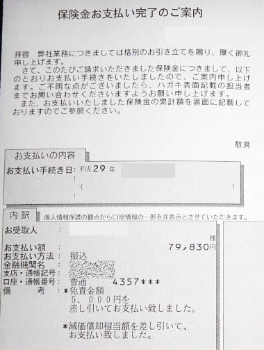

# 第7回物欲選手権後日談，その2…をを！保険金が下りたよ…！！

📅 投稿日時: 2017-12-01 05:33:34

🏷️ カテゴリ: [スキー雑談](c1f9d2cb7478308da16419928ea3945e9.md)

えー．

なんだか．

今日もご無体時間までいろいろやっていたので．

…ええ．いろいろと．

＃働き方改革などと言われる昨今．

＃口が裂けてもこんな時間まで仕事していたとは

＃言ってはいけない

なんと．もうこんな時間か…（涙）

今から1時間ちょいしか寝られないけど，

明日朝起きられるかな…？？？

ってことで．

今日は遅い（朝早い，とも言う）ので．

今日は短めのネタを…

えー．

[第7回物欲選手権](e38b4d4ca6ea3af24cebf3838ab8c791d.md)の時にATOMICに修理依頼を出した，

'16 SX．

結局，[板のコア材まで逝ってしまっており，修理不能](e56c11ebadfa98e86c1f0cbe36198f076.md)…というところまで

お伝えしましたが．

…そんなときのために．

私の入っているスキー保険の

「携行品損害特約」

こいつを使おうではありませんか…！

とりあえず．

持ち物に予期せぬ破損が生じ，

修理費が発生した・修理不能になった

という状態になれば請求できるので．

ATOMICから

「修理不能です～！」

と言われた際．

反射的に修理不能証明書の発行をお願いしていた自分が

いたのでした…

あ，携行品特約は，自然損耗には使えないのですが．

私の'16 SX．

わずか4か月の利用で破損してしまったので．

決して自然の損耗では無いはず！！！

ということで．

保険会社に手続書類を送ってみたところ．

その数日後．

我が家に届いた郵便物を見ると…．

うむ？？

保険金？？？

…って．

…えええええ！！

購入から2年経っても，こんな評価額がつくの？？？

これ，免責5000円を引いた額だから．

なんと，84,830円もの評価額が！！！

…まぁ，定価が高い板ではあるけど…

…ということで．

私が2シーズン使った板．

ほぼ寿命が終わっている気もするのですが

新品からそれほど落ちないお値段の

携行品保険が出たのでした…

これで，安く買った'17 SXと太板の購入金額の

ほとんどが補償されたな！！

…良かった…

これで，あとは．

買い忘れたスキーパンツを買いに

行くだけだな！←危険だ…いろいろ危険だ

PS.高額の払い戻しを何度も繰り返すと，保険会社から

　保険の継続や契約を断られるようになるらしいので，

　意図的に板を毎年破損すれば，毎年板の代金が保険でもらえる…

　とか，考えない方がいいです（笑）

## 💬 コメント一覧

### 💬 コメント by (しんちゃん)
**タイトル**: すごい評価額
**投稿日**: 2017-12-01 23:15:20

すごい評価額だったんですね。

どうりで物欲も刺激されてしまいますね(^^;

はやめに哀れな姿になったスキーパンツを替えてあげましょう(^^)/

### 💬 コメント by (Skier_S)
**タイトル**: しんちゃんさま
**投稿日**: 2017-12-01 23:31:33

毎年板を壊そうか？？という思いに駆られるほどの，

びっくり評価額です．

とりあえず，スキーパンツについては…

また次の物欲選手権をお待ちください（笑）

### 💬 コメント by (ホンダ)
**タイトル**: Unknown
**投稿日**: 2020-03-31 18:08:56

私も二度とほど保険請求して新しい板買いました。なかなか手続きが大変ですが。メーカーが修理不能と出してくれるのも時間がかかります。次何を買うんですか？

### 💬 コメント by (Skier_S)
**タイトル**: >ホンダさま
**投稿日**: 2020-04-01 01:21:16

私は3回ほど保険請求しています(笑)．

今回も板が破損してくれれば保険金でいい板が買えるのですが，

あまり転倒しない私の場合，破損じゃなく自然損耗で留まってしまうので，

なかなか保険金がもらえるケースがありません…

次の主力戦闘機は悩み中です…

