# 4月27日，3連休初日の志賀高原は…奇跡は2度起きる！ミラクルアゲイン

📅 投稿日時: 2013-04-27 19:13:25

🏷️ カテゴリ: [2013スキー滑走日記](c91dbe557f9a69230b1600e48622fdd61.md)

えーーー

なんというか．

奇跡は起きるもので．

まさか，まさかの，先週に引き続き．

今日も，10cm以上の新雪が積もり，終日マイナスの気温の一日と

なったのでした！！

いやー．それだけ私の日ごろの行いがよかったということか！！←だから違うでしょ(自己突っ込み)

まず，朝に志賀高原に上がる道路から，もう完全に雪道です．

真冬です．滑ります．

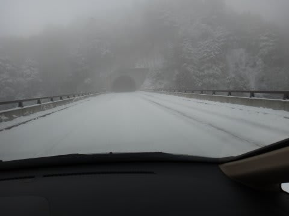

…GWにこれだけ本気の雪道って…

私のスキー歴の中でも初めてのような気が…

＃今シーズン，3月はスタッドレスいらないくらいだったのに…

んで．

いつもどおりの焼額の駐車場に，7時からの早朝営業に間に合うように

到着するわけですが…

なんだ？この気温表示は？？

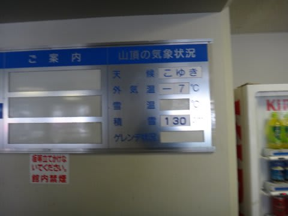

そしてゴンドラで山頂へ行くと…

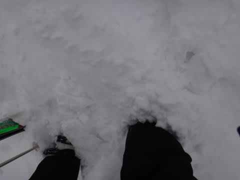

なんだ？この積雪は？？？

えーっと．

えーーっと．

あと3日で，5月ですよね？？？

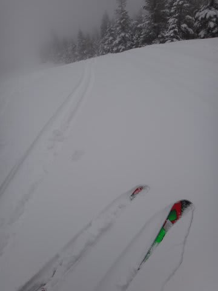

とても，あと3日で5月のゲレンデと思えないんですが？？？

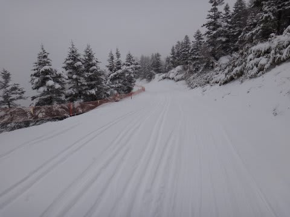

いつもなら，トレーナーでも滑れるような時期に，ありえなく寒いんですが？？

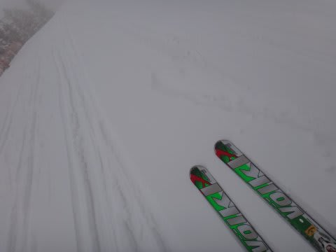

えーーーっと．今日，GWでしたっけ？

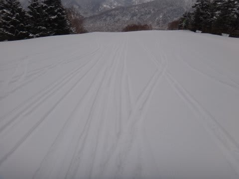

超奇跡．

ミラクル．

ありえない…

朝のうちは，ゴンドラの窓も凍ってます．

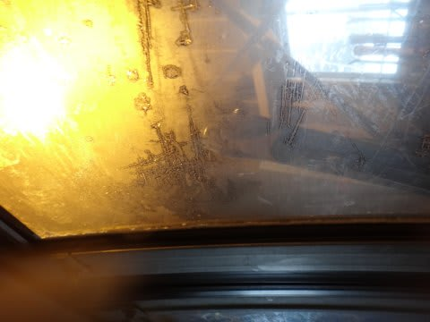

時折すごく雪も降り…

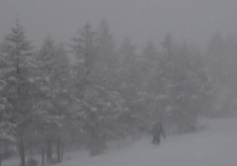

すばらしい．すばらしいよ．

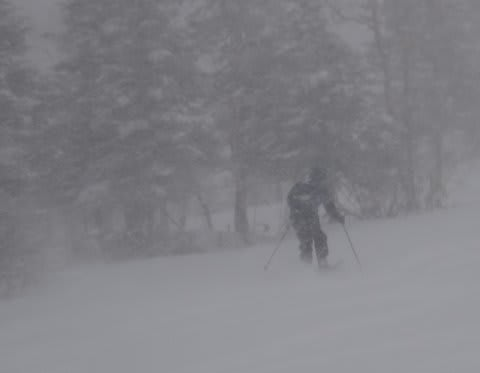

ただ，新雪が先週よりはちょいと重めで，積もったのは圧雪後らしく，

朝イチは，10cmほどの重めの新雪がアイスバーンの上に乗ったような状態で．

急斜面ではエッジングすると硬い下地にがりがり引っかかったけど…

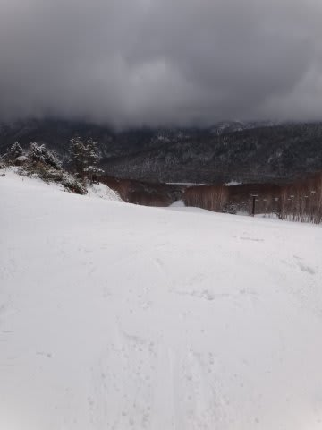

重めの新雪が一通り踏まれると，かなり良い感じの圧雪バーンに！

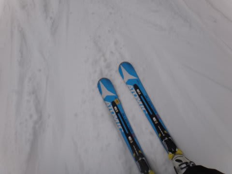

新雪荒踏みのちょいとでこぼこしたバーンで，快適度は先週よりわずかに落ちるけど．

＃先週日曜が良すぎた…

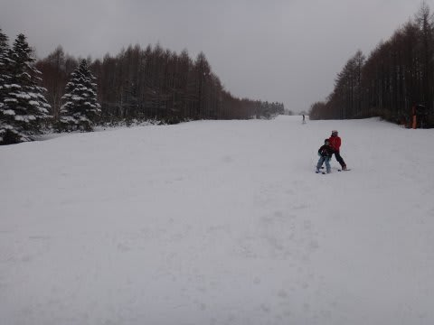

でも，この日も昼間は気温が氷点下のまま！！

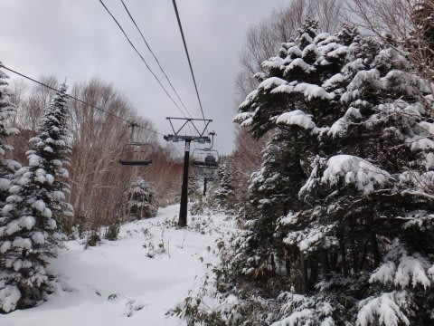

えーっと．

これが，GWの昼すぎの景色なんですけど．

信じてもらえるでしょうか…

そして．

ゲレンデはどうしたわけか，GWというのにまったく人がいない状態．

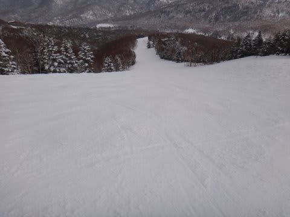

どうしたんだ！

こんなにゲレンデコンディションが良いのに，どうして，

どうして誰も来ないんだ！！！

人が少ないので，ゲレンデも好きなライン取り放題．

コース上に新雪が踏まれて無い部分が，リフトストップまで残る程度…

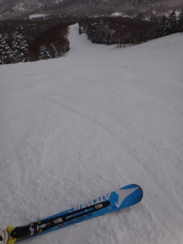

これが，リフトストップのときのゲレンデ状況なんですが…

[予想通り](ed3b1222002f6e22c3a9106080c03c81d.md)，一日冷えひえの気温だったので．

リフトストップまで，GWとは思えない最高の雪で．

…だというのに．

GW3連休と思えない，超がらがらの，平日並みのゲレンデで．

もう…こんなに幸せでいいのだろうか，というGW初日だったのでした．

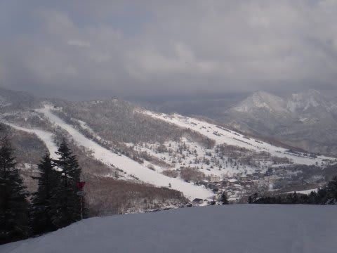

とりあえず．

ゲレンデコンディションは，間違いなく3月中旬より良いです！！

積雪量的には，もうGW後半まで，ぜんぜん問題なさそうですね！

やはり，私の日ごろの行いが…(バシッ！)

…あぁっ！い，石を！石を投げないでくださいっ！！（次々投げ込まれる石)

＃明日の昼からは気温が上がり，春の雪になっていきそうですが…．

PS.いまも路面は積雪＆凍結が結構あります．

　明日の朝も，朝早くは路面に凍結部分があるかと思います…

　明日朝に志賀へやってくる方は，夏タイヤはやめたほうが良いかと…

　ご注意を！

## 💬 コメント一覧

### 💬 コメント by (gokuraku skier)
**タイトル**: Unknown
**投稿日**: 2013-04-27 20:41:07

って言うことは・・・

明日の早朝はＧＷ史上サイコーの粉雪圧雪シマシマバ～ン！が待っている訳ですね。

７時の２ゴンでお会いしましょう。

### 💬 コメント by (Skier_S)
**タイトル**: 明日は…
**投稿日**: 2013-04-27 21:32:54

今晩積もってくれるとうれしいのですが…

あまり積もらなさそうなので，明日の朝は結構締まった感じの圧雪かな～．

ふかふか粉雪，ってほどではないですが，でもいい感じの

うはうは大回り小回りバーンだと思います！

朝の道路，気をつけてきてくださいね～！

昼に向かって日が射し始め，気温も上がるので，

早朝が勝負ですよ～．

では，7時の2ゴンで！

### 💬 コメント by (いか)
**タイトル**: Unknown
**投稿日**: 2013-04-27 23:39:35

志賀も最高だったんですね！

こちら八方もうさぎ線下は30cmほど積もっていて、ぱっふぱふうはうはコンディションでした！

繰り返しパウダーを食べまくったのは言うまでもありません…

こちらは風が強すぎてお昼でクローズになってしまいましたが(笑)

惜しむらくは日帰りだったことです…。

あしたも楽しんでください！

### 💬 コメント by (Skier_S)
**タイトル**: いかさま
**投稿日**: 2013-04-28 17:30:17

いやーーー

八方も良かったんですね！

しかし，この時期に30cmって…

こちらは，日曜も朝は超Goodコンディションでしたよ～っ！

### 💬 コメント by (Piano)
**タイトル**: GW初日！
**投稿日**: 2013-04-29 03:26:20

skilineの文字にヒットしたので　お邪魔しました～(＾-＾)

27日の志賀高原は、確かに有り得ないくらい好条件のゲレンデで、夢みたいでしたね！

スタッドレスを脱いでいなくて正解でした！

当日は、Top100ランクアップという目標を立てて、

歳甲斐も無く（！）ひたすらヘビーローテーションで滑りました。（一ノ瀬＆焼額）

・・・・と言いましても、若い人に体力では叶いませんが、

(^_^;)女子内でベスト10入り、総合でも100位内ランクインし、頑張った甲斐があったというものです（嬉涙）

ここのサイトを、skiline の仕組みを説明する為に紹介させていただきたいと思います。

### 💬 コメント by (Skier_S)
**タイトル**: Pianoさま
**投稿日**: 2013-04-29 21:47:17

はじめまして～

ようこそ，このマニアックなブログへ…

いやー．

私もスタッドレスを外そうかと思ってたんですが，

念のため天気を確認すると，外さないほうがよさそう

と判断して，そのままにしたんです…

もし，このBlogをSkilineの説明用に使われるので

あれば，ぜひどうぞ！

でも，このサイトの人気コンテンツはスキー場天気予想

だったりします(笑）．

では，今後もご愛読のほど！

