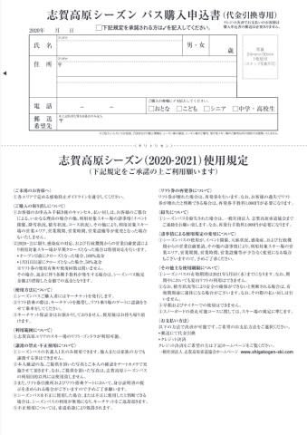

# 2021シーズン志賀高原スキー場共通シーズン券，申し込み開始！

📅 投稿日時: 2020-10-08 01:07:30

えー．

もう，10月も1週間が終わったというのに．

例年なら10月3週ごろにオープンする狭山とYeti．

いまだにどちらも2021シーズンオープンの

案内が出ておらず．

今シーズンは狭山，営業しないんじゃないか？

という危惧を抱きつつある，Skier_Sです…

とはいえ．

もうそろそろ，2021シーズンもシーズンインが

近づいた今日この頃．

志賀高原索道協会のウェブページに，

2021シーズン券の申込書ページができていました！！

([志賀高原索道協会ホームページ](https://www.shigakogen-ski.com/uploads/20-21seasonpass.pdf)より）

今シーズンもお値段77000円．

決して安い額ではないですが…

昨年から値上げが無かったようで，そこは一安心．

志賀の全山共通シーズン券，

2014シーズン　65,000円

2015～17シーズン　67,000円

2018シーズン　70,000円

2019シーズン　72,000円

2020シーズン　77,000円

…と，2016，17シーズンを除いてここしばらく

ずっと値上げが続いていたイメージでしたが．

今シーズンは久々の値上げ無しですね…！！

で．

今シーズンから新たに

Webでシーズン券が申し込める

ようになりましたっ！！！

([Webket志賀高原シーズン券申し込みページ](https://webket.jp/pc/ticket/index?fc=00304&ac=0201)より）

こんな申し込みページで必要事項を記入して，

写真ファイルを添付．

あるいはスマホなら，顔写真をカメラで

撮影して送ればいいみたいで．

…これ，かなり楽になりましたね！！

今までは，こんな紙の申込書に記入して，

郵送しなきゃならなかったですから…

それに比べれば，便利になりました！

すばらしい！

あ，そういえば．

この紙の申込書にも，Webの申込書にも，

お約束のようにこんな注意書きが書かれて

いるわけですが…

…なんだか，今シーズンの注意書き．

いつもと違いますよ…

良く見てみると．

んん！？？？

2020～2021シーズンに限り，

感染症の対応や行政からの指導で

スキー場が早期クローズになったら，返金！？？

・オープン前にクローズになったら全額返金

・1月31日以前にクローズになったら，50％返金

だって！！！

なるほど…

このシーズンは，確かにそういうリスク，

あるからな…

まぁ，今年の夏のダイビング旅行を予約後に

キャンセル料を払って泣く泣くキャンセルした

経験がある私としては．

このような返金制度があれば，安心してシーズン券の

申し込みができますね～…

…

…でも．

願わくば．

このような返金制度を使う事態にならないことを

全身全霊で祈りつつ．

また，

返金期限が切れた2月に入った途端に，感染者数が

急増してスキーはできないわ，お金は戻ってこないわ

みたいな恐怖シナリオにならないよう，

皆さん，今シーズンは，くれぐれも感染防止に

気をつけましょう…

## 💬 コメント一覧

### 💬 コメント by (yumi)
**タイトル**: Unknown
**投稿日**: 2020-10-08 01:40:19

Ｓさぁ～ん🎉🎆🎃

狭山もイエティもオープンはしますよ☺️

ただ、狭山のお兄さんも、イエティのお兄さんも、いつ❗️とは❗️まだ言えない🤐そうです😢

だいぶん、食い付いたんだけどなぁ～😅

### 💬 コメント by (アリス)
**タイトル**: シーズンパス
**投稿日**: 2020-10-08 08:53:25

Skier_S様

お世話になっております。

料金据え置きで一安心ですね。

私のところにも、申込書が索道協会から郵送されてきました。

正直、申し込みを悩んでいます。

スキー場自体では、新型コロナの感染リスクは少ないだろうと予想していますが、問題は宿泊施設での感染リスクです。

Gokuさんのように、片道1時間程度の移動であれば迷わずシーズンパス申し込みするんですが、こちらからは片道5時間かかり日帰りはほぼ不可です・・・

ならば、志賀高原より手前の小諸を中心に左右にある、小海リエックスとアサマ2000ここなら宿泊せす日帰り可能かなと・・・

２ケ所のシーズンパス購入しても志賀高原単独より安いのも魅力です。

しばらく考慮期間です。

### 💬 コメント by (さち)
**タイトル**: Unknown
**投稿日**: 2020-10-08 12:01:52

恐ろしい前フリじゃないことを祈ります…

### 💬 コメント by (わかすぎ)
**タイトル**: Unknown
**投稿日**: 2020-10-08 12:59:21

手紙来ましたよ。また、志賀野沢ビッグ2にします。83000円。値上げはしてないみたい。でも、昨年がいくらだったか、年取ると記憶がない。

### 💬 コメント by (かず)
**タイトル**: Unknown
**投稿日**: 2020-10-08 19:04:46

お久しぶりです！まさか今シーズンまでコロナ引っ張られるとは……想定外ですよ

外国人の状況が読めないですし ヤケビのゴンドラまた人数制限あるとかなり厳しいですね ゴンドラ内 ゴーグル＆バラクラバ着用＆会話禁止でなんとかなりませんかね？

### 💬 コメント by (Skier_S)
**タイトル**: 2021シーズンはもうすぐ
**投稿日**: 2020-10-09 00:38:45

＞yumiさま

狭山，オープンするんですね！

でも，まだ日程未定なら，例年より遅くなりそうな感じはしますね…

そして，例年通り，狭山がアナウンスしてからその1週間前を狙って，

日本で一番早いオープンを計画するYetiなんでしょうね(笑)．

＞アリスさま

うーむ．

宿自体より，特に食事場所が気になりますよね…

私も片道4時間以上かかりますが，とりあえず志賀に行かないと

行けない義務（？）があるので，志賀のシーズン券は購入予定です…

＞さちさま

全くもってその通りです…

2月1日に狙ったようにクローズとか(笑)．

＞わかすぎさま

お久しぶりです～！！

今年も野沢に行かれるんですね．

野沢高原のみのシーズン券は値下がりしたようですが，Big2は値下がりしないようですね（涙）

＞かずさま

もう，一体いつまでコロナウイルス対策が続くのか…

ヤケビのゴンドラは人数制限確定です．

1ゴン4人，2ゴン3人までの，去年と同じ制限です．

おそらく，待ちの列も密にならないようにスペース調整が入ったり

するのかもしれません…

### 💬 コメント by (ほっぽ)
**タイトル**: シーズン券
**投稿日**: 2020-10-09 06:34:16

Ｓさん

いよいよシーズン券情報が出てきましたが、

イエティはオープン予定すら公表されておらず心配しています。

一応、ナイター営業がある限りナイターシーズン券は買うつもりです。

さて、昨夜長野券当選の案内が届きました。

通算４回目の当選になりました。

今シーズンは長野県のスキー場を満喫する予定です。

http://www2.tokai.or.jp/nana_hoppo/

### 💬 コメント by (かず)
**タイトル**: Unknown
**投稿日**: 2020-10-09 09:46:57

ゴンドラ規制確定ですか…ヤケビと奥しか利用しないので  悩みます リスク分散で野沢と共通？

長野券当たれば良かったですが 一回も当たったことがない人もいれば4回も！日頃の行いでしょうか…今シーズンは気分がモヤモヤです

### 💬 コメント by (Skier_S)
**タイトル**: シーズン券申し込んだよ！
**投稿日**: 2020-10-10 00:49:19

＞ほっぽさま

えええええ！！

長野県当選4回！？？？

どんなマジックを使ったんですか？？

うらやましいです…

＞かずさま

焼額はゴンドラ規制確定です．

1ゴン，2ゴンとも休日は混みそうです（涙）

天気が良ければリフトに逃げられるけど，天気が悪い日はゴンドラが混むのは

辛い…

### 💬 コメント by (ほっぽ)
**タイトル**: Unknown
**投稿日**: 2020-10-11 07:44:37

Sさん

まさかのビックリ、当選しました😳

流石にもうムリかなと思ってたので嬉しさ100倍です。

毎回チケット売り場でリフト券と引き換えるのが面倒ですが、

そんなこと言ったらバチが当たりますね😅

今シーズンは長野県のスキー場を満喫します。

### 💬 コメント by (Skier_S)
**タイトル**: ＞ほっぽさま
**投稿日**: 2020-10-12 01:22:35

長野券は，一日ごとにリフト券もらわないといけないのですか？

3日券とかには換えられないシステムなんでしょうか…

今シーズンは，志賀以外ににもいっぱい行けますね！

### 💬 コメント by (ほっぽ)
**タイトル**: Unknown
**投稿日**: 2020-10-12 19:13:45

Sさん

そうなんです。長野券は一日券としか交換出来ません。

毎朝リフト券と交換する手間が発生します。

昔ほ三日券まで交換出来たんですけどね。

今シーズンもほぼ志賀高原オンリーだと思いますが、

アサマ2000のアルペン試乗会もリフト無料で参加出来ます。

### 💬 コメント by (Skier_S)
**タイトル**: ＞ほっぽさま
**投稿日**: 2020-10-13 00:28:02

あ，やっぱり毎日交換する必要があるんですね…

ちょっとめんどくさいですね．

でも，志賀シーズン券よりずっと安いのがうらやましいです…

### 💬 コメント by (ikkun)
**タイトル**: Unknown
**投稿日**: 2021-09-11 12:51:35

え(・・;)70000???スキー買えちゃいます(笑)昨年準指導員試験の為にお安く買えましたが……普段は学校のゲレンデだけで満足なので( *´艸｀)やはりお金持っていないと出来ないスポーツですなあ😅改めて

### 💬 コメント by (Skier_S)
**タイトル**: ＞ikkunさま
**投稿日**: 2021-09-12 07:00:07

また古い記事にコメントされてますね…

大人のシーズン券77000円ですから，スキー余裕で買えちゃいます（涙）

板も1シーズン毎に買わなきゃならないし，我が家からは往復交通費もすごいことに

なってますので，すごい金額がスキーにかかってます…

