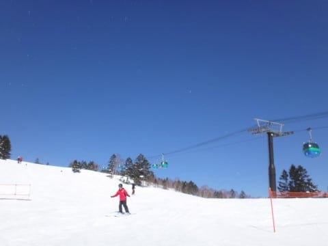
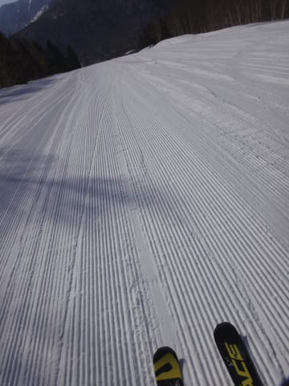
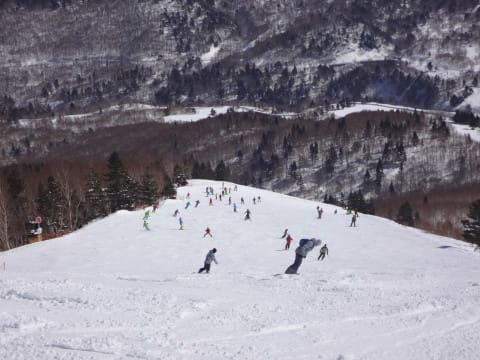
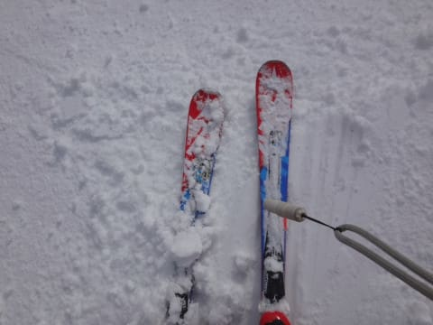
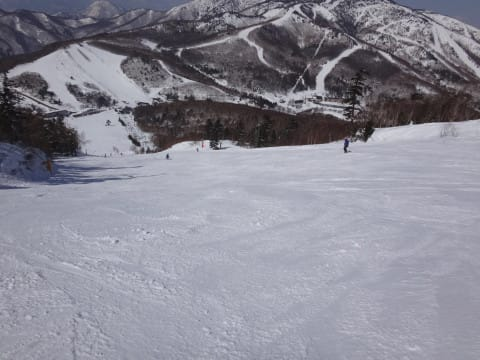
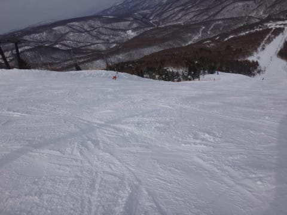
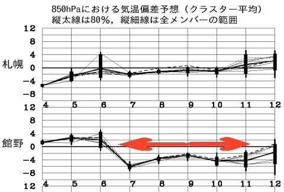

# 3月5日，日曜日の志賀高原の状況速報モード…晴天→うす曇り，春の気配が近づいてきたなぁ…

📅 投稿日時: 2017-03-06 01:37:39

えー．

本日は，11時前に帰宅できたのですが…

板の手入れいろいろやっているとまたこんな時間（涙）．

だもんで．

いつもの日曜深夜恒例，速報モードにて…

取りあえず．

本日朝も，すっきり晴天でスタート！

…そして，朝イチは…

ふはははははは！

いつものシマシマバーンがお出迎え！！

今朝のシマシマも柔らかめだったけど，

昨日よりは締まり気味の快楽バーンだぁっ！！

…と，しばらく喜んで滑っていたら．

…ありゃ．

10時前に，ゲレンデはかなりの人口密度に…（涙）．

とはいえ，ゴンドラ待ちはゲートの外まで

並ぶことはなかったので，どうしようもない

混雑ではなかったのですが…

そして．

昼ごろには気温も0℃前後まで上がって…

南斜面は，ちょっとしっとりした感じの，

固まるような雪になってきましたか…

まぁ，南斜面以外は結構まともだったので，

許してあげましょう．←なぜそんな上から目線？

で．

昼ごろには，ゲレンデのところどころ．

下地に固いのが出始めて…

午後3時ごろには，うっすらと雲が出て，

うす曇りになってきて．

ゲレンデもちょいと凸凹になってきたかな…

でも．

まぁ．

基本的には天気も良く．

雪も南斜面以外はそれほど緩まなかったし．

まぁ，今日も恵まれた一日だったかな～．

…で．

今週は．

7日以降，11日まで．

図中の矢印で記したように，平年より

低い気温の日々が続きそうで…

また，冷え冷えウィークになりそうな予感！

うーむ．

次の週末も，いい感じになるかな？

とりあえず．

また明日，

詳細レポートやります～！

## 💬 コメント一覧

### 💬 コメント by (下手くそスキーヤーの、)
**タイトル**: 水曜日あたりの天気はどうでしょう
**投稿日**: 2017-03-06 05:31:33

神予報士様❤️

今週の水曜日辺りは天気どうでしょうか？

週末仕事してましたので、

そろそろウズウズしてます。

天気予報お願いしまーす☃️

### 💬 コメント by (Goku)
**タイトル**: ゴールドステッカー
**投稿日**: 2017-03-06 21:47:57

この週末は、天気、雪質、共に恵まれましたね。

毎週こんなだったらサイコーなんですが・・・

って、なんか来週末もコンディションが良さそうですね～♪

最近は天気の周期が良い感じです!(^^)!

### 💬 コメント by (Goku)
**タイトル**: 忘れ物・・・
**投稿日**: 2017-03-06 21:50:36

タイトルに『ゴールドステッカー』と入れといて、

お礼のコメントを忘れて投稿してしまいました(笑)

改めて、ステッカーありがとうございました。

### 💬 コメント by (マルハバ)
**タイトル**: 週末・・
**投稿日**: 2017-03-06 22:23:25

年に一度の志賀へ伺います、

コンディションが良さそうで楽しみです。

土曜の夜はダイヤモンドですか？

2年振りにご一緒したいですね～♪

日曜日は「キレッキレ少女」を探しに

奥志賀まで遠征？かも・・（笑）

### 💬 コメント by (Skier_S)
**タイトル**: 今日もご無体時間に帰宅…（涙）
**投稿日**: 2017-03-07 04:11:33

＞Gokuさま

午後はちょいと固めの下地&わずかな荒れ

でしたが…

でも，ボコボココブコブにならなかったし，

今シーズンは恵まれた週末が続きますね！

…ゴールドステッカー，ブーツにも貼ったのでしょうか（笑）．

KonSukeさんに会ったらぜひシールのお礼を

お伝えください～！

＞マルハバさま

…非常に残念ながら．

この週末は，おそらく日曜日帰りです（涙）．

運が悪ければ，日曜も行けない可能性が…

もし，日曜に行けたらまた焼額でお会いしましょう！

### 💬 コメント by (Skier_S)
**タイトル**: 水曜の予想は…
**投稿日**: 2017-03-07 04:28:56

＞へたくそスキーヤーの…さま

水曜の天気は…

晴れたり雲が流れてきて雪がぱらついたり…

と，ころころ変わる天気．

西風なので志賀では雪雲が届きにくい天気ですが，

結構強めの寒気が入るので，北アルプスを越えて

時々雪雲が志賀に届く…って感じです．

気温は朝は-10℃以下，昼間も冷えて-5℃程度まで

しか上がらない，トップシーズン並みの状況です．

前日にうっすら雪が積もるので，朝は最高じゃないでしょうか？？

コンディションはかなりいいかと思います～！！

### 💬 コメント by (マルハバ)
**タイトル**: ありゃ～
**投稿日**: 2017-03-09 10:56:31

それは残念！

それではまた焼額で

お目にかかれることを期待してます。

### 💬 コメント by (Skier_S)
**タイトル**: マルハバさま
**投稿日**: 2017-03-10 05:14:10

はい．

日曜は焼額滑ってますので，

そこでお会いできれば…

よろしくお願いします．

