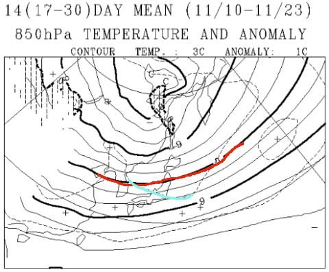

# 11月は冷えるのか？11月下旬，早めのスキー場オープンはありそうか？？1か月予想図を読み解いてみる

📅 投稿日時: 2018-10-27 01:07:34

えー．

仕事が極めて大変非常に危ない危機的状態

だった昨晩．

何とかほぼ徹夜で突っ切り．

本日のヤマを乗り越えたので．

土曜日に必死にかんばれば，今週日曜は

なんとかYetiに行けそうな感じになってきた，

Skier_Sです…

いやーー．

ヤバかった．

危なかった…←まだ来週月曜と水曜と金曜にヤマが続くけど

これで，来週木曜は会社を休んで，

引っ越し関係の各種お役所＆銀行関係の

処理を全部やって．

3，4日は自宅引っ越しって予定なんだけど…

大丈夫なんだろうか…？？←スキーシーズン前に

引っ越しを終えようとしたツケが一気に来ている

とりあえず．

こんな記事を書いている時間も無いはずなんだけど．

今日は意地で更新っ！！

ってなわけで．

そうなんです．

もう，来週からは11月ですよっ！！

志賀高原（熊の湯だけだけど…）も白馬もかぐらも

オープンする，11月ですよ！！

だもんで．

いつも定番の，一か月予想図（[FCVX12](https://n-kishou.com/ee/exp/exp01.html?cd=fcvx12&cat=e4))を読み解いてみましょうか…

えー．

まず．

11月第1週…というより，10月後半から11月頭にかけて．

10/27～11/2の期間の850hpa気温図から見てみましょう…

ふむ．

赤く印した0℃線．

スキー場で雪が降る目安のこの線は，まだ津軽海峡付近ですが．

11月初めでこのあたりにあるのは，結構冷え気味

ですね…

そして．

本州は，水色で塗った平年より気温が低い

エリアにすっぽり囲まれており．

さらに，水色で描いた，平年より2度低い線が

志賀高原近辺にかかっているので．

冷えますね～．この週は…

天気図を見てみると．

30日あたり，日本海側や信州の山沿いでは，

雪になっても不思議じゃない冷えっぷりに

なりそうです…

…でも．まだこの時期に降るのはちと早い．

まだ，根雪にはならない時期なので．

この時期はそんなに冷えなくても

いいんですけどね～．

そして，11月第2週．

11/3～11/9の一週間の850hpa気温を見ると…

うむ？？

なんじゃこりゃ？？

秋が深まっていく時期なのに．

前の週より，気温が上がりそうなんですけど…！？？

赤く印した0℃線は北海道の真ん中あたり．

前の週より明らかに北上しています（涙）

そして…

水色で示した線が，平年より3℃高いことを

示す線なんですが．

週平均気温が，平年より+3℃高いって…

異常高温レベルなんですけど！！！（泣）

この週は，季節が1か月戻ったか？？？

って思うほど，妙に暖かい日が続きそう…

スキー場の雪は絶対期待できません（涙）

で．

最後に，

11/10～11/23の2週間ですが．

うーむ．

赤く印した0℃線は，まだ東北近辺なのは

いいとして…

水色で示した，平年比+1度の線．

こいつが志賀高原あたりを横切っているので．

信州や新潟のスキー場は，平年より1度ほど

高い気温で推移しそう…

いや．

平均+1度高いって，たいしたことなさそうに

感じますが．

こういう

「雪になるかどうか…？？」

という，微妙な時期には．

結構効きます…（涙）

ってことで．

この天気図を見たところでは．

23日の3連休までにガツンと冷え込んで，

ドサドサ雪が降る…

という期待は，あまりもたない方が良さそう

です…（泣）．

まぁ．

昨年ほど恵まれたシーズンインを望むのは無理としても．

一昨年のような．

11月3連休にオープン予定のスキー場が雪不足で

軒並みオープンできず．

12月に入ってからも，志賀高原になかなか雪が

積もらない…

というような，

雪不足にならないよう，祈るばかり…

いや．じゃなく．

このBlog読者の皆さんにおかれましては．

雪不足にならないよう，踊るばかり…でお願いします．

## 💬 コメント一覧

### 💬 コメント by (すぎぃ)
**タイトル**: 一か月予想図
**投稿日**: 2018-10-27 17:49:55

志賀の希望予報士はご無体職場なのですね。

sさんのお身体が心配です。

### 💬 コメント by (つーちゃん)
**タイトル**: 夏日
**投稿日**: 2018-10-27 18:25:48

今日は汗をかくくらい暑かったですね

そのくせ朝晩は肌寒いので着るものに困ります

順調に冷えてドカドカ降って欲しいものです

今日のイエティFBにナイター開始の動画が掲載されてましたが

見たことあるようなウェアが、、、人違いかな？

### 💬 コメント by (Skier_S)
**タイトル**: つーちゃんさま
**投稿日**: 2018-10-28 07:38:14

う～ん

知ってる人かな？

ちょっと違うようにも見えますが…

つーちゃんさんもイエティ参戦、いかが？

### 💬 コメント by (Skier_S)
**タイトル**: すぎぃさま
**投稿日**: 2018-10-28 07:40:34

かなりご無体職場です(涙)

でも、今日はなんとかイエティに来れてます(笑)

