# これから1/15の週末までの志賀高原スキー場の積雪を予想してみる…正月ほどはドサドサ積もらなさそうだけど，14日朝はパウダーねらい目

📅 投稿日時: 2022-01-12 00:44:23

えー．

本日の志賀高原．

奥志賀ゴンドラ，焼額第1＆第2ゴンドラは

強風のため営業できなかったようですが…

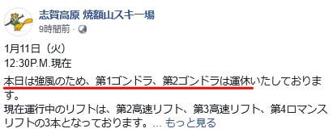

（[焼額山スキー場Facebook](https://www.facebook.com/yakebitaiyama/posts/4672793286149314)より）

風が強いけど，雪が降ったわけではなく．

朝のうちは日が射すほどの天気だった

ようで，積雪の積み増しは

無かったようですね…

ただ．

夜になってから雪が降り始め，

夜23時現在，麓の上林でもかなりの

雪が降ってます…！！！

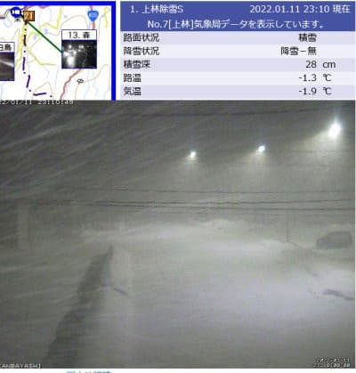

（[北信建設事務所道路気象状況ページ](http://hokushin.pref-nagano-roadcamera.jp/)より）

ってなことで．

ニュースとかでも話題になってますが，

これから数日間は，3連休のシマシマ晴天

からうって変わって，雪降りの悪天候が

続きそうで．

うーん．

やはり3連休だけ天気が良かったのは，

3連休に志賀高原に行っていた私の

おかげですね！！←いい天気だったら自分のおかげにしたいのね…

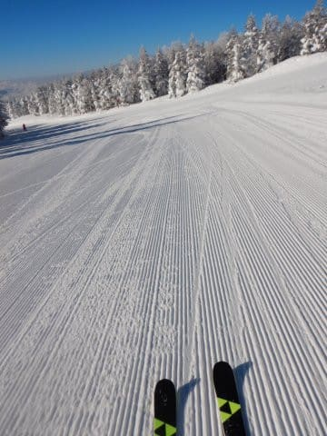

で．

元来，このBlogでは自分が滑りに行く

週末の志賀高原の天気を，自分のために

予想していたのですが…

どうやら平日の予想を知りたい人も

多いらしいので．

大変優しい私は，その方たちのために

自分が滑りに行かない日の天気を

予想するわけですね．

あぁ…なんて優しいんでしょう，私って！！←自己陶酔モード

まず明日，12日の水曜日ですが．

850hPa図では，水色の-12℃の線が

志賀高原に近づく激冷えレベル…！

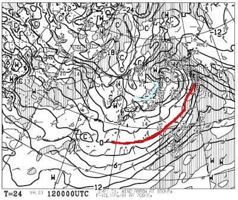

が．

この図を拡大してみてみると…

え？

赤で囲ったところ，風速50ノットを

示してますよ？？

これ…風速25mなんですけど？？

これは，明日もゴンドラは動かなさ

そう…（泣）

ってか，リフトも動かせないのが

多発しそうな激烈強風です（涙）

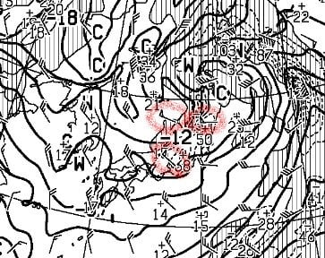

地上天気図を見ると，日本海側に

降水域がかかる冬型になっているので，

一見雪が降りそうに感じますが．

850hpa図では西風だったので，

志賀はそんなに積もらないかな…

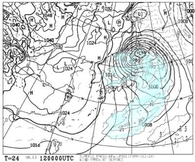

ただ，地上天気図を拡大すると．

志賀高原にまで降水域の水色が

伸びているので…

ドサドサ積もらないまでも，

西風ながらも志賀高原まで

雪雲が飛んできそうですね．

まぁ，10～20cm，ブーツパフ

くらいは積もる感じでしょうか．

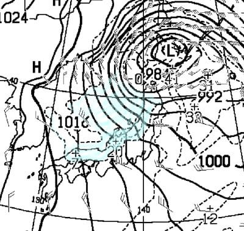

続いて，13日の木曜の850hpa図を見ると．

この日は，-6℃線が志賀よりちょい南

程度なので，12日ほどは冷えないですね…

あと，風も12日より弱そう．

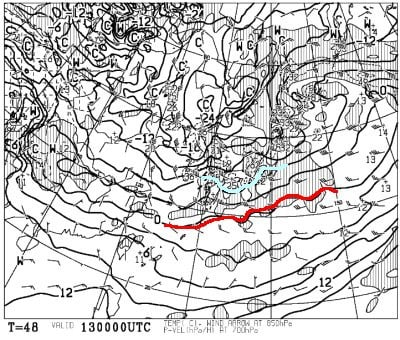

そして，地上天気図も冬型だけど．

完全に西風になるパターンで，

志賀高原はギリギリ降水域にかかるか

どうか…

13日は雪は降るものの，ほとんど

積もらなさそうです．

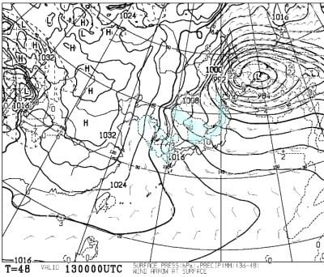

そして，14日の金曜ですが…

この日の850hpa図を見ると，また

水色の-12℃線が志賀高原に近づいて

いるので…また激冷えデーになりそう！

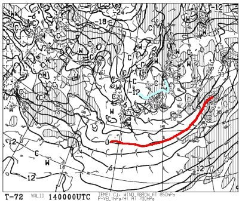

ただ，この図を拡大すると…

12日よりは弱いけど，この日も

赤で括った部分，風速45ノット…

大体風速22m位です（涙）

この日も，ゴンドラは動かない

可能性が…

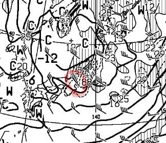

ただ，この850hpaの風向を見ると，

12日の志賀高原に積もらない完全西風

パターンとは異なり，北西の風になってます！

…これは，志賀高原にも積もりそう…！！

ってなことで，この日の地上天気図を

見てみると．

うはー．見事な縦縞等圧線の冬型！

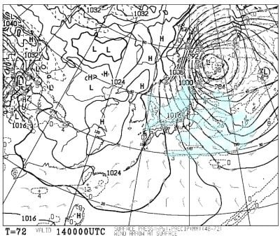

そして，この図を拡大すると．

赤矢印で示したように，大雪の目安となる

朝鮮半島付け根から伸びるJPCZが見えていて…

このJPCZ，かなり南向きにたなびいていて，

能登半島よりはるか西に突き刺さっているので…

これは志賀高原にも降るパターン！

…さらに言えば，山陰でもかなりの降雪に

なる天気図ですね…

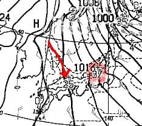

さらに上の図，新潟付近にある+37の

数字…これは，24時間の降雪量37cmを

意味するので．

…14日は積もりそう！

ってなことで．

まとめると．

12日(水)：朝は激冷え，-15℃レベル！

　ただ，猛烈な風でゴンドラだけじゃなく，

　一部リフトも止まりそうな感じ(涙)．

　志賀高原は積雪はそれほどでもなく，

　さらに軽い雪が風で飛ばされて

　そんなに積もらないかも．

　風で雪が飛ばされないところは，

　ブーツパフ程度か…

　終日強風の吹雪．

　この日滑りに行く人は，何かの

　修行と思って行くべし．

13日(木)：朝の気温は-10℃近くまで冷える．

　風は弱まり，朝までに10cm程度

　積もっているかどうか．

　前日強風でオープンできず，だれも

　滑ってない非圧雪コースは

　20～30cmの積雪があるかも？

　志賀高原は終日雪がぱらついたり

　止んだり．一瞬雲が切れて日が

　射すタイミングもあるかも．

　

14日(金)：朝は-15℃近くまで冷える．

　この日は降る．積もる．

　朝までに30cm以上，脛～膝パフ！

　終日雪が降り続ける，エンドレス

　パウダーデーの予感…！　

　ただ，風が強そうなのでゴンドラは

　動かない可能性が…

ってな感じでしょうか．

とりあえず，14日はパウダーねらい目です！

で．

そのあとの週末の天気は，また明日

詳細を予想しますが…

FXXN519から，15日の500hpa高度図を

見てみると…

赤く印したように500hpa高度線が

上向きに凸に曲がっています．

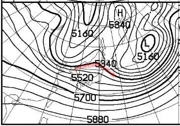

16日の500hpa高度線を見ても，

上に凸の傾向になってますね…

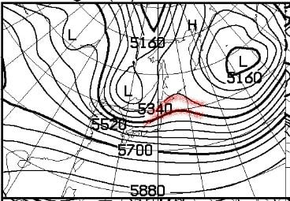

この，500hpa高度線が上に凸に

なっているところは「リッジ」と言って，

高気圧に覆われる場所になります．

だもんで，15，16日の週末に，

日本付近がリッジになっている

ということは…

この週末も，高気圧に覆われて

晴れそうという予感…！！

ただ．

FZCX50から，16日の特定高度線の

予想のばらつきを見ると…

赤く印した5400m高度線の予想の

ばらつきが大きくて，ホントにこの日，

日本付近がリッジになるかどうか

まだわからない感じ…

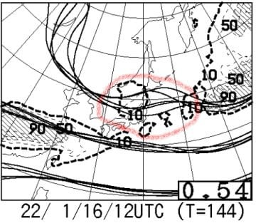

だもんで．

まだこの週末が晴れるかどうか

確信をもって予想できるレベルでは

無いことが分かりますね…

果たして，この週末がまた3連休のように

最高に恵まれた，冷え冷え降雪のあとの

晴れ間になるのか？？？

また，明日に週末の天気予想やります～！

## 💬 コメント一覧

### 💬 コメント by (大阪のK)
**タイトル**: Unknown
**投稿日**: 2022-01-12 06:05:04

S様、先日は我が仲間も含め、焼額山のレジェンド達にお会いできて光栄でした。

トレインに混ぜていただきありがとうございました。

今週末の焼額山は、降雪後のゲレンデが柔らかそうですね。

何を履こうか迷うところですが、今回は若すぎる女性2人お守りですので、ARMADAでのんびり滑ってみます。

彼女達、昨年は焼額山を滑りましたので、今年は奥志賀まで足を伸ばそうと思います。

もしかしたら、1ゴンあたりでチャーミングな子供達と遭遇するかもです(笑)

### 💬 コメント by (koi)
**タイトル**: Unknown
**投稿日**: 2022-01-12 10:04:05

詳細なご説明ありがとうございます！今回もおそらく敢えて色々触れていただいたのかと。嬉しいです

私は来月トマムに向かうので、天候が安定すると良いなと祈っています

### 💬 コメント by (アリス)
**タイトル**: Unknown
**投稿日**: 2022-01-12 15:52:45

S 様

こんにちは☺

お世話になっております🎵昨日から志賀高原参戦してます🎵

お陰さまで、アマズフィット活躍しております☺

本日意外と良かったです🙆

詳細はレインボーさんからコメントがあると思います☺

偶然にも1ゴンで、レインボーさんと同ゴンドラに乗車です☀

レインボー様、本日はお世話になりました🙇

ただ、レインボー様御一行様、スキー意外の人助け労働でお疲れの様子をでした😅

### 💬 コメント by (レインボー74)
**タイトル**: Unknown
**投稿日**: 2022-01-12 16:55:49

水曜日の志賀高原情報

朝の上林-5℃　蓮池-11℃、寒い！

そこで一句盗作

「寒さのみ　寒さや寒さ　身の寒さ」

後ろからも読んでみてくださいね。

ニゴンパークに着くと、暗礁？に乗り上げて奮闘している人が一人。

とりあえず駐車したら、剣客の隊員が「助けてくる」

最も苦手な力仕事なので通りすぎた自分が！

兵庫の人も手伝ってくれて、50分程かけて脱出成功。

汗だくで下着を脱いだため、このあと寒くて寒くて。

強風でニゴン運休。四ロマからGSサイドへ。めっちゃ楽しい！30センチ位しか積もってないけど、快適すぎて他へ行けなくなってしまいました。

昼はニ高乗り場にある中華「獅子」

去年までの人気従業員が働いているので会いに行きました。

本日の業務はここまで！

なお、オリンピックは膝上まであったそうですよ。

明日も新雪いただきます！

### 💬 コメント by (Skier_S)
**タイトル**: この週末も，志賀は良さそう！
**投稿日**: 2022-01-13 02:57:15

＞大阪のKさま

突然の動画飛び入りでしたね…

今週末は，土曜は雪は柔らかそうですが，日曜はいい感じの圧雪バーンになると思いますよ！

＞koiさま

はい．今回もちょっといろいろ情報を追加しておきました…（笑）．

来月トマムですか…いいなぁ…

＞アリスさま

今日から志賀ですか！

激冷え吹雪の日，お疲れ様でした．

意外と良かったのですね…

根性の無いスキーヤーふるい落とし機能がフル発揮の日かと思ってました（笑）．

＞レインボー74さま

人助け，お疲れ様です．

困っている人をそのまま通り過ぎないところが偉いです！！

オリンピックは新雪だったけど，ちょっと重めだったとも

報告がありました…

