# 2020/3/15(日)の志賀高原スキー場，速報レポート！…すっきり晴天なれど冷え冷え，雪質良くてガラガラの，結構恵まれた一日！

📅 投稿日時: 2020-03-16 01:25:52

ということで．

どうやら明日16日(月)は，

予想通り終日冷え冷えで，

昼間に雪がドサドサ積もる

天気になりそうで．

（吹雪，と言った方が良いのかも）

16日の昼間だけで，運がよければ

20cm以上積もりそうな感じ…！

で．

17日の火曜は冷えて晴れそうなので．

やっぱり17日が最高の1日に

なりそうですね…！

…でも．

このいいコンディションの雪は．

週末までもつのか微妙…

いや．

19日（木）に，すごい気温が

上がりそうなので，厳しいか…

次の週末，3連休はいい雪になることを

祈りたいところ…

ってことで．

今日もいつも通り，ラストリフトまで滑って．

さらに温泉にのんびり立ち寄ってしまったので．

帰宅はいつも通りの深夜パターン…（涙）

だもんで．

本日も，日曜深夜恒例．

志賀高原レポート，速報モードにて！

えー．

まず．

第1ゴンドラ不具合のため営業開始時間未定

という，1ゴンを住み家とする私にとって

衝撃のニュースで始まった本日．

私としては極めて珍しい，第2ゴンドラ

でスタートです！

朝のうちは，天気はちょっと雲が

多めだったけど…

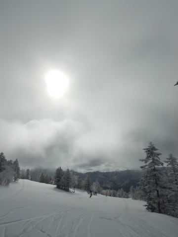

気温はかなり冷え込んで．

あさイチは，締まった圧雪の上に

軽い冷え冷え新雪が2-3cmほど乗っている，

かなり極上なコンディション！

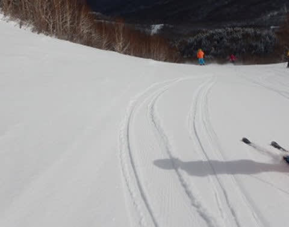

焼額の1ゴンが動かないので．

第2ゴンドラに人が集中し，

絶対混むと思い，

逃げてきたのは奥志賀エキスパートコース．

しっかり締まったのに，いい感じで

エッジが効く，シーズンでベストに

近い，かなりのゴキゲンバーンですよ！

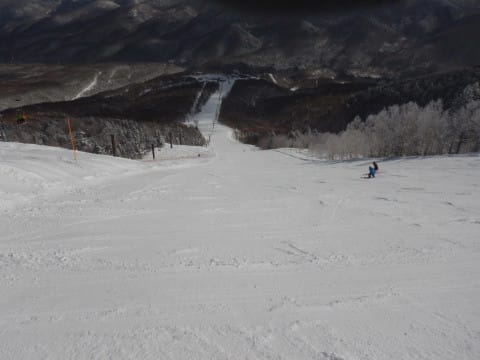

下部の緩斜面も，今朝降った，いい感じの

冷え冷え雪がゲレンデ全体を覆ってくれて．

トップシーズンのコンディションに復活！

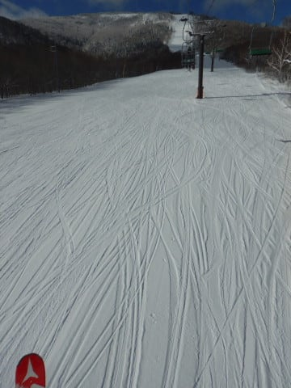

そして，午前9時を過ぎると，見事な

青空になってきて…

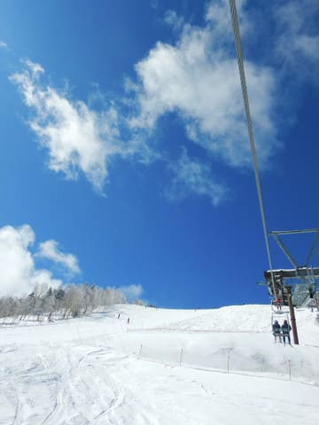

それなのに，気温は昼間でも-5℃以下で．

晴天なのに，雪が緩まないという，

理想のコンディション！！！

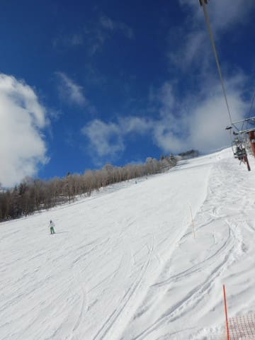

いや…

いいよ．

昨日はイマイチだったけど．

今日はかなり結構すごく最高の

コンディションなのでは？？？

…と，思ってたら．

ちょっと奥志賀の第2高速リフト，

混み始めてきました…（ちょい涙）

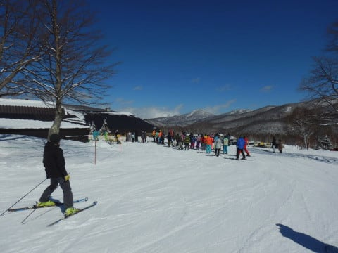

で．

10:30には焼額第1ゴンドラの故障も

直り，営業が始まったようなので．

焼額へ復活！！

いや．

焼額も晴天でいい感じだし．

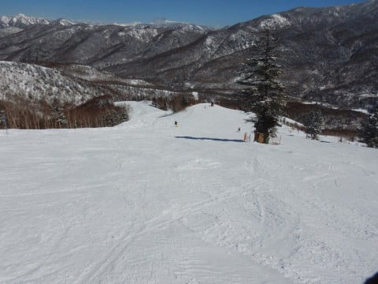

さらに，4人乗りに制限されているのに，

ゴンドラもそれほど待たずに

乗れます！

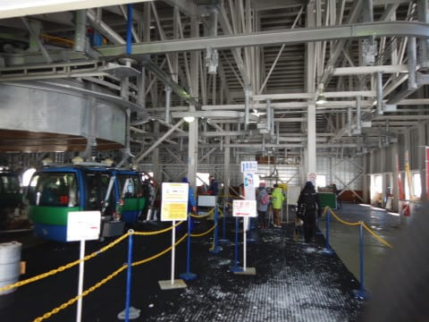

昼間も冷え冷えだったので．

雪質も，午後まで緩むことなく，

トップシーズンの雪質をキープ

してくれて．

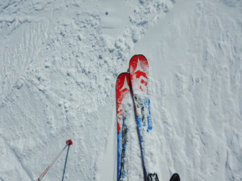

そして，こんなに晴天で

ガラガラなんですから…

これ以上何を求めるというのでしょうか！？？

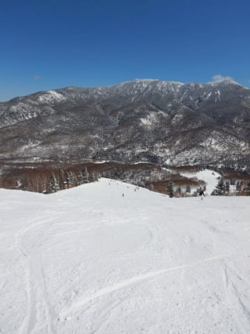

もう，最高！

昨日と違って，今日はもう，

雪よし，天気よし，混雑無しの

最高の一日．

夕方ラストは，さすがにちょっと

ゲレンデは荒れてきたけど．

でも，人が少なかったので，

いつもに比べれば，ラストまで

全然大回り可能なレベルだったので．

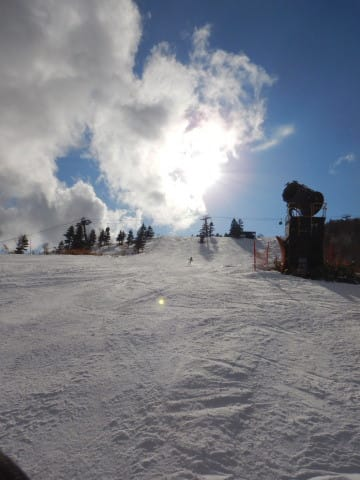

今日は一日，いい感じのハイスピード

大回りを，夕方ラストまでたらふく

楽しめたのでした…

…いや．

良かった．

今日は良かった…

明日はちょっと荒れ気味の終日雪降りの

一日ですが．

明後日17日(火）も，最高の一日になりそう！

## 💬 コメント一覧

### 💬 コメント by (かず)
**タイトル**: Unknown
**投稿日**: 2020-03-16 20:22:50

本日朝は晴れてましたがしばらくしてかなり降ってきました  昼間膝下位つもりましたよ！奥志賀は視界もかなり悪く全て止まりましたがヤケビは減速のみ 非圧雪は下が固く入れませんでしたが人が少ないので久々16時15分のリフトまで楽しめました 明日は晴れで最高！！

### 💬 コメント by (レインボー)
**タイトル**: Unknown
**投稿日**: 2020-03-16 23:05:24

ええーつ。かずさん、蛍の光まで！あのてんきで！

やっぱりかずさんはボード2万をやらなくてはいけない人なのかも。

レインボーは、今日はイレブンでやめて、長岡市まで足を運んで、来シーズンの板の支払いに行ってきました。ひろさんは、フィッシャーの黄色175を頼んでしまいました。

理由が異常です。[上手く滑れなかったので買った]

おかしいでしょ！

### 💬 コメント by (しんちゃん)
**タイトル**: 最高のコンディション
**投稿日**: 2020-03-16 23:20:44

週末はお世話になりました。

土曜は悪天候ながら次期戦闘機検討会に参加でき、楽しめました。（めちゃめちゃ物欲を掻き立てられてしまった）日曜は、「最高」の言葉しか言い表せないほどのコンディションに大満足でした。

あんなコンディションに巡り合えてしまうから、冷え冷えフレフレ踊りも欠かせなくなってしまうんですよね(笑)

次回登場まで、いや、ＧＷまで滑走できるよう、引き続き踊り続けておきます(笑)

### 💬 コメント by (Skier_S)
**タイトル**: 明日は最高のはず
**投稿日**: 2020-03-17 02:10:08

＞かずさま

今日はひざ下まで積もったんですか！

予想より積もりましたね…

で，もしかしたら火曜まで滞在ですか？？

だとしたら，最高のコンディションで滑れるかと…

うらやましい…

＞レインボーさま

長岡まで行ってらしたんですね…！

そして，「上手く滑れなかったので買った」とは，

すごい理由ですね…

＞しんちゃんさま

物欲を刺激されたようですね．

…そして，日曜は最高でしたね！

ってことで．

これからも踊り続けてください（笑）．

