# 5月18日(日)，かぐらファイナルデー特派員情報と志賀高原の渋・横手山特派員情報！

📅 投稿日時: 2025-05-19 03:28:29

🏷️ カテゴリ: [日記](cc4b5682fb7b8b144980957a978653fb0.md)

あぁ…

結局スキーに全く行けなかった週末．

かぐらが今日で終わりだったのに，

滑りに行けなかったのが悔しい…(激泣)

ってなことで．

この週末．

土曜はこれまでの睡眠不足を解消するため，

午後2時過ぎまで10時間以上寝てしまい．

その後，サービス終了するGoo Blogの引っ越し

先を検討していたら，せっかくの休み

というのに，ほぼ何もせずに終わっちゃって．

そして日曜はまる一日，娘に勉強を教えて

いたら終わってしまいました…（涙）

娘が土曜は特別講習で学校に行かねばならない

ので，土曜はスキーに行っていいけど

日曜は勉強を教えてほしいとお願いされていた

この週末．

その，スキーに行ける土曜を見事に狙ったように

悪天候になるとは…

私は日頃の行いがムチャクチャすごくいいはず

なのに，なぜだ？？←そう自信をもって言い切れるところがすごい…

とりあえず．

雪がまだまだたっぷりあるので，ものすごく

行きたかったかぐらファイナルには行けな

かったけど．

特派員の方がかぐらファイナルをレポート

してくれました～！！

写真を見ると，メインバーンはまだ

雪がいっぱいで…

…って，これ，おこみん特派員に対抗して，

「鹿」特派員？？？

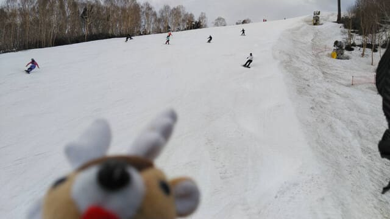

とりあえず．

今日のかぐらは雪がたっぷりあるのに

これでファイナルデーということで，

かなり混んだらしくて．

朝9時半からすでにクワッドは5分以上

待ち！

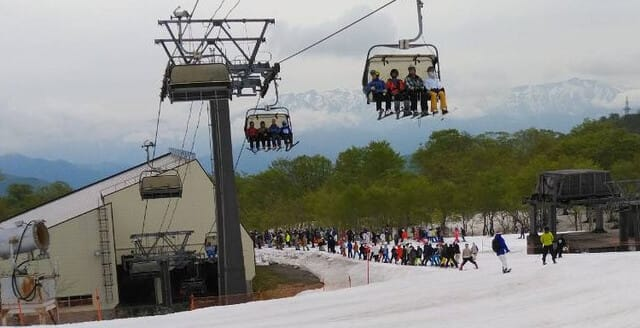

かぐら第1ロマンスも，かなりの列ですが…

でも，ここまで混んだのは10時半くらい

までだったようで．その後はクワッドも

1分待ちくらいで乗れたようです…

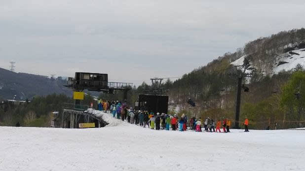

ジャイアントコースも一部土が出てるけど，

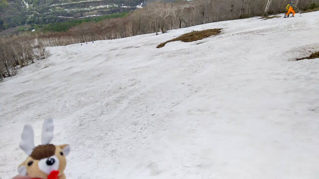

それ以外のところはまだコブの底も

抜けずに，一部を除けば幅いっぱい雪が

着いていたようだし…

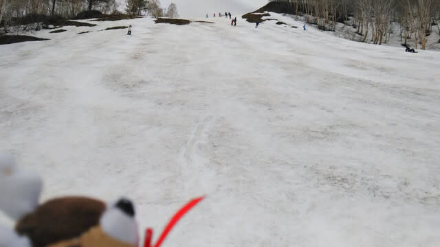

テクニカルコースもかなり土が出てきた

ものの，まだまだ滑れる感じで．

テクニカル・ジャイアントが両方とも

ファイナルまで生き残ったってのは

記録に残る雪の多さじゃないかな…？？

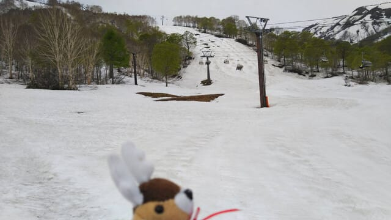

ただ…

さすがパノラマは今日はもう終了していた

みたいです…

うーん．土曜の雨でかなり雪がやられたのかな．

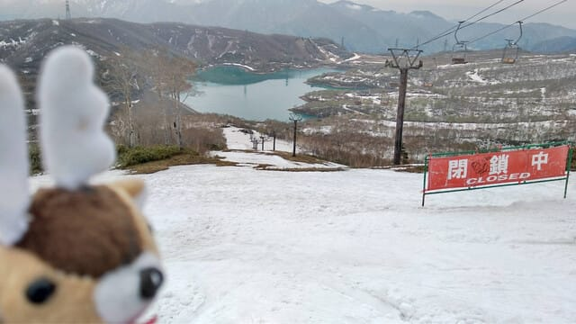

ってな感じで，雪がたっぷりあるかぐらを

みんな楽しんだんだろうなぁ…

と思っていたら．

11時ごろには，前が全く見えないくらいの

ひどいガスが出てきたみたいで…

あまりのガスのひどさに帰る人が続出

したらしく，11時からはだんだん人が減って

いったようで．

13:30ごろにはリフト待ちが0になったようで，

人も少なかったので，午後になっても全面

コブコブにはならなかったとのことですが…

ガスというか霧雨でウェアがびしょ濡れに

なるうえに視界も悪いし．

こんな日に滑るのはスキー〇カくらいだと

いう感じだったようです…

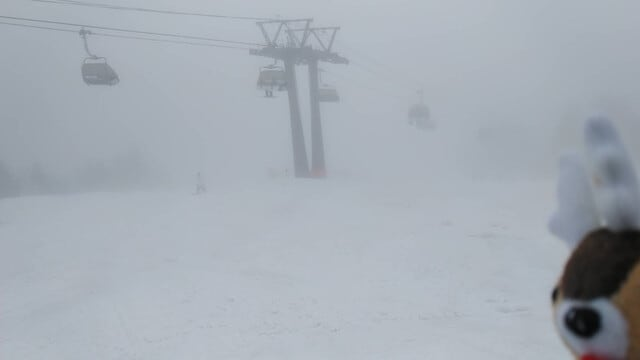

たぶん．

これは，私の怨念が思いっきり届きましたね．

かぐらスキー場にまで…

ちなみにファイナルのこの日まで，昨日の

雨にも耐えて，みつまたまでぎりぎり滑って

下りれたようです．

しかし．

こんな状況で最後まで滑っていたこの

「鹿」特派員…

もう一つ「馬」の人形をもっていくのを忘れた，

「馬」「鹿」特派員なんじゃないかな…

ということが，喉まで出かけたけど．

ここはぐっと呑み込んでおこう…←いや，

飲み込んでなく，書いちゃってるから！！

そして．

今日は本家おこみん特派員からも渋＆横手の

写真が送られてきましたが…

志賀高原は時折晴れ間もあったようですね！

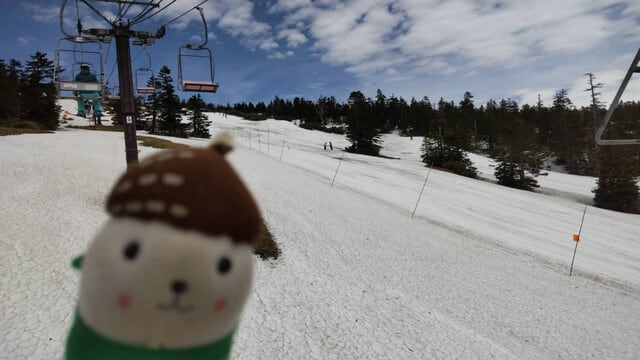

渋峠はまだまだ雪が残っていて．

今朝は硫安がしっかり撒いてあったからか，

雪が締まって結構板が走ったようです…！

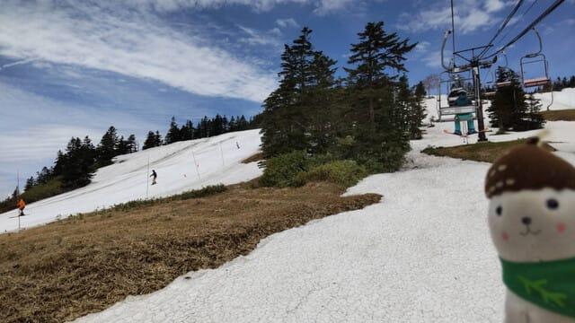

まぁ，あと1週間は雪がもってくれそうかな？

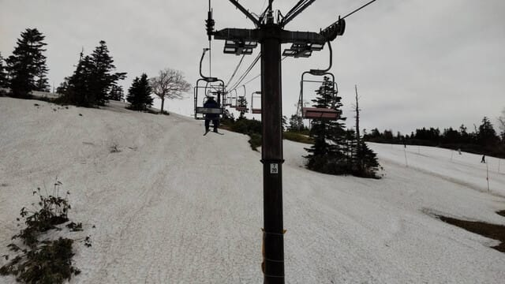

そして，横手山第2リフトがラストの本日も，

渋峠から横手山まで滑って下りれたみたい

ですが．

でも，もう雪は風前の灯火ですね…

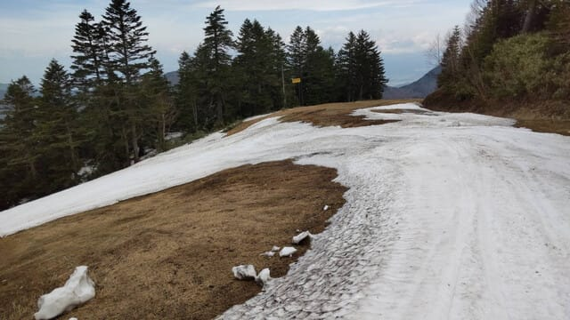

第2ゲレンデももう最終形態で，

コース途中にも穴が開いて，よくラストの

今日までもってくれた…

という感じですね．

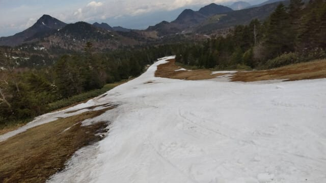

明日からは，渋峠と第4ゲレンデのみになり，

横手-渋を結ぶシャトルバスもなくなるので，

両者を行き来するには車で移動するしか

無くなるので，ご注意を…！

ちなみに今後の横手山・渋峠の営業時間は

7:00～14:10で，渋峠は25日がファイナル．

ファイナルデーは渋峠は1[5:40まで延長営業](https://yokoteyama2307.com/2025/05/18/5%e6%9c%8825%e6%97%a5%e3%81%af%e6%b8%8b%e5%b3%a0%e3%82%b9%e3%82%ad%e3%83%bc%e5%a0%b4-%e6%9c%80%e7%b5%82%e5%96%b6%e6%a5%ad%e6%97%a5%e3%80%82%e8%b1%9a%e6%b1%81%e3%82%92%e7%84%a1%e6%96%99%e9%85%8d/)

するみたいですね…

ってなことで．

滑りに行こうと思っていたファイナル

かぐらが午前激混み，午後はガスの悪視界＆

霧雨という状況だったようなので．

滑りに行けなかったけど，まぁこれなら

滑りに行かなくても良かったよね…

と自分に言い聞かせることができて．

少しは心が落ち着いたのでした…

…うん．こんな状況なら滑りに行けなくても

良かったよね…

…って，自分を騙せない（泣）

やっぱりムチャクチャ滑りに行きたかった…（涙）
