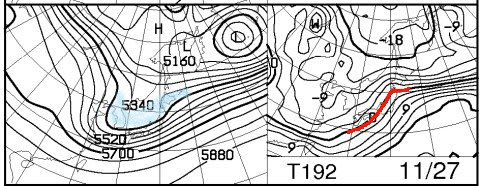

# 明日は…仕方がない，Yetiか…

📅 投稿日時: 2015-11-21 00:07:56

🏷️ カテゴリ: [日記](cc4b5682fb7b8b144980957a978653fb0.md)

…

というわけで．

アサマ2000も丸沼も鹿沢も湯の丸もかぐらも，

1mmの積雪も無い状態で，3連休を迎えてしまい，

「ふがーっ！！！」

と暴れたくなる今日この頃，皆様いかがおすごしでしょうか．

いや，

「ふがー！！」

というより，「だめだこりゃー！！！」

って叫びたい気分ですが…

本日のかぐらがこんな感じで…

…去年は，3連休の約一週間前，

11月15日には，もうこんな感じだというのに…

ダメだ．

ダメすぎる…

ってことで．

やむなく明日はYetiに行きますが．

…混むのかなぁ．

混むんだろうなぁ…

とりあえず，明日は．

朝方は多少雲が残るかもしれないけど，

晴れてくれそうかな．

日が射すと暖かい一日になりそう…

（もう，11月下旬なのに…）

で．

今後の冷え込みですが．

残念ながら，21日の冷え込みは

[この日の楽観的な予測](ecc2430cfea07b7c2c74c07c0b42d5732.md)ほどには冷え込まず．

この図の赤矢印で示したように，平年並み程度になっちゃいそう…

残念…

さらに，24，25日の冷え込みも，それほど大したものでは

なさそうかな～．

でも，25日は，このままなら，

人工雪を打てるレベルには冷え込んでくれるかな．

で．

すこし期待できるのが．

この図に示すように，27日に．

チョットした寒気がやってきそう．

この図の左側，水色で示したように，

高度5400mの特定高度線が垂れ下がったような

トラフが形成されており．

27日から28日にかけて，寒気が流れ込みます．

右側の図の0℃線が，南に下がり始めてます．

…ただ．

前のグラフ，「850hpaにおける気温偏差予想」グラフの

水色矢印で指し示した27日のところは．

まだ，気温予想ばらつきが大きく．

27日の冷え込みも，まだ確定と言った状況では

ありません…

まだ，予想の精度は低いです．

で．

FCVX12の850hpa傾向を見ても…

一応，27，28日あたりに冷え込みのピークが来そうかな？

…とはいえ．

せいぜい予想中心値では平年比マイナス1度

くらいだから，強烈な冷え込み，って感じでは

なさそうですが…

とはいえ．

今のところは．

27，28の冷え込みに期待かな～．

しかし．

この，FCVX12の傾向図を見ると．

11月28日以降，またプラス側にずれていっており．

なんだか．

12月上旬も，強烈な冷え込みは期待薄なんですけど…（泣）．

＃そして．この図を見ると．

＃いかにこの11月が平年より気温が高かったがよくわかる…（涙）．

なんだか，ダメだ．

これはきっと．

みんなの祈りが足りないのだっ！！←悪いことは他人のせいか？

もっと真剣に，祈るのだっ！！

## 💬 コメント一覧

### 💬 コメント by (マルハバ)
**タイトル**: ＞1mmの積雪も無い状態で・・
**投稿日**: 2015-11-21 09:43:58

私がいつも利用している日帰りバスツアーにも

とうとうYetiが「緊急発売」だそうです・・

http://www2.orion-tour.co.jp/orion-skitour/tourDetail.aspx?tc=281580910002

今までYetiのツアーなんて記憶にないなぁ～

あのコースにバスツアーが押し寄せたら

どうなっちゃうんでしょう？（汗）

### 💬 コメント by (Skier_S)
**タイトル**: マルハバさま
**投稿日**: 2015-11-21 22:55:32

Yeti，行ってきましたよ…

今帰ってきました．

想像ほどは混まず，

まぁ3連休と考えれば許容範囲ですかね～．

しかし，Yetiのバスツアーですか…

いろいろ末期症状ですね（涙）．

