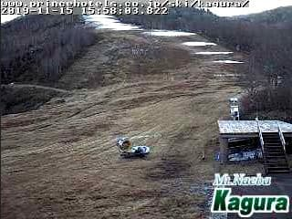

# 明日はYetiに行ってくる…のだが

📅 投稿日時: 2019-11-16 01:32:44

🏷️ カテゴリ: [日記](cc4b5682fb7b8b144980957a978653fb0.md)

ということで．

やはり金曜午前中までは

人工雪を打てたようですが．

昨日の予想通り，昼前には

かぐらも熊の湯も人工降雪機が

止まったようで．

かぐらは，昨晩からの人工降雪が

朝7時にはこんな感じでちょっと

積もってましたが…

午後4時ごろには，せっかくの人工雪が

結構解けちゃってました（涙）

（以上2枚，[かぐらHPライブカメラ](https://live.monitorbox.jp/site/kagura/90/#d0)より）

…そして，今晩は．

昨日予想した通り，冷え込みが足り無いようで，

熊の湯もかぐらも，人工降雪機が動いてません…（泣）

あぁ…こんな予想は当たらなくていいのに．

おそらくこのまま，20日までは人工降雪

厳しいだろうなぁ…

ギリギリ17日夜に打てるかどうか…

とりあえず．

23日にかぐら・熊の湯がオープンする可能性は

かなり低くなったけど．

20，21日の冷え込みに期待！！

…ってことで．

週末を迎えた明日土曜，

朝5時に出て，イエティに行く予定なんですけど…

…

…深夜1時過ぎのたった今，帰ってきました．

…なぜ，今日は終電で帰ってきているんだ（涙）

とりあえず．

Yetiなので，出発時間が遅くてもいいのが救い．

これからシャワー浴びて，3時間だけ寝て

出発です…

また今晩レポートしますので，

お楽しみに！
