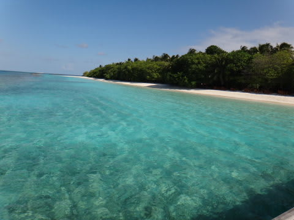

# 2012年　子連れモルジブ　ダイビング旅行記　プロローグ

📅 投稿日時: 2012-10-06 00:56:03

さて．

今年．

夏休みは9月の3連休と絡めて取ることを決めてたわけですけど．

問題は，どこに行くか．

コモドはサザンスタークルーズが運行休止してしまったし．

2年連続で行っているので．

まぁ，今年はちょっと違うところに行こうかと．

候補に挙がるのはパラオ，モルジブなど．

パラオも良いけど…

あのスピードボートで一日沖に出っ放しは，娘にはつらいかな～．

あと，ダイビングの合間に娘を泳がせることもできないし．

いろいろな検討はあったのですが．

結果的に，かつて行ったこともある，モルジブはバアァ環礁の，

ロイヤルアイランドに再訪することになりました．

ホントはモルジブのダイブクルーズに行きたかったんですが．

子連れで乗船させてくれる船が無かったので，やむなく

陸上リゾートを選びました…．

この時期のモルジブ．

雨季で，透明度は悪いですが．

バアァ環礁のマンタポイントは見所だし．

魚影も濃いし．

モルジブも4回目なので，ちょっと違うところにも…

という気もしたんですが．

さて．

今回．

娘はもう4歳10ヶ月．

海外のダイビング旅行ももう4回目．

旅行前から，

「飛行機に乗ったら，ゲームして，映画見て，お弁当(機内食のこと）食べて…」

って，国際線の飛行機に乗るのを楽しみにしている娘．

国際線での長距離フライトもまったく気にならないし．

旅行先でお船に乗って，プールで泳いで…と．

去年までには無かった，

「旅行を心待ちにしている」

感もたっぷり醸し出してきてます．

もう，今さら．

「子連れ海外だ！」って気負うことも，心配事もなく．

いつもの旅行…って感じで準備が進み．

これといった心配事も無く，あっさりと出発当日を迎えたのでした．

