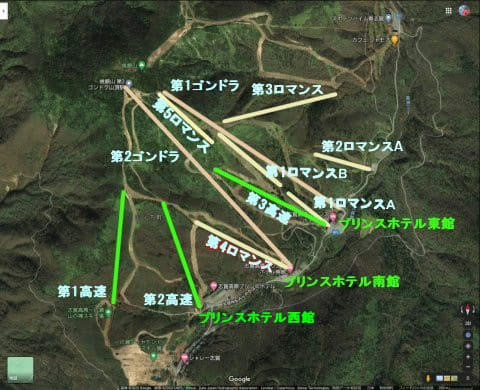

# 焼額山スキー場の歴史を振り返ってみる4…長野オリンピックがあった1998がピーク．志賀高原スキー場全体の1999年マップと今を比べてみる

📅 投稿日時: 2020-09-27 00:24:04

ということで．

長野オリンピックの年，1998年にほぼピークを迎えた

焼額山スキー場．

…でも．1998年の頃には，すでにバブルも

崩壊していて．

スキー客も1992～3年ごろをピークに

明確に減少してきており．

オリンピックのために強引に投資を

続けていた

感じで．

オリンピック以降，なんだか下り坂を

下っていくような，悲しい感じになって

来ました…

ということで．

オリンピックの翌年から．

○16年目　1999シーズン～18年目　2001シーズン

この年は，オリンピックの1998年と

全く変わりません．

ちなみに，私がもっている，

もっとも古い志賀高原マップがこちら．

1999，2000，2002年のマップです．

この，1999年のマップを見ると…

いや．やっぱり計11本のリフトがあった

この頃が焼額のピークだったなぁ…という

感じですね．

ただ，このうち赤矢印で描いたあたりに，

ミドル連絡コースがあるはずなのですが．

まだこの頃には，ミドル連絡コースは

無かったようですね…

それ以外，今あるコースはこの時には

もうすでに揃ってます！

焼額に限らず，志賀高原全体が

この頃がピークだったなぁ…

志賀高原全体を見渡してみて．

廃止された設備を赤い星印でマークしてみましたが．

まず，丸池・蓮池・サンバレーエリア．

サンバレーは

③の法坂第3シングルリフト，

②の法坂第2ペアリフト，

の2本が無くなり．

丸池はナイターが無くなり．

蓮池は

⑧の高速ペアリフトが消えてます…

ジャイアントは，

⑪のジャイアントペアが無くなり，

⑫の高速トリプルは低速ペアにグレードダウン．

中央エリアを見てみると…

あぁ．この頃はまだ山の駅から

発哺までのロープウェーがありましたね．

⑨のロープウェーが消え，

ロープウェーにつながる⑩のシングルリフトが消え，

⑭の発哺高速リフトが一昨年に無くなり，

高天ヶ原では

⑳の並びのペアリフトが消え，

㉒のトリプルが無くなり．

タンネの森は

㉗のペアが消え，

ダイヤモンドでは

㉙のトリプル

そして，寺子屋は

㉟の寺子屋第4ペア

が消えてます．

熊の湯エリアでは．

笠岳スキー場と

前山スキー場

の二つの

スキー場が丸々消えてます！！

…ただ，熊の湯のリフトは1本も

減ってないところがすごいかも．

横手．渋もほぼ変化が無いですね…

無くなったのは，

75の渋峠クワッド

くらいですね．

やっぱり悲惨なのは焼額エリアかも…

山の神は，

㉛の山の神トリプルが消え，

焼額は

㊳の第1高速，

㊶の1ロマA

㊷の1ロマB

㊻の5ロマ

㊸の2ロマ

㊹の3ロマ

奥志賀が，

54の第7リフト

と，計7本が消えてます…

とりあえず．

1999年に有ったリフトでこれまでに廃止されたものは，

ざっと数えて20本（涙）

そんなになくなってるのか…

ということで．

焼額の歴史も，これからはほぼ縮小の歴史になります…

（まだ終わらない！[次回](e7845fbeb5b3bb2d7f3f18006f3fc039a.md)へ続く）

## 💬 コメント一覧

### 💬 コメント by (Goku)
**タイトル**: 奥志賀第７？？？
**投稿日**: 2020-09-27 10:01:44

２０年前のマップが残っているのが凄い！

この中で、私が乗ったことがないリフトがありました。

奥志賀第７リフトは乗ったこともなければ、記憶にもないです。

### 💬 コメント by (Reader)
**タイトル**: 奥志賀第7
**投稿日**: 2020-09-27 10:26:17

ありましたよ！

第6ゲレンデの反対に・・・あたりに，上がってくる．

全部のリフトに乗るといろいろもらえる最初の頃は確か72だったような．最初の年は立派なクリスタルの盾？　あれは何年ごろだったのでしょうか？　オリンピックの前後？

### 💬 コメント by (加齢なるヒコーキ野郎)
**タイトル**: Unknown
**投稿日**: 2020-09-27 14:55:08

志賀高原は、大好きです。興味深く記事を拝見させて頂きました。先輩に連れられ、全リフト搭乗チャレンジを始めたのが90年頃でした❗残っている記念品は、9１年の物で、透明なアクリルの楯に志賀高原の全図が印刷してあり、副賞でTシャツが貰えました。また、達成者の中から抽選でスキー一式が貰えました。91年は全７４基。奥志賀の5４番も覚えています。その頃の焼額山はリフトが多く、チャレンジもやりがいが、ありました。先輩によると、石の湯スキー場のリフトの搭乗が一番、大変だったとか。今年も沢山雪が積もりますように。

### 💬 コメント by (まあ)
**タイトル**: Unknown
**投稿日**: 2020-09-27 22:19:27

渋峠のクワッドと奥志賀第7は雷に当たって壊れて、直す資金がなくて廃止したんですよね。来シーズンは旧ロープウェイのところ(山の駅)が駐車場になって、ジャイアントに向かってゴンドラができるらしいですね。それよりもジャイアントを高速に戻して欲しい。地味に、ジャイアントのロープも廃止されましたね。

### 💬 コメント by (はやと)
**タイトル**: Unknown
**投稿日**: 2020-09-27 23:50:59

１９８５シーズンと８６シーズンのチャレンジカードが出て来ました。

８５シーズンは志賀高原全体で、リフト７８基・ロープウェイ１基・ゴンドラ２基の合計８１基あったようです。

焼額山は、ゴンドラ・第１ロマンスＡ線・第１ロマンスＢ線・第２ロマンス・第３ロマンスの合計５基となっていますので、オープンの翌シーズンには第１ロマンスは２分割されたようです。

そして８６シーズンはリフトが２基減って志賀高原全体で合計７９基となったようです。

焼額山は、ゴンドラ・第１ロマンスＡ線・第１ロマンスＢ線・第２ロマンスＡ線・第２ロマンスＢ線・第３ロマンスの合計６基となっていますので、オープンの翌々シーズンに第２ロマンスは２分割されたようです。

第２ロマンスＡ線・Ｂ線ともにスタンブが押してあるので、たぶん乗車したんだと思いますが確かな記憶は有りません（前シーズンの第２ロマンスは長くて寒かった記憶が有ります）。

＊奥志賀第６ペアの上にあった第５（シングルリフトだったかな）は８６シーズンまだ有りました。

### 💬 コメント by (mae)
**タイトル**: Unknown
**投稿日**: 2020-09-28 00:20:51

懐かしいですね。

私も昔のチャレンジカードを確認してみました。

西館のペアリフトや高天原のトリプルがクワッドに架け替えられたのは良いのですが、随分と無くなりましたね。

ジャイアントには第３リフトもありました。

奥志賀第５リフトは支柱が今でも撤去されずに残ってます。

### 💬 コメント by (Skier_S)
**タイトル**: コメント回答遅れました
**投稿日**: 2020-09-28 22:33:03

＞Gokuさま

私の手元には，いろんなスキー場の古いマップがいくつか…

しかし，Gokuさんもとあろう方が，奥志賀第7をご存知ないとは！

ゴンドラが無いころは，第7→第6→第5と3本乗り継いでダウンヒルコースを

滑ったものです…

＞Readerさま

そうですよね．

ちょうど第6の反対側くらいにありましたよね…

最近まで，第7の乗り場跡が残っていたような気がするんですが．

リフト本数は結構毎年変わっているので，72本だといつごろでしょうか…

＞加齢なるヒコーキ野郎さま

91年ごろだと，まだスキー場も激込みだし，リフト本数も多く，

遅いシングルリフトやペアリフトも全て動いてたので

チャレンジカード達成が大変だったのではないでしょうか…

最後の方は，平日だと動いてないリフトも多く，その場合は

隣のリフトに乗った時に一緒にいっぱい押してもらえて

達成がそれほど難しくなかった思い出が…

＞まあさま

あ，あれ，雷でやられたんですか！

知りませんでした…

一昨年は西館トリプル降り場の小屋が落雷で焼けましたが…雷，多いんですね．

私も，ジャイアントのリフトを高速リフトにしてほしいです…

＞はやとさま

ををを！85年のカードですか！それはすごいですね！

一応，記事では1986シーズンに2ロマA,B分割と書きましたが，

当たってたようで…

確認できて助かりました．ありがとうございます．

ちなみに，1985シーズンのあたりがリフト本数ピークで，

そのあとは高速リフトが発明され，数本の短いリフトが長い高速リフトに

まとめられていく方向でリフト本数が減って行ってます．

ある意味，その時期は好景気だったからこそリフトが減ったのかも…

＞maeさま

ジャイアントの第3リフト，懐かしいですね～．．

私は乗ったことが無い気がします．

奥志賀第5，まだ支柱残ってますか！

子供の頃の思い出では，かなりの急斜面を登って行った，

怖いリフトだった思い出があります…

