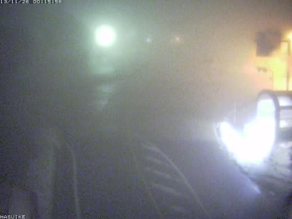
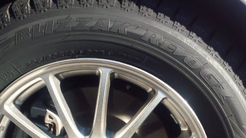
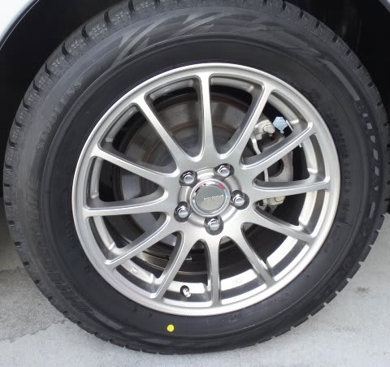
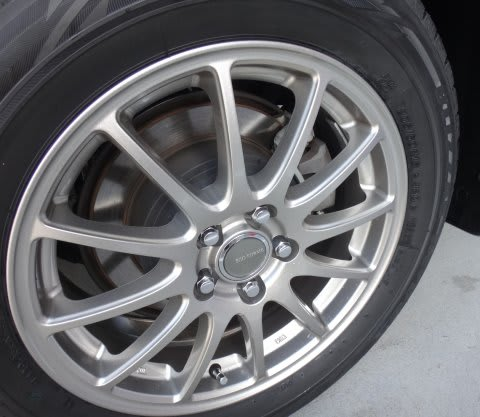

# 車の冬準備…スタッドレス　BLIZZAK　REVO GZを履かせてみた

📅 投稿日時: 2013-11-26 01:01:46

えー．

25日夜の志賀高原．

[道路状況カメラ](http://www.q0.ws302.smilestart.ne.jp/station1_1.htm)を見ると．

…[先週水曜日の予告通り](e293a1d687a9bc9717d28fbd2f4cea409.md)，雨になっちゃいましたね…(涙)．

まぁ，深夜まで降った後は，雨も上がり．

その後，26日の朝からは結構冷え込んでくれるはずなんですけど…

うーん．

水曜くらいまでは，志賀はあんまり降水量なさそうだな～．

でも．

木，金曜あたりにガツンと冷え込んで，寒気が入ってきそう．

志賀もこの2日間は雪が降りそうな気配．

この週末は，結構雪が回復してくれるかも…

…今の予想のままだと，土日は天気が良さそうなので．

この週末も．

晴天の中，天然雪が乗ったゲレンデを滑れそうな予感…

って，予想をしたところで．

本題へ．←今日はこれ以降がホントの本題

えー．

[車を買い換えた](eb1b0e385b422753c3e3aad5a58c12234.md)今シーズン．

当然，スタッドレス＆ホイールも，新しく買わなきゃならないわけで．

貧乏金無しの我が家．安いタイヤを求め，いろいろさすらったわけですね．

で．

ブリヂストンのスタッドレスタイヤが，今シーズンは

REVO GZから，REVO VRXにモデルチェンジしたので．

古い型になってしまったREVO GZが，他社のタイヤと比べても

比較的リーズナブルなお値段で買えるではあーりませんか！

昨年まで，[REVO2を履いていた](e815963ca7f35fb7c6fda9f3edc1f4e67.md)私．

私にとっては，REVO2でも十分な性能だったので．

それより高性能な次モデルのタイヤが他社のタイヤより安く

買えるというのであれば，もうこれしかないでしょ．

…ってことで．

買っちゃいました．REVO GZ．

意外なことに．

黄色帽子などといった自動車用品店やら，タ○ヤ館などといったタイヤ店より．

スバルディーラーが一番安かったという…．

＃自動bacsでの見積もり以下にできるか？と値切ったのは内緒

しかし．

ここ数年のスタッドレス，異常にお値段が上がってしまったので．

一瞬インチダウンして，安く上げようかと思いましたが．

(205/60R16→205/65R15)

ブレーキキャリパのクリアランスが16インチでぎりぎりっぽいので

これは無理．

前のオデッセイでは，夏タイヤ215/60R16を，スタッドレスで205/65R16と

ひとサイズ細めにしていたので．

ホイールは16インチと同じままひとつ細くして，195/65R16に

する手もあるなぁ…とも考えましたが．

195/65R16なんていうサイズのタイヤがラインナップに無い…（涙)

…ってことで．

素直に純正サイズにしておきました．

とりあえず．

この週末のアサマ2000の雪道では，アスファルト路面と同じような

感じでグリップして走っていったので．

かなりの雪道グリップ力はありそうです．

…もう少し本格的な雪道を走ったら，またどんなだったか報告します…

## 💬 コメント一覧

### 💬 コメント by (Gokuraku Skier)
**タイトル**: Unknown
**投稿日**: 2013-11-26 19:17:24

私も去年ＧＺにしました！

かれこれ２０年近くＢＳしか履いていないので他社の性能は判りませんが、ＢＳ以外で志賀の下りを降りてくるのはとっても不安です。

ＢＳで止まらなかったらしょうがないでしょ！って思ってます。

ただ、ＲＥＶＯ２よりＧＺの方が減りが早いかも？

あっそれとGokuraku Skierって長ったらしいので次からはGokuにします。

### 💬 コメント by (Skier_S)
**タイトル**: Gokuさま
**投稿日**: 2013-11-27 01:28:51

私は，BSのスタッドレスは3セット目です…

DUNLOP→DUNLOP→YOKOHAMA→BSx3と来ました．

しかし，ここ5年ほどのスタッドレスの進化はすごいなぁ，

と思ってます…

REVO2で十分だったのに，REVO GZどんなか楽しみです．

…しかし，GZ，減り早いですか…

REVO2も2シーズンが精一杯だったので，

GZ，2シーズンもたなかったらどうしよう…

### 💬 コメント by (megalith)
**タイトル**: ご無沙汰しています。
**投稿日**: 2013-11-29 21:49:33

この前の日曜日にようやく仕事の資格のテストが終わり、それまではネットはHP等見るだけの生活でしたが、ようやく書き込み解禁となりました。(^_^;)

結果は来月末近くに来るのですが・・・・

成果は・・・・聞かないで下さい・・・・orz

さて、いよいよ冬到来ですね。

今日は仕事が早出でしたが、寒いのなんのって午前中は外で震えていました。

夕方からは会社にいたら雪が降ってきました。

自分は予定通りネットでダンロップのDSX-2を買い、先々週に履き替えましたが、うっかりスノーワイパーを買い忘れていました。(^_^;)

今度の日曜日に買いに行こうと思っています。

スタッドレスはまだ凍結道路になっていないので、結果はどうなるのかわかりませんが、前のタイヤと同程度ならいいなぁと思っています。

### 💬 コメント by (Skier_S)
**タイトル**: megalithさま
**投稿日**: 2013-11-30 04:57:55

おお！

お久しぶりです．

テスト勉強，お疲れ様でした…

好成績を祈っています．

DSX-2購入ですね．

こちらも，通販で購入しようかとも思ったのですが，

ホイール込みで組み付け料金なども考えると，

意外とスバルディーラーが安かったので

ついつい買ってしまいました…

こちらはも，ルーフBOXもゲットして，冬準備

万全です．

早くBRレガシィ君で雪道を走りたくて，うずうず

しています～！

### 💬 コメント by (megalith)
**タイトル**: Unknown
**投稿日**: 2013-12-03 01:07:55

>好成績を祈っています．

今回試験時間が30分伸びたので、小論文の文字数が増えると予想していましたが、予想のはるかに斜め上の事態が起きたので、終了後会場に来ていた知っている人達に聞いても、殆どの人がパニック状態に陥ってしまい大変だったそうです。

もちろん自分もその一人でした。(^_^;)

来年も同じ方法で来るのかなぁ・・・・気が重い・・・・

スタッドレスですが、アルミはBPの時に使用していた物がそのまま使えたので、今回はタイヤだけ購入しましたが、付け替えた時スタンドの人が「アルミの塗装がかなり取れかかっているので空気圧に気をつけるように」と言われました。(^_^;)

ひどければ来年アルミだけ買い直しかもしれません・・・・（泣）

### 💬 コメント by (Skier_S)
**タイトル**: megalithさま
**投稿日**: 2013-12-03 01:25:00

私は資格試験だとか昇進試験とかいうものと無縁なまま，

今まで来てしまったおちゃらけサラリーマンなので，

試験の大変さはわかりませんが…

試験方式が変わった回にたまたま受験ってのも

たまりませんね(＾＾;

タイヤはスタンドで組み付けてもらったんですか．

スタンドって，持ち込みで付け替えてくれるんですね…

アルミは単体で買うより，タイヤとセットにしたほうが

割引率が高いから，今のスタッドレスがヘタるまで

我慢するというのも手かも…

こちらはREVO GZで1000kmほど走りましたが，

舗装路でも結構いい感じです．

