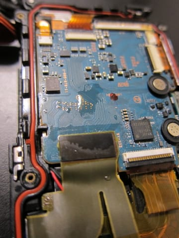

# そして…デジカメTX20の修理を試みてみた

📅 投稿日時: 2014-08-19 00:34:37

という感じで．

[昨日書いた](ec2fd28e254e78b285474bec50dc164a2.md)ように，

悲しくも，どうも壊れてしまったらしい

わが愛用デジカメ，SONYのTX20.

…でも．

水没した気配もないし．

これは．

もしかすると，接触不良か何かで，修理すると直るかも…？？

と，帰国後，さっそく分解してみたわけですね．

＃私のことを知っている人は．

＃私が，壊れたものはなんでも修理を試みる…

＃という本能をもっていることを知っていると思いますが．

まずは，フロントカバーを取り外します．

これは，外装のねじを数か所取り外すと，

労せず外せますね．

ここからが，水密筐体の解放で，ちょっと苦労するのだ．

いろんなところの影に隠れているねじを発見しながら，

ひとつづつ外していくと…

こんな感じで，Oリングで水密確保されている

筐体のフタが外せるのだ．

写真にオレンジ色でぐるっと一周しているが，

水密確保用のOリングですね…

ふーむ．

このOリング，結構複雑な形してるんだな…

ここで，基盤を見てみるけど…

あいや．

ちょっと濡れてる跡が…

マズい．

やっぱり水没だったのか？

とりあえず，

メイン基盤につながっているFPCを外して…

あららっら？

なんだか，FPCの裏に腐食の跡が…（汗）

ちょいとマズい感じだな…

とりあえず，FPCを外すと，

メイン基盤がいとも簡単に外せます．

…あれ？

なんだか，基盤の上に，かすかに塩を吹いたような跡が…

いや，でも．

この程度なら，[過去の経験](http://blog.goo.ne.jp/skier_nobu/e/b2208ef3ff8f870bacda7bc32a802f31)から．

直せるかも…？？

と，さらに分解を進めます．

光学ユニットを取り外してみましょう．

レンズ～CMOS受像素子までの工学系が，

このユニットにすべて一体化されてます．

こいつを見てみると…

うん？？？

あれ？？

あららら～っ！！

…ダメじゃん．

こら，完全水没だよ…

どうやら，水が入ったのは数滴程度だったんだろうけど．

この，レンズ駆動モータ部分が動作中に，そのわずか数滴の

塩水がかかって，完全に腐食，死亡しちゃったようですね…

…

…だめだ．

これは…直らんわ（激涙）．

…ここにおいて，完全なる死亡宣言です（合掌）．

まぁ．

せっかくだから．

ついでに，光学ユニットも分解してみましょうか…

こいつがCMOS撮像素子．

こいつが手ぶれ補正光学モジュール．

ソレノイドで，X,Y2軸にレンズが微小駆動

する構造ですね～．

よくできてるわ…

で，こいつが屈折光学＆フォーカスレンズ．

光学ユニットを並べるとこんな感じで…

上から屈折光学＆フォーカスレンズ，

ズームレンズ（軸に突き刺さって上下に動くレンズ）

ズームレンズ駆動部，

レンズユニットと，その左側に手ぶれ補正光学モジュール，

その下にCMOS撮像素子．

CMOS撮像素子とレンズユニットの間に，透明な

ガラスっぽいものがありますが，これはローパス

フィルタかな？？

…ということで．

カメラの修理はできなかったけど．

このカメラの構造がよく理解できて，

よかったなぁ…

と，わけのわからない理論をもって，

自分をポジティブにごまかすSkier_Sだったのだった…（悲）．
