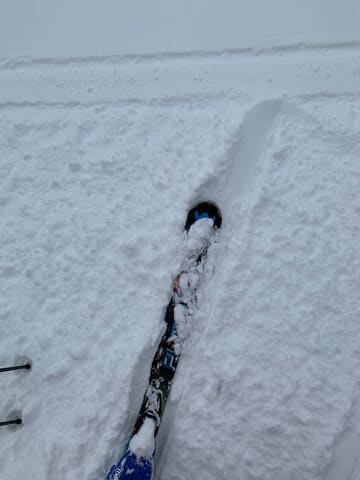
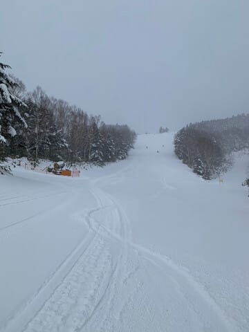

# 1月6,7,8日の3連休の志賀高原スキー場の天気は…6日夜から7日にかけて冷えて積雪あり！8日は午前雪が残るかもしれないけどじき晴れそう

📅 投稿日時: 2024-01-05 11:15:54

えー．

昨日は，仕事復帰初日からにBlogを

書かずに床に倒れたように寝て

しまったので…

いつもと違って，お昼前に更新！

で，昨日の1/4の志賀高原ですが…

昨晩から朝までに，10～15㎝ほどの

積雪があったようです！！

この雪で，ゲレンデの硬いところが

隠されて，朝のうちはいい感じだったよう

ですが…

ただ，雪不足のブッシュをすべて隠しきる

ほどの積雪量はなかったようで．

ブッシュが出ていたGSコース下部，

白樺下部などは，ブッシュが完全に

隠れ切ってくれなかったようです…

ってなことで．

正月休みも終わったばかりというのに，

明日からまた3連休なわけで…

この3連休の天気予想を，手短に！

1/6(土)：あさイチは曇り，気温-5℃程度と

　この時期としては高め．

　しっかり締まり気味の，いい感じのシマシマ

　バーンでスタート！

　天気は一日コロコロ目まぐるしく変わり，

　曇りベースだけど，時々晴れたと

　思ったら雪が降ったり…

　という天気．

　リフト営業時間中は，雪は積もるほど

　降らない．

　昼間は気温0℃程度に上がるかもだけど，

　基本的に良い感じの一日．

1/7(日)：前日夜から雪が降り，朝までに

　10cm程度積もる．

　圧雪バーンも，圧雪の上に数㎝の

　新雪が乗っている．

　あさイチの気温は-5～6℃程度だけど，

　昼間に向かってぐんぐん気温は下がる．

　朝までに降ってくれればいいものの，

　昼間も結構な勢いで雪が降り続け，

　昼間だけでも10～20cmは積もりそう…！

　昼間も-5℃を上回らなさそうで，

　冷えて，前が見にくいほどの雪降り

　になりそうな一日．

　午後もコース上はパフパフが続き，

　急斜面はもさもさコブになりそう．

1/8(月・祝)：あさイチは-10℃近く

　まで冷え込みそう…

　この日の朝も10cm程度の積雪が

　積もり，あさイチは新雪が踏まれた

　柔らかめの圧雪バーン！

　午前中まで雪が残るが，午後は雪が

　止んで晴れていきそう．

　午後は柔らかい雪が蹴散らされて

　急斜面はボコボコになりそうだけど，

　人も少なくて雪も冷えていい感じで，

　典型的なトップシーズンの一日．

ってな感じでしょうか…

冷えて雪も降り，トップシーズンらしい感じの

3連休になりそうです…！！

## 💬 コメント一覧

### 💬 コメント by (副院長)
**タイトル**: Unknown
**投稿日**: 2024-01-05 12:35:42

S様お疲れ様です。この週末はざっと、３０ｃｍほどですかね。私の出勤は来週からなので、来週までに志賀高原の本気（一晩１ｍ）をそろそろ出していただけないでしょうかねぇ。

Ｓ様の念力で何とか、、、期待しております。

### 💬 コメント by (油漏＠あちこち)
**タイトル**: Unknown
**投稿日**: 2024-01-05 17:31:54

お仕事お疲れ様です。

高天原の道路の温度計が見られる場所に泊まっておりました。今朝起きたらマイナス６度を示していましたが、ゲレンデに出ていく頃はマイナス１度、昼間はプラス３度を示してました。

ブナ平を過ぎ河原小屋に降りるクネクネ道は茶色い土やブッシュ、石ころが散見されました。西館山下部は、きれいなゲレンデ状態でしたが、まるで３月の春スキーの雪質でした。

寺子屋まで登ると冬の雪質に戻りましたが、稀にブッシュや小石も出てました。

朝一番とラストは一ノ瀬ファミリーでした。ここは安心して滑走できました。

連休のスキー場への運転、気を付けてお越しください。

### 💬 コメント by (Skier_S)
**タイトル**: 明日スキーに行けるかな…？
**投稿日**: 2024-01-05 21:59:42

＞副院長さま

うーん．3日間で少なくとも30㎝は積もってくれると信じています…

一晩1m積もってほしいけど，それはこれから1週間の天気図を見る限りでは

なさそうです…（涙）

＞油漏れ＠あちこちさま

今日は気温が上がったんですね…（涙）

寺小屋がオープンして，明日からは西舘フーディーと焼額の第3高速が動きそうですが，

早く冷え冷えが続く普通の冬になってほしいところ…

